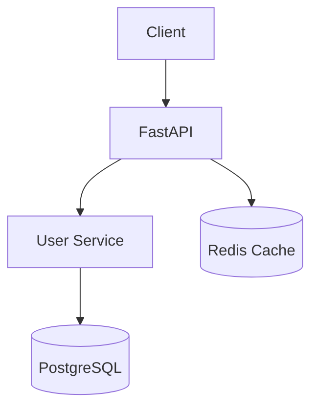

# README Examples

## Example 1: Simple Python Project

```markdown
# My API Service

[](https://github.com/user/my-api)
[](https://codecov.io/gh/user/my-api)
[](https://pypi.org/project/pylint/)
[](LICENSE)

A FastAPI service for managing user data with PostgreSQL backend.

## 🚀 Quick Start

```bash
git clone https://github.com/user/my-api.git
cd my-api
make install
make test
make run
```

## ✨ Features

- RESTful API with FastAPI
- PostgreSQL database
- Pylint ≥ 9.5
- Bandit security compliant
- 85%+ test coverage

## 📊 Architecture



## 🛠️ Tech Stack

| Component | Technology | Version |
|-----------|------------|---------|
| Language | Python | 3.10+ |
| Framework | FastAPI | 0.100+ |
| Database | PostgreSQL | 14+ |
| Cache | Redis | 7+ |
| Testing | Pytest | 7+ |

## 📦 Installation

```bash
make install
cp .env.example .env
```

## 📖 Usage

```bash
make help      # Show all commands
make lint     # Run linters
make test     # Run tests with coverage
make run      # Start API server
```

## Author

**[Author]**
AI Solutions Architect & Technology Evangelist
```

## Example 2: Makefile Target Output

```bash
$ make help

========================================
  Project Makefile - Available Commands
========================================

  clean          Clean temporary files
  diagrams       Create diagrams directory
  diagrams-render Render all Excalidraw diagrams to PNG
  docs           Build documentation
  docs-serve     Serve documentation locally
  docker-build  Build Docker image
  docker-run     Run Docker container
  format         Format code (isort + black)
  help           Show this help message
  install        Install dependencies
  lint           Run linters (pylint, target: ≥9.5)
  run            Run the application
  security       Run security checks (bandit)
  test           Run tests with coverage (target: ≥85%)
  test-integration Run integration tests only
  test-unit      Run unit tests only
  typecheck      Run type checking (mypy)
```

## Example 3: Excalidraw Diagram JSON

```json
{
  "type": "excalidraw",
  "version": 2,
  "source": "https://excalidraw.com",
  "elements": [
    {
      "id": "title",
      "type": "text",
      "text": "System Architecture",
      "x": 100, "y": 50,
      "fontSize": 28,
      "fontFamily": 3
    },
    {
      "id": "client_box",
      "type": "rectangle",
      "x": 100, "y": 120,
      "width": 120, "height": 60,
      "strokeColor": "#0891b2",
      "backgroundColor": "#cffafe"
    },
    {
      "id": "client_text",
      "type": "text",
      "text": "Client",
      "x": 130, "y": 140,
      "fontSize": 16,
      "fontFamily": 3
    },
    {
      "id": "arrow",
      "type": "arrow",
      "x": 220, "y": 150,
      "points": [[0, 0], [80, 0]],
      "strokeColor": "#1e40af",
      "strokeWidth": 2
    },
    {
      "id": "api_box",
      "type": "rectangle",
      "x": 300, "y": 120,
      "width": 120, "height": 60,
      "strokeColor": "#1e40af",
      "backgroundColor": "#dbeafe"
    },
    {
      "id": "api_text",
      "type": "text",
      "text": "API",
      "x": 330, "y": 140,
      "fontSize": 16,
      "fontFamily": 3
    }
  ],
  "appState": {
    "viewBackgroundColor": "#ffffff",
    "gridSize": 20
  },
  "files": {}
}
```
