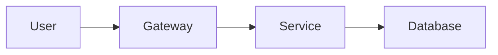
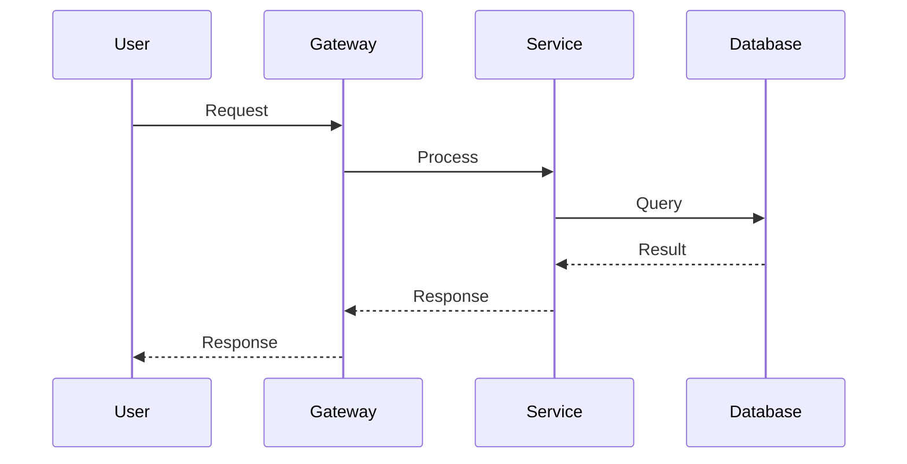
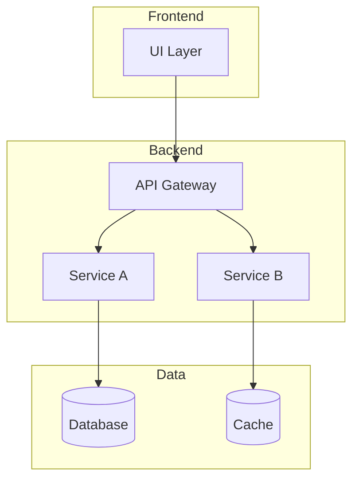

# README Sections Reference

## 1. Title + Badges

```markdown
# Project Name

[](https://...)
[](https://...)
[](link)
[](link)
```

## 2. Quick Start

```markdown
## 🚀 Quick Start

```bash
git clone https://github.com/user/repo.git
cd repo
make install
make test
```
```

## 3. Features

```markdown
## ✨ Features

- **Feature 1**: Description
- **Feature 2**: Description
- **Code Quality**: Pylint ≥ 9.5
- **Security**: Bandit compliant
```

## 4. Architecture (Mermaid)

### 4.1 Diagram Walkthrough


### 4.2 System Workflow


### 4.3 Architecture Components


### 4.4 Container Lifecycle

**Build Process:**
1. Clone repository
2. Install dependencies (`make install`)
3. Build Docker image (`docker build`)

**Runtime Process:**
1. Load configuration from environment
2. Initialize database connection
3. Start API server
4. Health check

### 4.5 File-by-File Guide

| File/Folder | Purpose |
|-------------|---------|
| `app/` | Main application code |
| `tests/` | Unit and integration tests |
| `config/` | Configuration files |
| `docs/` | Documentation |
| `Makefile` | Build automation |

## 5. Technical Stack

| Component | Technology | Version |
|-----------|------------|---------|
| Language | Python | 3.10+ |
| Framework | FastAPI | 0.100+ |
| Database | PostgreSQL | 14+ |
| Testing | Pytest | 7+ |
| Logging | Loguru | latest |

## 6. Installation

```markdown
## 📦 Installation

### Prerequisites
- Python 3.10+
- Docker (optional)

### Steps
```bash
git clone <repo>
python -m venv venv
source venv/bin/activate
make install
```
```

## 7. Configuration

```markdown
## ⚙️ Configuration

Create `.env` based on `.env.example`:
```bash
cp .env.example .env
```
```

## 8. Usage

```markdown
## 📖 Usage

```bash
make lint      # Run linters
make format   # Format code
make test     # Run tests
make run      # Run application
```
```

## 9. Testing

```markdown
## 🧪 Testing

```bash
make test
pytest --cov=app --cov-report=html
```
```

## 10. Author (OBLIGATORIO)

```markdown
---

## Author

**[Author]**  
AI Solutions Architect & Technology Evangelist  
[LinkedIn](https://[linkedin-url]
```
