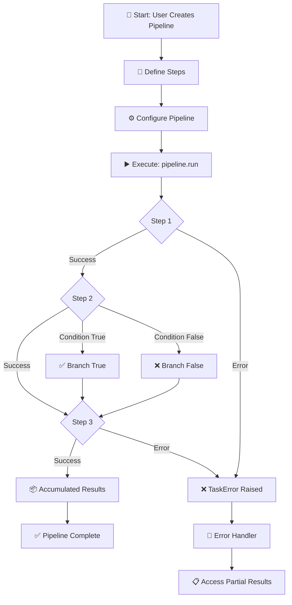
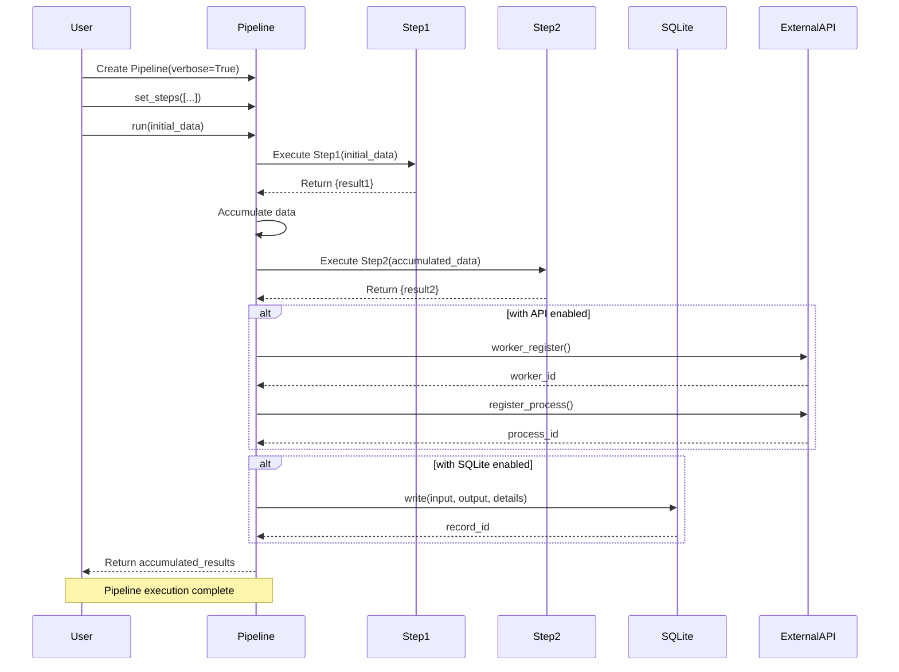
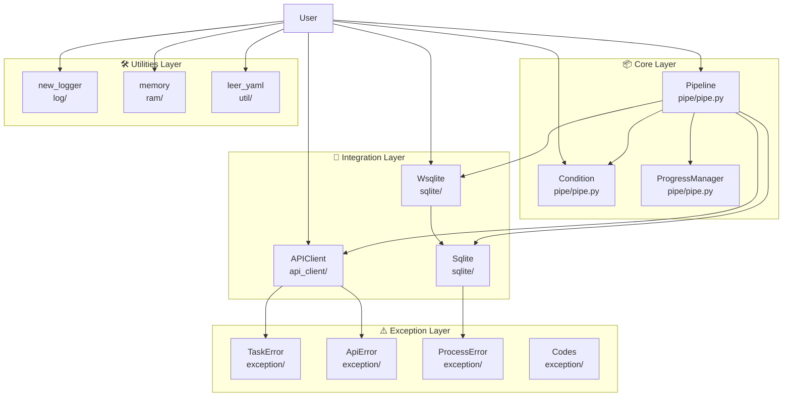
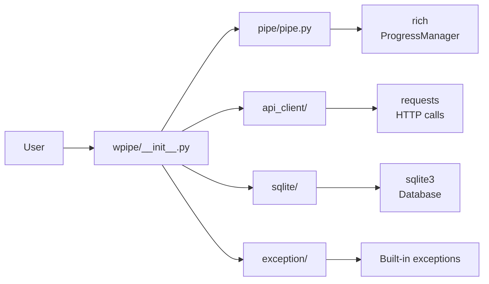
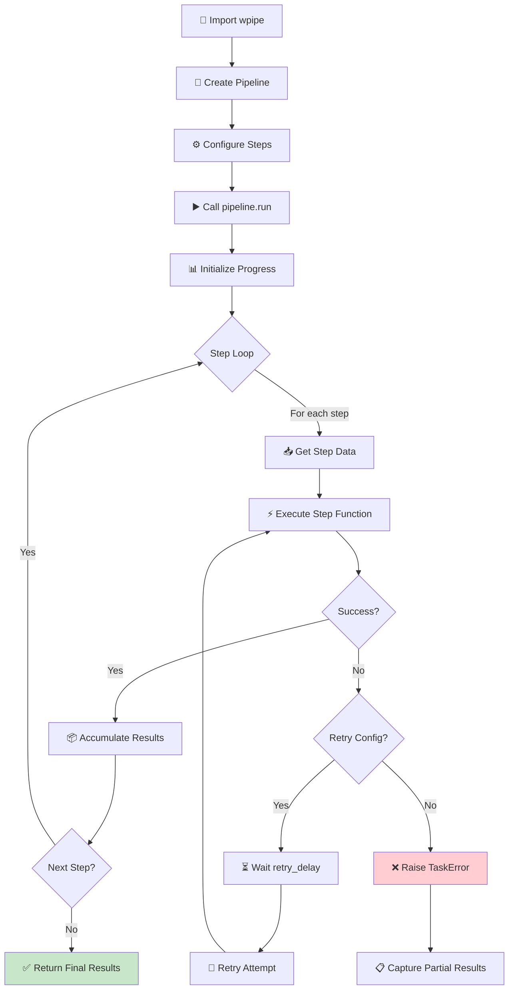

# wpipe - Python Pipeline Library for Sequential Data Processing

<!-- Logo placeholder -->
<!-- ┌─────────────────┐ -->
<!-- │                 │ -->
<!-- │     wpipe       │ -->
<!-- │   Pipeline ⚡   │ -->
<!-- │                 │ -->
<!-- └─────────────────┘ -->

[](https://badge.fury.io/py/wpipe)
[](https://pypi.org/project/wpipe/)
[](https://opensource.org/licenses/MIT)
[](CHANGELOG.md)
[](https://github.com/wisrovi/wpipe/actions)
[](https://wpipe.readthedocs.io/)
[](https://github.com/wisrovi/wpipe/stargazers)

> **Version 1.5**: Major release with parallel execution, pipeline composition, step decorators, resource monitoring, checkpointing, timeout controls, type hinting, and export capabilities.

## Project Overview

**wpipe** is a powerful, lightweight Python library for creating and executing sequential data processing pipelines without the complexity of web-based workflow tools. It provides a clean, intuitive API for orchestrating complex data processing tasks while maintaining production-grade quality.

### Key Characteristics

- **No web UI required** - Just clean, production-ready Python code
- **Minimal dependencies** - Only `requests` and `pyyaml`
- **Production-ready** - Comprehensive error handling, retry logic, and logging
- **Well-documented** - Extensive docs, tutorials, and 100+ examples
- **100% Type Hints** - Excellent IDE support and better developer experience

---

## Features

| Feature | Description |
|---------|-------------|
| 🔗 **Pipeline Orchestration** | Create pipelines with step functions and classes |
| 🌳 **Conditional Branches** | Execute different paths based on data conditions |
| 🔄 **Retry Logic** | Automatic retries with configurable backoff strategies |
| 🌐 **API Integration** | Connect to external APIs, register workers |
| 💾 **SQLite Storage** | Persist execution results to database |
| ⚠️ **Error Handling** | Custom exceptions and detailed error codes |
| 📋 **YAML Configuration** | Load and manage configurations |
| 🔀 **Nested Pipelines** | Compose complex workflows |
| 📊 **Progress Tracking** | Rich terminal output |
| 🧪 **Type Hints** | Complete type annotations |
| 🔒 **Memory Control** | Built-in memory utilities |
| 🧩 **Composable** | Reusable pipeline components |
| ⚡ **Parallel Execution** | Execute steps in parallel (I/O or CPU bound) |
| 📂 **Pipeline Composition** | Use pipelines as steps in other pipelines |
| 🎯 **Step Decorators** | Define steps inline with @step decorator |
| 💾 **Checkpointing** | Save and resume from checkpoints |
| ⏱️ **Timeouts** | Prevent hanging tasks with timeout support |
| 📈 **Resource Monitoring** | Track RAM and CPU during execution |
| 📤 **Export** | Export logs, metrics, and statistics to JSON/CSV |

---

## 🚶 Diagram Walkthrough

The following diagram shows the high-level execution flow of a typical wpipe pipeline:



### Flow Description

1. **Start**: User creates a Pipeline instance and defines step functions
2. **Configure**: Steps are registered with name and version metadata
3. **Execute**: `pipeline.run()` starts the sequential execution
4. **Data Flow**: Each step receives accumulated results from all previous steps
5. **Conditions**: Optional branching based on data evaluation
6. **Complete**: Final accumulated results are returned

---

## 🗺️ System Workflow

The following sequence diagram shows the interaction between components during pipeline execution:



---

## 🏗️ Architecture Components

The following diagram illustrates the static structure and dependencies of wpipe's main modules:



### Module Dependencies



---

## ⚙️ Container Lifecycle

### Build Process


### Runtime Process



---

## 📂 File-by-File Guide

| File/Directory | Purpose | Description |
|----------------|---------|-------------|
| `wpipe/__init__.py` | Main exports | Exports Pipeline, Condition, APIClient, Wsqlite |
| `wpipe/pipe/pipe.py` | Core logic | Pipeline, Condition, ProgressManager classes |
| `wpipe/api_client/api_client.py` | HTTP client | APIClient, send_post, send_get functions |
| `wpipe/sqlite/Sqlite.py` | Database | Core SQLite operations |
| `wpipe/sqlite/Wsqlite.py` | Wrapper | Context manager for simple DB operations |
| `wpipe/log/log.py` | Logging | new_logger function (loguru) |
| `wpipe/ram/ram.py` | Memory | memory decorator, memory_limit, get_memory |
| `wpipe/util/utils.py` | Config | leer_yaml, escribir_yaml functions |
| `wpipe/exception/api_error.py` | Errors | TaskError, ApiError, ProcessError, Codes |
| `docs/source/` | Documentation | Sphinx documentation source files |
| `examples/` | Examples | 100+ working examples organized by topic |
| `test/` | Tests | pytest test suite (106 tests) |

---

## Getting Started

### Installation

#### PyPI (Recommended)

```bash
pip install wpipe
```

#### From Source

```bash
git clone https://github.com/wisrovi/wpipe
cd wpipe
pip install -e .
```

#### Development Install

```bash
pip install -e ".[dev]"
```

### Requirements

- Python 3.9 or higher
- requests (for API integration)
- pyyaml (for YAML configuration)

### Verification

```python
import wpipe
print(wpipe.__version__)  # 1.0.0
```

---

## Usage/Examples

### Basic Pipeline

```python
from wpipe import Pipeline

def fetch_data(data):
    """Fetch data from a source."""
    return {"users": [{"name": "Alice"}, {"name": "Bob"}, {"name": "Charlie"}]}

def process_data(data):
    """Process the fetched data."""
    users = data["users"]
    return {"count": len(users), "names": [u["name"] for u in users]}

def save_data(data):
    """Save results."""
    return {"status": "saved", "processed": data["count"]}

# Create and configure your pipeline
pipeline = Pipeline(verbose=True)
pipeline.set_steps([
    (fetch_data, "Fetch Data", "v1.0"),
    (process_data, "Process Data", "v1.0"),
    (save_data, "Save Data", "v1.0"),
])

# Run the pipeline
result = pipeline.run({})
# Output: {'users': [...], 'count': 3, 'names': [...], 'status': 'saved', 'processed': 3}
```

### Conditional Pipeline

```python
from wpipe import Pipeline, Condition

def check_value(data):
    return {"value": 75}

def process_high(data):
    return {"result": "High value"}

def process_low(data):
    return {"result": "Low value"}

condition = Condition(
    expression="value > 50",
    branch_true=[(process_high, "High", "v1.0")],
    branch_false=[(process_low, "Low", "v1.0")],
)

pipeline = Pipeline(verbose=True)
pipeline.set_steps([
    (check_value, "Check", "v1.0"),
    condition,
])
```

### With SQLite Storage

```python
from wpipe import Pipeline
from wpipe.sqlite import Wsqlite

with Wsqlite(db_name="results.db") as db:
    db.input = {"x": 10}
    result = pipeline.run({"x": 10})
    db.output = result
    print(f"Record ID: {db.id}")
```

### With Retry Logic

```python
pipeline = Pipeline(
    verbose=True,
    max_retries=3,
    retry_delay=2.0,
    retry_on_exceptions=(ConnectionError, TimeoutError),
)
```

---

## Data Flow Visualization

```
┌───────────────────────────────────────────────────────────────────────────┐
│                        PIPELINE EXECUTION FLOW                            │
└───────────────────────────────────────────────────────────────────────────┘

Input          Step 1            Step 2            Step 3            Output
──────          ──────            ──────            ──────            ──────
┌─────┐      ┌─────────┐      ┌─────────┐      ┌─────────┐      ┌─────────┐
│  {}  │────▶│  Fetch  │────▶│ Process │────▶│  Save   │────▶│ Result  │
└─────┘      │  Data   │      │  Data   │      │  Data   │      └─────────┘
             └─────────┘      └─────────┘      └─────────┘
             {users: [...]}   {users, count}   {count, status}
```

---

## API Reference

### Pipeline

```python
from wpipe import Pipeline

pipeline = Pipeline(
    verbose=True,           # Enable verbose output
    api_config={},         # API configuration
    max_retries=3,         # Maximum retry attempts
    retry_delay=1.0,       # Delay between retries
    retry_on_exceptions=(ConnectionError, TimeoutError),
)
```

**Methods:**
- `set_steps(steps)` - Configure pipeline steps
- `run(input_data)` - Execute the pipeline
- `worker_register(name, version)` - Register with API
- `set_worker_id(worker_id)` - Set worker ID

### Condition

```python
from wpipe import Condition

condition = Condition(
    expression="value > 50",
    branch_true=[(step_true, "True", "v1.0")],
    branch_false=[(step_false, "False", "v1.0")],
)
```

### Exceptions

```python
from wpipe.exception import TaskError, ApiError, ProcessError, Codes

try:
    result = pipeline.run(data)
except TaskError as e:
    print(f"Step: {e.step_name}")
    print(f"Code: {e.error_code}")
```

**Error Codes:**
- `TASK_FAILED` (502) - Task execution failed
- `API_ERROR` (501) - API communication error
- `UPDATE_PROCESS_ERROR` (504) - Process update failed
- `UPDATE_TASK` (505) - Task update failed
- `UPDATE_PROCESS_OK` (503) - Process completed successfully

---

## Code Quality

| Metric | Value |
|--------|-------|
| Tests | 106 passing |
| Examples | 100+ |
| Python Support | 3.9, 3.10, 3.11, 3.12, 3.13 |
| Type Hints | Complete |
| Docstrings | Google-style |

### Running Tests

```bash
# Run all tests
pytest

# Run with coverage
pytest --cov=wpipe --cov-report=html
open htmlcov/index.html

# Lint
ruff check wpipe/

# Auto-fix linting
ruff check wpipe/ --fix

# Type check
mypy wpipe/

# All quality checks
ruff check wpipe/ && mypy wpipe/ && pytest
```

---

## Examples

Explore **100+ examples** organized by functionality:

| Folder | Examples | Description |
|--------|----------|-------------|
| [01_basic_pipeline](examples/01_basic_pipeline/) | 15 | Functions, classes, mixed steps, data flow, async |
| [02_api_pipeline](examples/02_api_pipeline/) | 20 | External APIs, workers, authentication, health checks |
| [03_error_handling](examples/03_error_handling/) | 15 | Exceptions, error codes, recovery, partial results |
| [04_condition](examples/04_condition/) | 12 | Conditional branches, decision trees, boolean logic |
| [05_retry](examples/05_retry/) | 12 | Automatic retries, backoff, custom exceptions |
| [06_sqlite_integration](examples/06_sqlite_integration/) | 14 | Persistence, CSV export, batch operations |
| [07_nested_pipelines](examples/07_nested_pipelines/) | 14 | Complex workflows, parallel execution, recursion |
| [08_yaml_config](examples/08_yaml_config/) | 14 | Configuration, environment variables, validation |
| [09_microservice](examples/09_microservice/) | 11 | Production-ready microservice patterns |

### Running Examples

```bash
# Basic pipeline
python examples/01_basic_pipeline/01_simple_function/example.py

# With conditions
python examples/04_condition/01_basic_condition_example/example.py

# With SQLite
python examples/06_sqlite_integration/02_wsqlite_example/example.py

# With retry
python examples/05_retry/01_basic_retry_example/example.py
```

---

## Architecture

```
wpipe/
├── __init__.py           # Main exports (Pipeline, Condition, APIClient, Wsqlite)
├── pipe/
│   └── pipe.py           # Pipeline, Condition, ProgressManager
├── api_client/
│   └── api_client.py     # APIClient, send_post, send_get
├── sqlite/
│   ├── Sqlite.py         # Core SQLite operations
│   └── Wsqlite.py        # Simplified context manager wrapper
├── log/
│   └── log.py            # Logging utilities (loguru)
├── ram/
│   └── ram.py            # Memory control utilities
├── util/
│   └── utils.py          # YAML utilities (leer_yaml, escribir_yaml)
└── exception/
    └── api_error.py      # TaskError, ApiError, ProcessError, Codes
```

---

## Documentation

| Resource | URL |
|----------|-----|
| Documentation | https://wpipe.readthedocs.io/ |
| Live Demo | https://wisrovi.github.io/wpipe/ |
| PyPI Package | https://pypi.org/project/wpipe/ |
| GitHub Repository | https://github.com/wisrovi/wpipe |
| Releases | https://github.com/wisrovi/wpipe/releases |
| Issues | https://github.com/wisrovi/wpipe/issues |

---

## Why wpipe?

| Traditional Tools | wpipe |
|-------------------|-------|
| Complex setup | Simple pip install |
| Web UI required | Pure Python code |
| Heavy dependencies | Minimal requirements |
| YAML/JSON config | Python code |
| Overkill for simple tasks | Perfect for any scale |

---

## License

MIT License - See [LICENSE](LICENSE) file

---

## Author

**William Steve Rodriguez Villamizar**

- GitHub: [github.com/wisrovi](https://github.com/wisrovi)
- LinkedIn: [linkedin.com/in/wisrovi-rodriguez](https://www.linkedin.com/in/wisrovi-rodriguez/)
- Portfolio: [wisrovi.github.io](https://wisrovi.github.io/)

---

<p align="center">
  <strong>Star ⭐ this repo if you find it useful!</strong>
</p>
