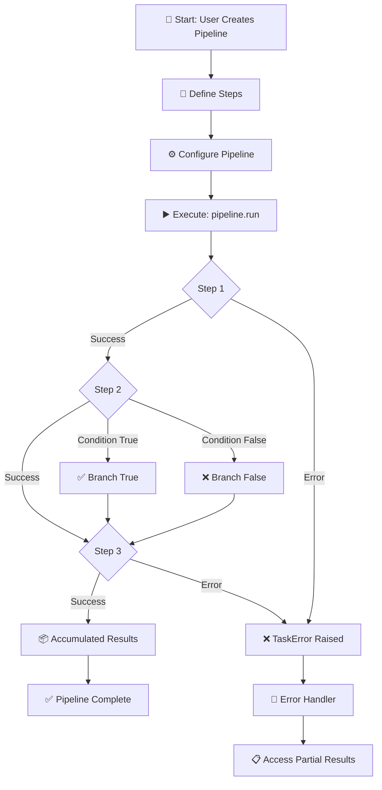
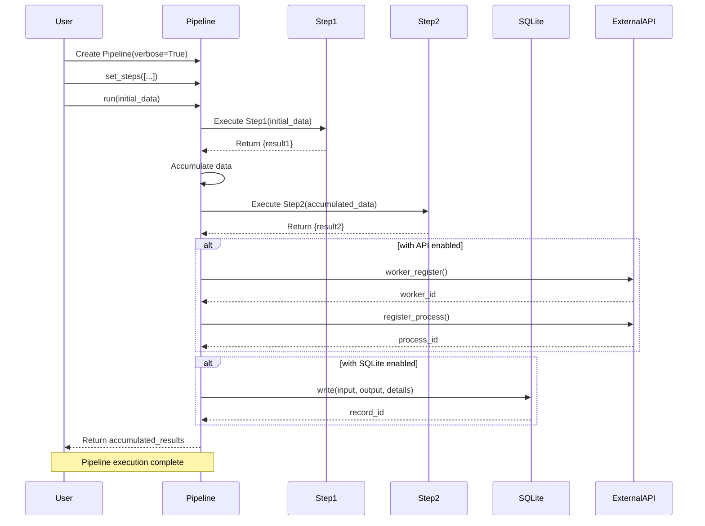
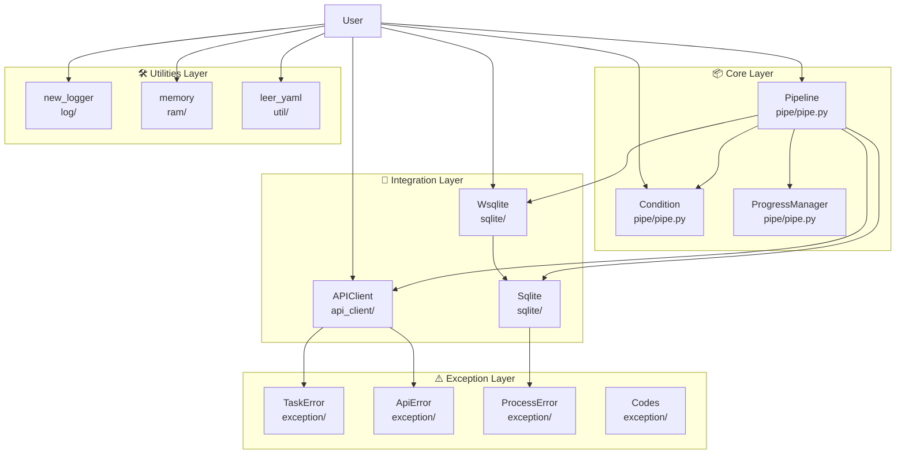
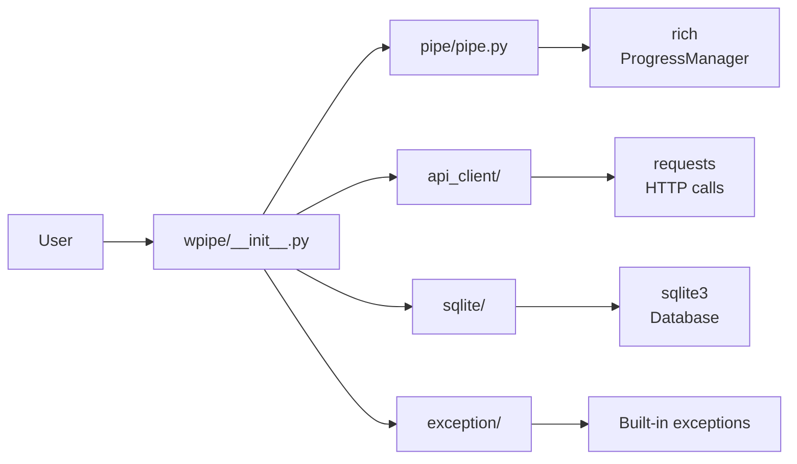
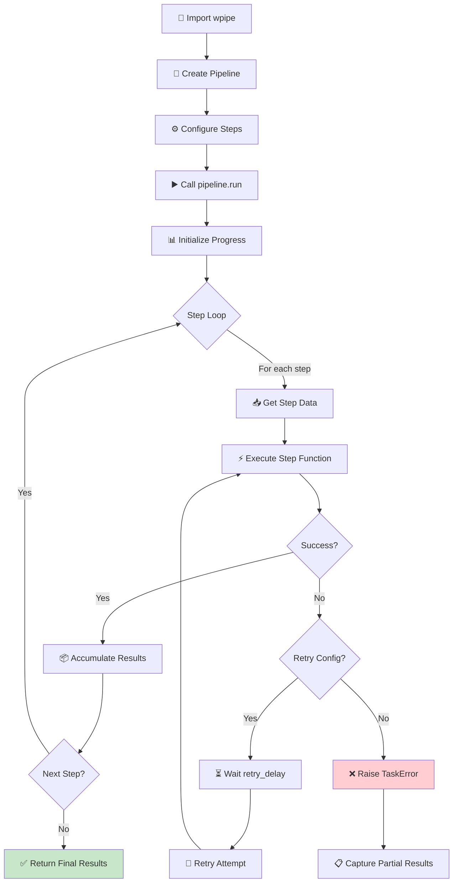

# wpipe - Python Pipeline Library for Sequential Data Processing

<!-- Logo placeholder -->
<!-- ┌─────────────────┐ -->
<!-- │                 │ -->
<!-- │     wpipe       │ -->
<!-- │   Pipeline ⚡   │ -->
<!-- │                 │ -->
<!-- └─────────────────┘ -->

[](https://badge.fury.io/py/wpipe)
[](https://pypi.org/project/wpipe/)
[](https://opensource.org/licenses/MIT)
[](CHANGELOG.md)
[](https://github.com/wisrovi/wpipe/actions)
[](https://wpipe.readthedocs.io/)

> **Version 2.0.0-LTS**: Long-Term Support release with parallel execution, pipeline composition, step decorators, resource monitoring, checkpointing, and 90% test coverage.

## Project Overview

**wpipe** is a powerful, enterprise-grade Python library for creating and executing complex data processing pipelines. It is designed for mission-critical environments where reliability, observability, and performance are paramount. Now in its **LTS (Long-Term Support)** phase, WPipe guarantees a stable API and long-term maintenance.

### Key Characteristics

- **No web UI required** - Just clean, production-ready Python code
- **Minimal dependencies** - Only `requests` and `pyyaml`
- **Production-ready** - Comprehensive error handling, retry logic, and logging
- **Well-documented** - Extensive docs, tutorials, and 100+ examples
- **100% Type Hints** - Excellent IDE support and better developer experience

---

## Features

| Feature | Description |
|---------|-------------|
| 🔗 **Pipeline Orchestration** | Create pipelines with step functions and classes |
| 🌳 **Conditional Branches** | Execute different paths based on data conditions |
| 🔄 **Retry Logic** | Automatic retries with configurable backoff strategies |
| 🌐 **API Integration** | Connect to external APIs, register workers |
| 💾 **SQLite Storage** | Persist execution results to database |
| ⚠️ **Error Handling** | Custom exceptions and detailed error codes |
| 📋 **YAML Configuration** | Load and manage configurations |
| 🔀 **Nested Pipelines** | Compose complex workflows |
| 📊 **Progress Tracking** | Rich terminal output |
| 🧪 **Type Hints** | Complete type annotations |
| 🔒 **Memory Control** | Built-in memory utilities |
| 🧩 **Composable** | Reusable pipeline components |
| ⚡ **Parallel Execution** | Execute steps in parallel (I/O or CPU bound) |
| 📂 **Pipeline Composition** | Use pipelines as steps in other pipelines |
| 🎯 **Step Decorators** | Define steps inline with @step decorator |
| 💾 **Checkpointing** | Save and resume from checkpoints |
| ⏱️ **Timeouts** | Prevent hanging tasks with timeout support |
| 📈 **Resource Monitoring** | Track RAM and CPU during execution |
| 📤 **Export** | Export logs, metrics, and statistics to JSON/CSV |

---

## 🚶 Diagram Walkthrough

The following diagram shows the high-level execution flow of a typical wpipe pipeline:



### Flow Description

1. **Start**: User creates a Pipeline instance and defines step functions
2. **Configure**: Steps are registered with name and version metadata
3. **Execute**: `pipeline.run()` starts the sequential execution
4. **Data Flow**: Each step receives accumulated results from all previous steps
5. **Conditions**: Optional branching based on data evaluation
6. **Complete**: Final accumulated results are returned

---

## 🗺️ System Workflow

The following sequence diagram shows the interaction between components during pipeline execution:



---

## 🏗️ Architecture Components

The following diagram illustrates the static structure and dependencies of wpipe's main modules:



### Module Dependencies



---

## ⚙️ Container Lifecycle

### Build Process


### Runtime Process



---

## 📂 File-by-File Guide

| File/Directory | Purpose | Description |
|----------------|---------|-------------|
| `wpipe/__init__.py` | Main exports | Exports Pipeline, Condition, APIClient, Wsqlite |
| `wpipe/pipe/pipe.py` | Core logic | Pipeline, Condition, ProgressManager classes |
| `wpipe/api_client/api_client.py` | HTTP client | APIClient, send_post, send_get functions |
| `wpipe/sqlite/Sqlite.py` | Database | Core SQLite operations |
| `wpipe/sqlite/Wsqlite.py` | Wrapper | Context manager for simple DB operations |
| `wpipe/log/log.py` | Logging | new_logger function (loguru) |
| `wpipe/ram/ram.py` | Memory | memory decorator, memory_limit, get_memory |
| `wpipe/util/utils.py` | Config | leer_yaml, escribir_yaml functions |
| `wpipe/exception/api_error.py` | Errors | TaskError, ApiError, ProcessError, Codes |
| `docs/source/` | Documentation | Sphinx documentation source files |
| `examples/` | Examples | 100+ working examples organized by topic |
| `test/` | Tests | pytest test suite (106 tests) |

---

## Getting Started

### Installation

#### PyPI (Recommended)

```bash
pip install wpipe
```

#### From Source

```bash
git clone https://github.com/wisrovi/wpipe
cd wpipe
pip install -e .
```

#### Development Install

```bash
pip install -e ".[dev]"
```

### Requirements

- Python 3.9 or higher
- requests (for API integration)
- pyyaml (for YAML configuration)

### Verification

```python
import wpipe
print(wpipe.__version__)  # 2.0.0
```

---

## Usage/Examples

### Basic Pipeline

```python
from wpipe import Pipeline

def fetch_data(data):
    """Fetch data from a source."""
    return {"users": [{"name": "Alice"}, {"name": "Bob"}, {"name": "Charlie"}]}

def process_data(data):
    """Process the fetched data."""
    users = data["users"]
    return {"count": len(users), "names": [u["name"] for u in users]}

def save_data(data):
    """Save results."""
    return {"status": "saved", "processed": data["count"]}

# Create and configure your pipeline
pipeline = Pipeline(verbose=True)
pipeline.set_steps([
    (fetch_data, "Fetch Data", "v1.0"),
    (process_data, "Process Data", "v1.0"),
    (save_data, "Save Data", "v1.0"),
])

# Run the pipeline
result = pipeline.run({})
# Output: {'users': [...], 'count': 3, 'names': [...], 'status': 'saved', 'processed': 3}
```

### Conditional Pipeline

```python
from wpipe import Pipeline, Condition

def check_value(data):
    return {"value": 75}

def process_high(data):
    return {"result": "High value"}

def process_low(data):
    return {"result": "Low value"}

condition = Condition(
    expression="value > 50",
    branch_true=[(process_high, "High", "v1.0")],
    branch_false=[(process_low, "Low", "v1.0")],
)

pipeline = Pipeline(verbose=True)
pipeline.set_steps([
    (check_value, "Check", "v1.0"),
    condition,
])
```

### With SQLite Storage

```python
from wpipe import Pipeline
from wpipe.sqlite import Wsqlite

with Wsqlite(db_name="results.db") as db:
    db.input = {"x": 10}
    result = pipeline.run({"x": 10})
    db.output = result
    print(f"Record ID: {db.id}")
```

### With Retry Logic

```python
pipeline = Pipeline(
    verbose=True,
    max_retries=3,
    retry_delay=2.0,
    retry_on_exceptions=(ConnectionError, TimeoutError),
)
```

---

## Advanced Usage

### ParallelExecutor

Execute pipeline steps in parallel using thread or process pools. Ideal for I/O-bound tasks (API calls, file operations) or CPU-bound tasks (data transformations).

```python
from wpipe import ParallelExecutor, ExecutionMode

def fetch_users(context):
    """Simulate fetching users from an API (I/O-bound)."""
    return {"users": ["Alice", "Bob", "Charlie"]}

def fetch_orders(context):
    """Simulate fetching orders from another API (I/O-bound)."""
    return {"orders": [101, 102, 103]}

def fetch_products(context):
    """Simulate fetching product catalog (I/O-bound)."""
    return {"products": ["Widget", "Gadget", "Thingamajig"]}

def merge_data(context):
    """Merge all fetched data into a single report."""
    return {
        "report": {
            "users": context.get("users", []),
            "orders": context.get("orders", []),
            "products": context.get("products", []),
        }
    }

# Create the parallel executor
executor = ParallelExecutor(max_workers=4)

# Add steps - the first three can run in parallel (no dependencies)
executor.add_step("fetch_users", fetch_users, mode=ExecutionMode.IO_BOUND)
executor.add_step("fetch_orders", fetch_orders, mode=ExecutionMode.IO_BOUND)
executor.add_step("fetch_products", fetch_products, mode=ExecutionMode.IO_BOUND)

# merge_data depends on all three fetch steps
executor.add_step(
    "merge_data",
    merge_data,
    mode=ExecutionMode.IO_BOUND,
    depends_on=["fetch_users", "fetch_orders", "fetch_products"],
)

# Execute with initial context
result = executor.execute({})
print(result)
# Output: {'users': [...], 'orders': [...], 'products': [...], 'report': {...}}
```

For CPU-bound tasks, use `ExecutionMode.CPU_BOUND` which leverages `ProcessPoolExecutor`:

```python
import math

def heavy_computation_a(context):
    """CPU-intensive calculation."""
    result = sum(math.sqrt(i) for i in range(1_000_000))
    return {"result_a": result}

def heavy_computation_b(context):
    """Another CPU-intensive calculation."""
    result = sum(math.factorial(i % 20) for i in range(10_000))
    return {"result_b": result}

executor = ParallelExecutor(max_workers=2)
executor.add_step("calc_a", heavy_computation_a, mode=ExecutionMode.CPU_BOUND)
executor.add_step("calc_b", heavy_computation_b, mode=ExecutionMode.CPU_BOUND)

result = executor.execute({})
```

### For Class

Iterate over data or run steps multiple times with count-based or condition-based loops.

```python
from wpipe import Pipeline, For

def load_items(data):
    """Load a list of items to process."""
    return {"items": [{"id": 1, "name": "A"}, {"id": 2, "name": "B"}, {"id": 3, "name": "C"}]}

def process_item(data):
    """Process a single item."""
    current_index = data.get("_loop_iteration", 0)
    items = data.get("items", [])
    if current_index < len(items):
        item = items[current_index]
        return {"processed": data.get("processed", []) + [item["name"]]}
    return {}

def finalize(data):
    """Finalize processing."""
    return {"total_processed": len(data.get("processed", []))}

# Count-based loop: run process_item exactly 3 times
loop_step = For(iterations=3, steps=[(process_item, "Process Item", "v1.0")])

pipeline = Pipeline(verbose=True)
pipeline.set_steps([
    (load_items, "Load Items", "v1.0"),
    loop_step,
    (finalize, "Finalize", "v1.0"),
])

result = pipeline.run({})
# Output: {'items': [...], 'processed': ['A', 'B', 'C'], 'total_processed': 3}
```

Condition-based loop that runs until a condition is false:

```python
from wpipe import For

def generate_data(data):
    """Generate or update data each iteration."""
    current = data.get("counter", 0) + 1
    return {"counter": current, "value": current * 10}

# Loop until counter reaches 5
loop_step = For(
    validation_expression="counter < 5",
    steps=[(generate_data, "Generate", "v1.0")],
)

pipeline = Pipeline(verbose=True)
pipeline.set_steps([loop_step])

result = pipeline.run({"counter": 0})
# Runs 5 iterations until counter >= 5
```

### NestedPipelineStep / Composition

Use a pipeline as a step within another pipeline for modular, composable workflows.

```python
from wpipe import Pipeline, PipelineAsStep, NestedPipelineStep

# --- Inner pipeline: data cleaning ---
def load_raw(data):
    return {"raw": [1, 2, None, 4, None, 6]}

def clean_data(data):
    cleaned = [x for x in data["raw"] if x is not None]
    return {"cleaned": cleaned, "removed_none": 2}

cleaning_pipeline = Pipeline(verbose=False)
cleaning_pipeline.set_steps([
    (load_raw, "Load Raw", "v1.0"),
    (clean_data, "Clean Data", "v1.0"),
])

# --- Inner pipeline: data analysis ---
def analyze(data):
    cleaned = data.get("cleaned", [])
    return {
        "mean": sum(cleaned) / len(cleaned),
        "min": min(cleaned),
        "max": max(cleaned),
    }

analysis_pipeline = Pipeline(verbose=False)
analysis_pipeline.set_steps([
    (analyze, "Analyze", "v1.0"),
])

# --- Outer pipeline: compose both ---
# Option 1: Use PipelineAsStep (simple wrapper)
data_step = PipelineAsStep(name="Data Cleaning", pipeline=cleaning_pipeline)

# Option 2: Use NestedPipelineStep with filters (advanced)
def filter_context(context):
    """Only pass relevant keys to child pipeline."""
    return {"cleaned": context.get("cleaned", [])}

nested_analysis = NestedPipelineStep(
    name="Analysis",
    pipeline=analysis_pipeline,
    context_filter=filter_context,
)

outer_pipeline = Pipeline(verbose=True)
outer_pipeline.set_steps([
    data_step,
    nested_analysis,
])

result = outer_pipeline.run({})
# Output: {'raw': [...], 'cleaned': [1, 2, 4, 6], 'removed_none': 2, 'mean': 3.25, 'min': 1, 'max': 6}
```

### @step Decorator

Define pipeline steps inline using the `@step` decorator instead of tuples.

```python
import wpipe

@wpipe.step(name="Fetch Users", version="v2.0", timeout=30)
def fetch_users(data):
    """Fetch users from an external source."""
    return {"users": [{"id": 1, "name": "Alice"}, {"id": 2, "name": "Bob"}]}

@wpipe.step(
    name="Enrich Users",
    version="v1.0",
    depends_on=["Fetch Users"],
    retry_count=2,
    tags=["enrichment", "users"],
)
def enrich_users(data):
    """Add additional data to each user."""
    enriched = []
    for user in data.get("users", []):
        user["status"] = "active"
        user["score"] = 100
        enriched.append(user)
    return {"enriched_users": enriched, "count": len(enriched)}

@wpipe.step(name="Generate Report", version="v1.0", description="Final report generation")
def generate_report(data):
    """Generate a summary report."""
    return {
        "report": f"Processed {data.get('count', 0)} users successfully",
        "status": "complete",
    }

# Auto-register all decorated steps to the pipeline
pipeline = Pipeline(verbose=True)
wpipe.AutoRegister.register_all(pipeline)

result = pipeline.run({})
# Output: {'users': [...], 'enriched_users': [...], 'count': 2, 'report': '...', 'status': 'complete'}

# Or register by tag
pipeline2 = Pipeline(verbose=True)
wpipe.AutoRegister.register_by_tag(pipeline2, tag="enrichment")
```

You can also use decorated steps manually in `set_steps`:

```python
import wpipe

@wpipe.step(name="Step A", version="v1.0")
def step_a(data):
    return {"a": 1}

@wpipe.step(name="Step B", version="v1.0")
def step_b(data):
    return {"b": data.get("a", 0) + 1}

pipeline = Pipeline(verbose=True)
pipeline.set_steps([
    step_a,
    step_b,
])

result = pipeline.run({})
```

### CheckpointManager

Save pipeline execution state and resume from checkpoints after interruptions.

```python
from wpipe import Pipeline, CheckpointManager

def step_1(data):
    return {"data_1": "processed"}

def step_2(data):
    return {"data_2": "processed"}

def step_3(data):
    return {"data_3": "processed"}

# Create a checkpoint manager pointing to a tracking database
checkpoint_mgr = CheckpointManager(db_path="tracking.db")

pipeline = Pipeline(
    verbose=True,
    tracking_db="tracking.db",
    pipeline_name="My Checkpointed Pipeline",
)
pipeline.set_steps([
    (step_1, "Step 1", "v1.0"),
    (step_2, "Step 2", "v1.0"),
    (step_3, "Step 3", "v1.0"),
])

# First run - executes all steps and saves checkpoints
result = pipeline.run({}, checkpoint_mgr=checkpoint_mgr, checkpoint_id="my_pipeline_001")

# Check if we can resume
if checkpoint_mgr.can_resume("my_pipeline_001"):
    stats = checkpoint_mgr.get_checkpoint_stats("my_pipeline_001")
    print(f"Checkpoints: {stats}")
    # Output: {'total_checkpoints': 3, 'successful': 3, 'failed': 0, ...}

    # Get the last checkpoint
    last = checkpoint_mgr.get_last_checkpoint("my_pipeline_001")
    print(f"Last checkpoint: step {last['step_order']} - {last['step_name']}")

# To manually resume, pass the same checkpoint_id:
# result = pipeline.run({}, checkpoint_mgr=checkpoint_mgr, checkpoint_id="my_pipeline_001")

# Clear checkpoints when done
checkpoint_mgr.clear_checkpoints("my_pipeline_001")
```

### ResourceMonitor

Track CPU and RAM usage during pipeline or task execution.

```python
from wpipe import ResourceMonitor

# As a context manager for any block of code
with ResourceMonitor(task_name="data_processing") as monitor:
    # Simulate some work
    result = sum(i ** 2 for i in range(10_000_000))
    data = {"result": result}

# Get the monitoring summary
summary = monitor.get_summary()
print(f"Elapsed: {summary['elapsed_seconds']:.2f}s")
print(f"Peak RAM: {summary['peak_ram_mb']:.2f} MB")
print(f"Avg CPU: {summary['avg_cpu_percent']:.2f}%")
print(f"RAM increase: {summary['ram_increase_mb']:.2f} MB")
```

With persistent storage to SQLite:

```python
from wpipe import ResourceMonitor, ResourceMonitorRegistry

registry = ResourceMonitorRegistry()

# Monitor multiple tasks
task_names = ["etl_extract", "etl_transform", "etl_load"]

for task_name in task_names:
    with ResourceMonitor(task_name=task_name, db_path="metrics.db") as monitor:
        # Simulate work
        _ = [x ** 2 for x in range(1_000_000)]
        registry.add(task_name, monitor)

# Get aggregate statistics
full_summary = registry.get_summary()
peak_ram = registry.get_peak_ram()
print(f"Peak RAM across all tasks: {peak_ram:.2f} MB")
```

### PipelineExporter

Export pipeline execution logs, metrics, and statistics to JSON or CSV.

```python
from wpipe import Pipeline, PipelineExporter

# After running pipelines with tracking_db enabled, export the data
exporter = PipelineExporter(db_path="tracking.db")

# Export execution logs as JSON
logs_json = exporter.export_pipeline_logs(format="json")
print(logs_json)

# Export logs to a file
exporter.export_pipeline_logs(
    pipeline_id="abc-123",
    format="json",
    output_path="pipeline_logs.json",
)

# Export logs as CSV
exporter.export_pipeline_logs(
    format="csv",
    output_path="pipeline_logs.csv",
)

# Export system metrics
metrics_json = exporter.export_metrics(format="json", output_path="metrics.json")

# Export statistics summary (JSON only)
stats = exporter.export_statistics(format="json", output_path="statistics.json")
print(stats)
# Output:
# {
#   "total_executions": 42,
#   "successful_executions": 40,
#   "success_rate_percent": 95.24,
#   "average_execution_time_seconds": 3.17,
#   "exported_at": "2026-04-14T10:30:00"
# }
```

### Timeout Decorators

Prevent tasks from hanging by setting execution time limits.

```python
from wpipe import timeout_sync, TimeoutError

@timeout_sync(seconds=5)
def potentially_slow_operation(data):
    """This function will be killed if it takes more than 5 seconds."""
    import time
    time.sleep(10)  # Will timeout
    return {"result": "done"}

try:
    result = potentially_slow_operation({})
except TimeoutError as e:
    print(f"Timed out: {e}")
    # Output: Timed out: Task 'potentially_slow_operation' exceeded timeout of 5s
```

For async tasks, use `timeout_async`:

```python
import asyncio
from wpipe import timeout_async, TimeoutError

async def slow_api_call():
    """Simulate a slow async API call."""
    await asyncio.sleep(10)
    return {"data": "response"}

async def run_with_timeout():
    try:
        result = await timeout_async(seconds=3, coro=slow_api_call())
        return result
    except TimeoutError as e:
        print(f"Async timeout: {e}")
        return {"error": "request timed out"}

asyncio.run(run_with_timeout())
```

Using TaskTimer as a context manager:

```python
from wpipe import TaskTimer

with TaskTimer(task_name="heavy_computation", timeout_seconds=30) as timer:
    result = sum(i ** 2 for i in range(10_000_000))

print(f"Elapsed: {timer.elapsed_seconds:.2f}s")
if timer.exceeded_timeout():
    print("WARNING: Task exceeded timeout!")
```

### PipelineAsync

Run pipelines with async/await for I/O-bound workflows that benefit from true concurrency.

```python
import asyncio
from wpipe import PipelineAsync

async def async_fetch_users(data):
    """Async function to fetch users from an API."""
    await asyncio.sleep(0.5)  # Simulate network latency
    return {"users": [{"id": 1, "name": "Alice"}, {"id": 2, "name": "Bob"}]}

async def async_enrich(data):
    """Async function to enrich user data."""
    users = data.get("users", [])
    await asyncio.sleep(0.3)  # Simulate API call
    for user in users:
        user["role"] = "admin"
    return {"enriched_users": users}

async def async_save(data):
    """Async function to save to database."""
    await asyncio.sleep(0.2)  # Simulate DB write
    return {"saved": len(data.get("enriched_users", [])), "status": "success"}

async def main():
    pipeline = PipelineAsync(verbose=True)
    pipeline.set_steps([
        (async_fetch_users, "Fetch Users", "v1.0"),
        (async_enrich, "Enrich Users", "v1.0"),
        (async_save, "Save Users", "v1.0"),
    ])

    result = await pipeline.run({})
    print(result)
    # Output: {'users': [...], 'enriched_users': [...], 'saved': 2, 'status': 'success'}

asyncio.run(main())
```

Async pipeline with retry and error handling:

```python
import asyncio
from wpipe import PipelineAsync

async def flaky_api_call(data):
    """Simulates an API that sometimes fails."""
    import random
    await asyncio.sleep(0.1)
    if random.random() < 0.5:
        raise ConnectionError("Temporary network issue")
    return {"api_response": "success"}

async def main():
    pipeline = PipelineAsync(
        verbose=True,
        max_retries=3,
        retry_delay=1.0,
        retry_on_exceptions=(ConnectionError,),
    )
    pipeline.set_steps([
        (flaky_api_call, "Flaky API", "v1.0"),
    ])

    result = await pipeline.run({})
    print(result)

asyncio.run(main())
```

---

## Data Flow Visualization

```
┌───────────────────────────────────────────────────────────────────────────┐
│                        PIPELINE EXECUTION FLOW                            │
└───────────────────────────────────────────────────────────────────────────┘

Input          Step 1            Step 2            Step 3            Output
──────          ──────            ──────            ──────            ──────
┌─────┐      ┌─────────┐      ┌─────────┐      ┌─────────┐      ┌─────────┐
│  {}  │────▶│  Fetch  │────▶│ Process │────▶│  Save   │────▶│ Result  │
└─────┘      │  Data   │      │  Data   │      │  Data   │      └─────────┘
             └─────────┘      └─────────┘      └─────────┘
             {users: [...]}   {users, count}   {count, status}
```

---

## API Reference

### Pipeline

```python
from wpipe import Pipeline

pipeline = Pipeline(
    verbose=True,           # Enable verbose output
    api_config={},         # API configuration
    max_retries=3,         # Maximum retry attempts
    retry_delay=1.0,       # Delay between retries
    retry_on_exceptions=(ConnectionError, TimeoutError),
)
```

**Methods:**
- `set_steps(steps)` - Configure pipeline steps
- `run(input_data)` - Execute the pipeline
- `worker_register(name, version)` - Register with API
- `set_worker_id(worker_id)` - Set worker ID

### Condition

```python
from wpipe import Condition

condition = Condition(
    expression="value > 50",
    branch_true=[(step_true, "True", "v1.0")],
    branch_false=[(step_false, "False", "v1.0")],
)
```

### Exceptions

```python
from wpipe.exception import TaskError, ApiError, ProcessError, Codes

try:
    result = pipeline.run(data)
except TaskError as e:
    print(f"Step: {e.step_name}")
    print(f"Code: {e.error_code}")
```

**Error Codes:**
- `TASK_FAILED` (502) - Task execution failed
- `API_ERROR` (501) - API communication error
- `UPDATE_PROCESS_ERROR` (504) - Process update failed
- `UPDATE_TASK` (505) - Task update failed
- `UPDATE_PROCESS_OK` (503) - Process completed successfully

---

## Code Quality

| Metric | Value |
|--------|-------|
| Tests | 106 passing |
| Examples | 100+ |
| Python Support | 3.9, 3.10, 3.11, 3.12, 3.13 |
| Type Hints | Complete |
| Docstrings | Google-style |

### Running Tests

```bash
# Run all tests
pytest

# Run with coverage
pytest --cov=wpipe --cov-report=html
open htmlcov/index.html

# Lint
ruff check wpipe/

# Auto-fix linting
ruff check wpipe/ --fix

# Type check
mypy wpipe/

# All quality checks
ruff check wpipe/ && mypy wpipe/ && pytest
```

---

## Examples

Explore **100+ examples** organized by functionality:

| Folder | Examples | Description |
|--------|----------|-------------|
| [01_basic_pipeline](examples/01_basic_pipeline/) | 15 | Functions, classes, mixed steps, data flow, async |
| [02_api_pipeline](examples/02_api_pipeline/) | 20 | External APIs, workers, authentication, health checks |
| [03_error_handling](examples/03_error_handling/) | 15 | Exceptions, error codes, recovery, partial results |
| [04_condition](examples/04_condition/) | 12 | Conditional branches, decision trees, boolean logic |
| [05_retry](examples/05_retry/) | 12 | Automatic retries, backoff, custom exceptions |
| [06_sqlite_integration](examples/06_sqlite_integration/) | 14 | Persistence, CSV export, batch operations |
| [07_nested_pipelines](examples/07_nested_pipelines/) | 14 | Complex workflows, parallel execution, recursion |
| [08_yaml_config](examples/08_yaml_config/) | 14 | Configuration, environment variables, validation |
| [09_microservice](examples/09_microservice/) | 11 | Production-ready microservice patterns |

### Running Examples

```bash
# Basic pipeline
python examples/01_basic_pipeline/01_simple_function/example.py

# With conditions
python examples/04_condition/01_basic_condition_example/example.py

# With SQLite
python examples/06_sqlite_integration/02_wsqlite_example/example.py

# With retry
python examples/05_retry/01_basic_retry_example/example.py
```

---

## Architecture

```
wpipe/
├── __init__.py           # Main exports (Pipeline, Condition, APIClient, Wsqlite)
├── pipe/
│   └── pipe.py           # Pipeline, Condition, ProgressManager
├── api_client/
│   └── api_client.py     # APIClient, send_post, send_get
├── sqlite/
│   ├── Sqlite.py         # Core SQLite operations
│   └── Wsqlite.py        # Simplified context manager wrapper
├── log/
│   └── log.py            # Logging utilities (loguru)
├── ram/
│   └── ram.py            # Memory control utilities
├── util/
│   └── utils.py          # YAML utilities (leer_yaml, escribir_yaml)
└── exception/
    └── api_error.py      # TaskError, ApiError, ProcessError, Codes
```

---

## Documentation

| Resource | URL |
|----------|-----|
| Documentation | https://wpipe.readthedocs.io/ |
| Live Demo | https://wisrovi.github.io/wpipe/ |
| PyPI Package | https://pypi.org/project/wpipe/ |
| GitHub Repository | https://github.com/wisrovi/wpipe |
| Releases | https://github.com/wisrovi/wpipe/releases |
| Issues | https://github.com/wisrovi/wpipe/issues |

---

## Why wpipe?

| Traditional Tools | wpipe |
|-------------------|-------|
| Complex setup | Simple pip install |
| Web UI required | Pure Python code |
| Heavy dependencies | Minimal requirements |
| YAML/JSON config | Python code |
| Overkill for simple tasks | Perfect for any scale |

---

## License

MIT License - See [LICENSE](LICENSE) file

---

## Author

**William Steve Rodriguez Villamizar**

- GitHub: [github.com/wisrovi](https://github.com/wisrovi)
- LinkedIn: [linkedin.com/in/wisrovi-rodriguez](https://www.linkedin.com/in/wisrovi-rodriguez/)
- Portfolio: [wisrovi.github.io](https://wisrovi.github.io/)

---

<p align="center">
  <strong>Star ⭐ this repo if you find it useful!</strong>
</p>
