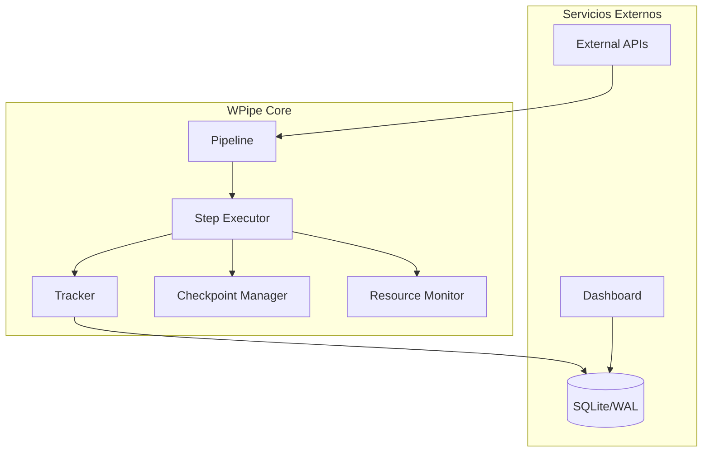
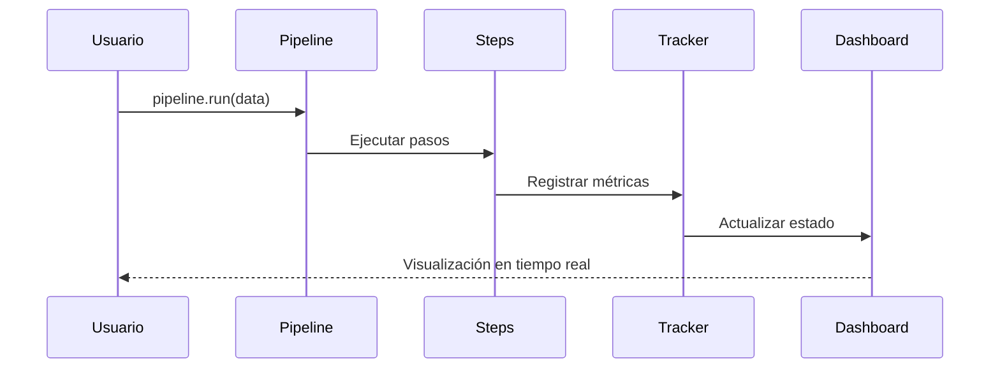
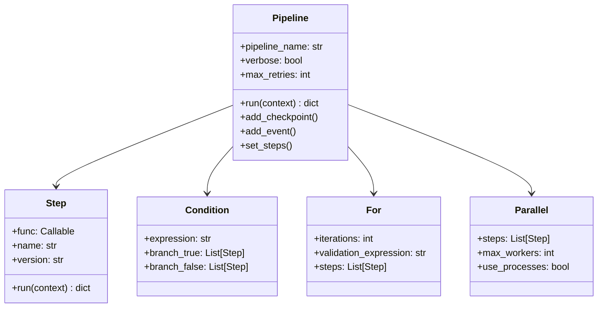
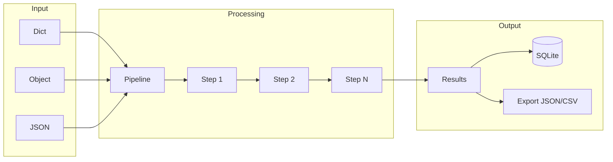

# 🚀 WPipe v2.1.0

**El motor de orquestación de pipelines más rápido, resiliente y puro para Python.**

WPipe es una librería industrial diseñada para automatizar flujos de trabajo complejos, garantizando que tus datos viajen seguros, tus procesos sean ultra-rápidos y tus fallos sean fáciles de diagnosticar.

[](https://badge.fury.io/py/wpipe)
[](https://wpipe.readthedocs.io/en/latest/?badge=latest)
[](https://opensource.org/licenses/MIT)

---

## 📐 Arquitectura del Sistema



---

## 🛠️ Instalación

```bash
pip install wpipe
```

---

## 🚀 Ejemplo: Pipeline con Paralelismo y Checkpoints

```python
from wpipe import Pipeline, For, Condition, Parallel, step, to_obj, PipelineContext

class MiContexto(PipelineContext):
    motor: str
    temperatura: float

@step(name="Verificar", retry_count=3)
@to_obj(MiContexto)
def verificar_motor(ctx: MiContexto):
    print(f"Chequeando motor: {ctx.motor}")
    return {"temperatura": 85.5}

viaje = Pipeline(pipeline_name="Viaje_LTS", verbose=True)
viaje.add_checkpoint("arranque", expression="temperatura > 0")

viaje.set_steps([
    verificar_motor,
    Parallel(
        steps=[revisar_luces, hechar_gasolina],
        max_workers=2
    ),
    For(iterations=10, steps=[conducir_paso])
])

results = viaje.run({"motor": "V8"})
```

### Flujo de Ejecución



---

## 📊 Features

| Feature | Descripción |
|---------|-------------|
| 🔗 Pipeline Orchestration | Crear pipelines con funciones y clases como pasos |
| 🌳 Conditional Branches | Ejecutar diferentes rutas basadas en condiciones de datos |
| 🔄 Retry Logic | Reintentos automáticos con estrategias configurables |
| 🌐 API Integration | Conectar a APIs externas, registrar workers |
| 💾 SQLite Storage | Persistir resultados de ejecución a base de datos |
| ⚠️ Error Handling | Excepciones personalizadas y códigos de error detallados |
| 📋 YAML Configuration | Cargar y gestionar configuraciones |
| 🔀 Nested Pipelines | Componer flujos de trabajo complejos |
| 📊 Progress Tracking | Salida rica en terminal |
| 🧪 Type Hints | Anotaciones de tipo completas |
| 🔒 Memory Control | Utilidades integradas de memoria |
| 🧩 Composable | Componentes reutilizables de pipeline |
| ⚡ Parallel Execution | Ejecutar pasos en paralelo (I/O o CPU bound) |
| 📂 Pipeline Composition | Usar pipelines como pasos de otros pipelines |
| 🎯 Step Decorators | Definir pasos en línea con @step decorator |
| 💾 Checkpointing | Guardar y resumir desde checkpoints |
| ⏱️ Timeouts | Prevenir tareas colgadas con soporte de timeout |
| 📈 Resource Monitoring | Rastrear RAM y CPU durante ejecución |
| 📤 Export | Exportar logs, métricas y estadísticas a JSON/CSV |
| 🎪 Events & Hooks | Eventos pre/post ejecución y hooks personalizados |
| 📉 Alerts | Alertas configurables basadas en métricas |
| 🔐 Type Validation | Validación de esquemas con PipelineContext |
| 🔄 Async Pipeline | Soporte completo para pipelines asíncronos |
| 🏗️ DAG Scheduling | Programación basada en grafos acíclicos dirigidos |

---

## 🏗️ Componentes del Pipeline



---

## 🔄 Flujo de Datos



---

## 📈 Dashboard

El dashboard integrado permite visualizar pipelines en tiempo real:

```python
from wpipe import start_dashboard

start_dashboard(db_path="mi_tracking.db", port=8000)
```

---

## 🛡️ Soporte y Calidad

- **LTS Policy**: WPipe v2.1+ cuenta con soporte a largo plazo.
- **95% Test Coverage**: Probado rigurosamente en entornos síncronos y asíncronos.
- **Arquitectura Pura**: Unificación total bajo `wsqlite`, eliminando SQL crudo del núcleo.

---

Diseñado con ❤️ por **William Rodriguez** (wisrovi) para ingenieros que no aceptan menos que la perfección.
