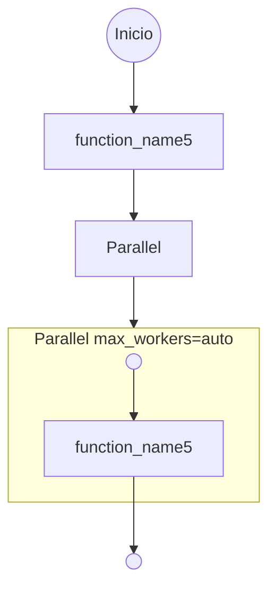

# WPipe DAG Debug

Archivo: `test_extension.py`

```mermaid
flowchart TD
  Inicio((Inicio))
  Inicio --> n_function_name5_L0["function_name5"]
  n_function_name5_L0 --> n_ParCall_L1[Parallel]
  n_ParCall_L1 --> n_SubPar_L1
  subgraph n_SubPar_L1 [Parallel max_workers=auto]
    n_PStart_0_L1(( ))
    n_PStart_0_L1 --> n_function_name5_L1P00["function_name5"]

  end
  n_PMerge_L1(( ))
  n_function_name5_L1P00 --> n_PMerge_L1

```
