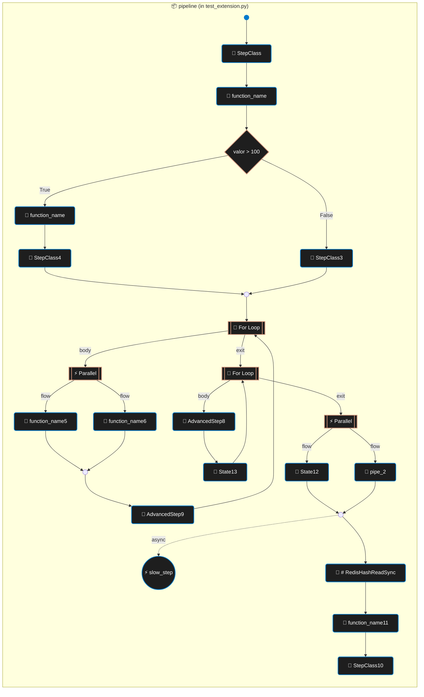

# Pipeline DAG: test_extension.py

Generated by WPipe Tools

```mermaid
flowchart TD
  classDef step fill:#1e1e1e,stroke:#007acc,stroke-width:2px,color:#fff,rx:5,ry:5
  classDef logic fill:#1e1e1e,stroke:#ce9178,stroke-width:2px,color:#fff,rx:2,ry:2
  classDef startN fill:#007acc,stroke:#007acc,color:#fff
  subgraph sg_pldnh ["📦 pipeline (in test_extension.py)"]
    direction TD
    start_pldnh(( )):::startN
      start_pldnh --> nLpldnh0[" 🚀 StepClass "]:::step
      nLpldnh0 --> nLpldnh1[" 🚀 function_name "]:::step
      nLpldnh1 --> nLpldnh2{"valor > 100"}:::logic
      nLpldnh2 -- True --> nnLpldnh2T0[" 🚀 function_name "]:::step
      nnLpldnh2T0 --> nnLpldnh2T1[" 🚀 StepClass4 "]:::step
      nnLpldnh2T1 --> nLpldnh2_m(( ))
      nLpldnh2 -- False --> nnLpldnh2F0[" 🚀 StepClass3 "]:::step
      nnLpldnh2F0 --> nLpldnh2_m(( ))
      nLpldnh2_m --> nLpldnh3[[" 🔄 For Loop "]]:::logic
      nLpldnh3 -- body --> nnLpldnh3F0[[" ⚡ Parallel "]]:::logic
      nnLpldnh3F0 -- flow --> nnnLpldnh3F0P00[" 🚀 function_name5 "]:::step
      nnnLpldnh3F0P00 --> nnLpldnh3F0_m(( ))
      nnLpldnh3F0 -- flow --> nnnLpldnh3F0P10[" 🚀 function_name6 "]:::step
      nnnLpldnh3F0P10 --> nnLpldnh3F0_m(( ))
      nnLpldnh3F0_m --> nnLpldnh3F1[" 🚀 AdvancedStep9 "]:::step
      nnLpldnh3F1 --> nLpldnh3
      nLpldnh3 -- exit --> nLpldnh4[[" 🔄 For Loop "]]:::logic
      nLpldnh4 -- body --> nnLpldnh4F0[" 🚀 AdvancedStep8 "]:::step
      nnLpldnh4F0 --> nnLpldnh4F1[" 🚀 State13 "]:::step
      nnLpldnh4F1 --> nLpldnh4
      nLpldnh4 -- exit --> nLpldnh5[[" ⚡ Parallel "]]:::logic
      nLpldnh5 -- flow --> nnLpldnh5P00[" 🚀 State12 "]:::step
      nnLpldnh5P00 --> nLpldnh5_m(( ))
      nLpldnh5 -- flow --> nnLpldnh5P10[" 🚀 pipe_2 "]:::step
      nnLpldnh5P10 --> nLpldnh5_m(( ))
      nLpldnh5_m -. async .-> nLpldnh6((" ⚡ slow_step ")):::step
      nLpldnh5_m --> nLpldnh7[" 🚀 # RedisHashReadSync "]:::step
      nLpldnh7 --> nLpldnh8[" 🚀 function_name11 "]:::step

      nLpldnh8 --> nAfxq0[" 🚀 StepClass10 "]:::step

  end

```