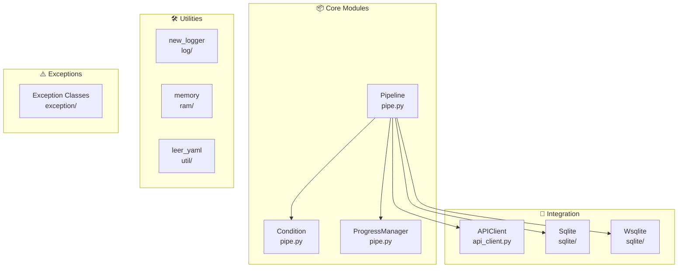
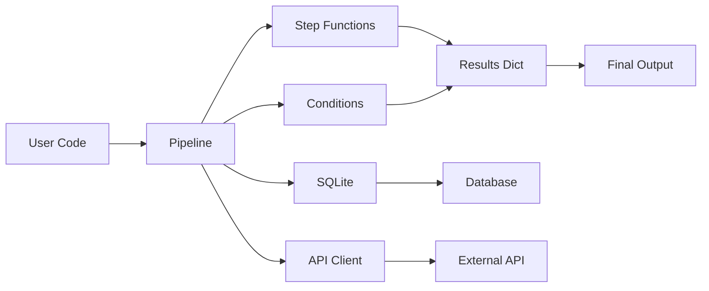

# wpipe - Core Package

<!-- Logo placeholder -->
<!-- ┌─────────────────┐ -->
<!-- │     wpipe       │ -->
<!-- │    Package      │ -->
<!-- └─────────────────┘ -->

This package contains the core library for creating and executing data processing pipelines.

## Project Overview

**wpipe** is a powerful, lightweight Python library for creating and executing sequential data processing pipelines. The core package provides all essential classes and utilities for building production-ready data workflows.

---

## Module Structure



### Module Descriptions

| Module | File | Description |
|--------|------|-------------|
| **pipe** | `pipe/pipe.py` | Pipeline, Condition, ProgressManager classes |
| **api_client** | `api_client/api_client.py` | HTTP client for API integration |
| **sqlite** | `sqlite/` | Sqlite and Wsqlite database classes |
| **log** | `log/log.py` | Logging utilities using loguru |
| **ram** | `ram/ram.py` | Memory management utilities |
| **util** | `util/utils.py` | YAML configuration utilities |
| **exception** | `exception/` | Custom exceptions and error codes |

---

## Features

| Feature | Module | Description |
|---------|--------|-------------|
| 🔗 **Pipeline Orchestration** | `pipe` | Create sequential pipelines |
| 🌳 **Conditional Branches** | `pipe` | Execute based on conditions |
| 🔄 **Retry Logic** | `pipe` | Automatic retries |
| 🌐 **API Integration** | `api_client` | External API communication |
| 💾 **SQLite Storage** | `sqlite` | Database persistence |
| 📋 **YAML Config** | `util` | Configuration management |
| ⚠️ **Error Handling** | `exception` | Custom exceptions |

---

## Architecture



---

## Getting Started

### Installation

```bash
pip install -e .
```

### Basic Usage

```python
from wpipe import Pipeline, Condition
from wpipe.sqlite import Wsqlite
from wpipe.exception import TaskError

# Create a pipeline
pipeline = Pipeline(verbose=True)
pipeline.set_steps([
    (my_function, "Step Name", "v1.0"),
    (another_function, "Another Step", "v1.0"),
])
result = pipeline.run(input_data)
```

---

## Code Quality

| Metric | Value |
|--------|-------|
| Type Hints | Complete |
| Docstrings | Google-style |
| Tests | 106 passing |

---

## File Structure

```
wpipe/
├── __init__.py           # Main exports
├── pipe/
│   ├── __init__.py
│   └── pipe.py           # Pipeline, Condition, ProgressManager
├── api_client/
│   ├── __init__.py
│   └── api_client.py     # APIClient, send_post, send_get
├── sqlite/
│   ├── __init__.py
│   ├── Sqlite.py         # Core SQLite class
│   └── Wsqlite.py        # Context manager wrapper
├── log/
│   ├── __init__.py
│   └── log.py            # new_logger
├── ram/
│   ├── __init__.py
│   └── ram.py            # memory, memory_limit, get_memory
├── util/
│   ├── __init__.py
│   └── utils.py         # leer_yaml, escribir_yaml
└── exception/
    ├── __init__.py
    └── api_error.py      # TaskError, ApiError, ProcessError, Codes
```

---

## Usage Examples

### Pipeline

```python
from wpipe import Pipeline

pipeline = Pipeline(verbose=True)
pipeline.set_steps([
    (fetch_data, "Fetch Data", "v1.0"),
    (process_data, "Process Data", "v1.0"),
    (save_data, "Save Data", "v1.0"),
])
result = pipeline.run({})
```

### Conditional Pipeline

```python
from wpipe import Pipeline, Condition

condition = Condition(
    expression="value > 50",
    branch_true=[(process_high, "High", "v1.0")],
    branch_false=[(process_low, "Low", "v1.0")],
)
```

### SQLite Storage

```python
from wpipe.sqlite import Wsqlite

with Wsqlite(db_name="results.db") as db:
    db.input = input_data
    result = pipeline.run(input_data)
    db.output = result
```

### YAML Configuration

```python
from wpipe.util import leer_yaml

config = leer_yaml("config.yaml")
pipeline = Pipeline(**config["pipeline"])
```

---

## Exception Handling

```python
from wpipe.exception import TaskError, Codes

try:
    result = pipeline.run(data)
except TaskError as e:
    print(f"Step: {e.step_name}")
    print(f"Code: {e.error_code}")
```

---

## Documentation

For complete documentation and examples, see:

- Main README: [../README.md](../README.md)
- Full Docs: https://wpipe.readthedocs.io/
- Examples: [../examples/](../examples/)

---

## License

MIT License - See [../LICENSE](../LICENSE) file
