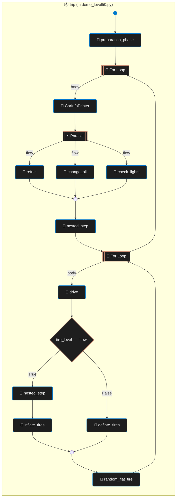

# Pipeline DAG: demo_level50.py

Generated by WPipe Tools

```mermaid
flowchart TD
  classDef step fill:#1e1e1e,stroke:#007acc,stroke-width:2px,color:#fff,rx:5,ry:5
  classDef logic fill:#1e1e1e,stroke:#ce9178,stroke-width:2px,color:#fff,rx:2,ry:2
  classDef startN fill:#007acc,stroke:#007acc,color:#fff
  subgraph sg_7f733 ["📦 trip (in demo_level50.py)"]
    direction TD
    start_7f733(( )):::startN
      start_7f733 --> nL7f7330[" 🚀 preparation_phase "]:::step
      nL7f7330 --> nL7f7331[[" 🔄 For Loop "]]:::logic
      nL7f7331 -- body --> nnL7f7331F0[" 🚀 CarInfoPrinter "]:::step
      nnL7f7331F0 --> nnL7f7331F1[[" ⚡ Parallel "]]:::logic
      nnL7f7331F1 -- flow --> nnnL7f7331F1P00[" 🚀 refuel "]:::step
      nnnL7f7331F1P00 --> nnL7f7331F1_m(( ))
      nnL7f7331F1 -- flow --> nnnL7f7331F1P10[" 🚀 change_oil "]:::step
      nnnL7f7331F1P10 --> nnL7f7331F1_m(( ))
      nnL7f7331F1 -- flow --> nnnL7f7331F1P20[" 🚀 check_lights "]:::step
      nnnL7f7331F1P20 --> nnL7f7331F1_m(( ))
      nnL7f7331F1_m --> nnL7f7331F2[" 🚀 nested_step "]:::step
      nnL7f7331F2 --> nnL7f7331F3[[" 🔄 For Loop "]]:::logic
      nnL7f7331F3 -- body --> nnnL7f7331F3F0[" 🚀 drive "]:::step
      nnnL7f7331F3F0 --> nnnL7f7331F3F1{"tire_level == 'Low'"}:::logic
      nnnL7f7331F3F1 -- True --> nnnnL7f7331F3F1T0[" 🚀 nested_step "]:::step
      nnnnL7f7331F3F1T0 --> nnnnL7f7331F3F1T1[" 🚀 inflate_tires "]:::step
      nnnnL7f7331F3F1T1 --> nnnL7f7331F3F1_m(( ))
      nnnL7f7331F3F1 -- False --> nnnnL7f7331F3F1F0[" 🚀 deflate_tires "]:::step
      nnnnL7f7331F3F1F0 --> nnnL7f7331F3F1_m(( ))
      nnnL7f7331F3F1_m --> nnnL7f7331F3F2[" 🚀 random_flat_tire "]:::step
      nnnL7f7331F3F2 --> nnL7f7331F3
      nnL7f7331F3 --> nL7f7331

  end

```