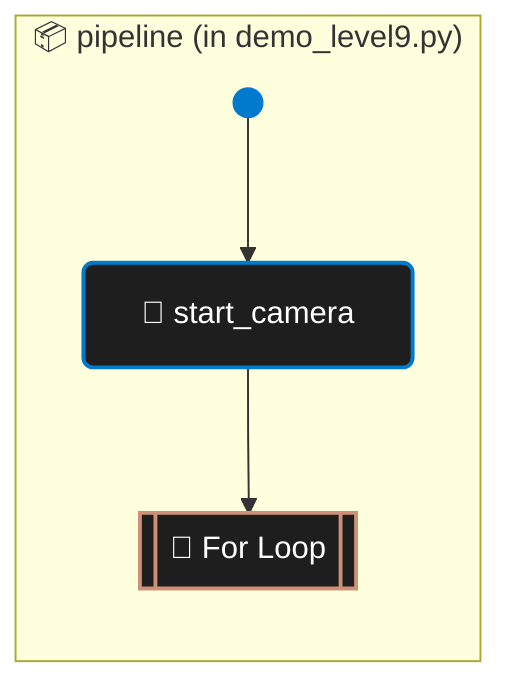

# Pipeline DAG: demo_level9.py

Generated by WPipe Tools

```mermaid
flowchart TD
  classDef step fill:#1e1e1e,stroke:#007acc,stroke-width:2px,color:#fff,rx:5,ry:5
  classDef logic fill:#1e1e1e,stroke:#ce9178,stroke-width:2px,color:#fff,rx:2,ry:2
  classDef startN fill:#007acc,stroke:#007acc,color:#fff
  subgraph sg_fvl5g ["📦 pipeline (in demo_level9.py)"]
    direction TD
    start_fvl5g(( )):::startN
      start_fvl5g --> nLfvl5g0[" 🚀 start_camera "]:::step
      nLfvl5g0 --> nLfvl5g1[[" 🔄 For Loop "]]:::logic

  end

```