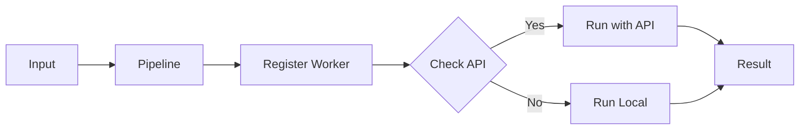
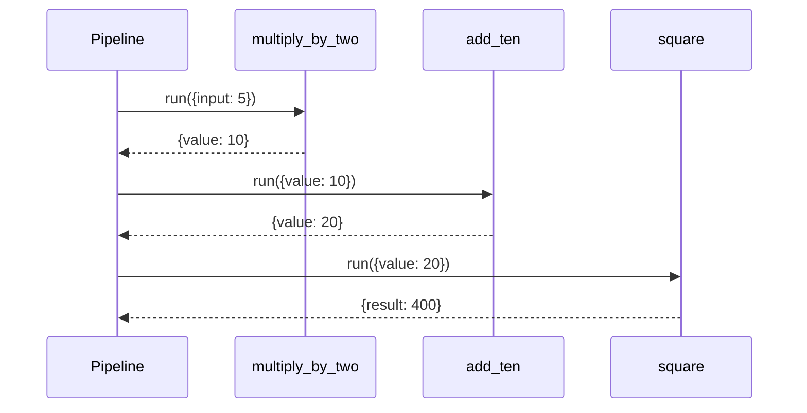
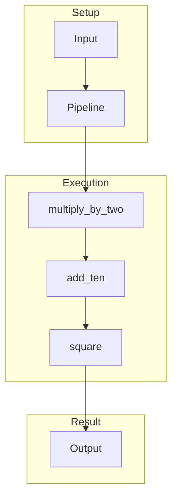
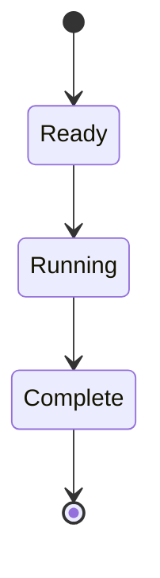
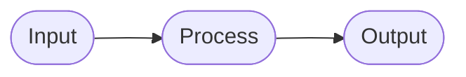

# 01 Simple Function

Sequential function execution in a pipeline.

## What It Does

- Creates a Pipeline instance
- Adds three functions as sequential steps
- Runs pipeline with input data
- Transforms data through each step

## Flow

