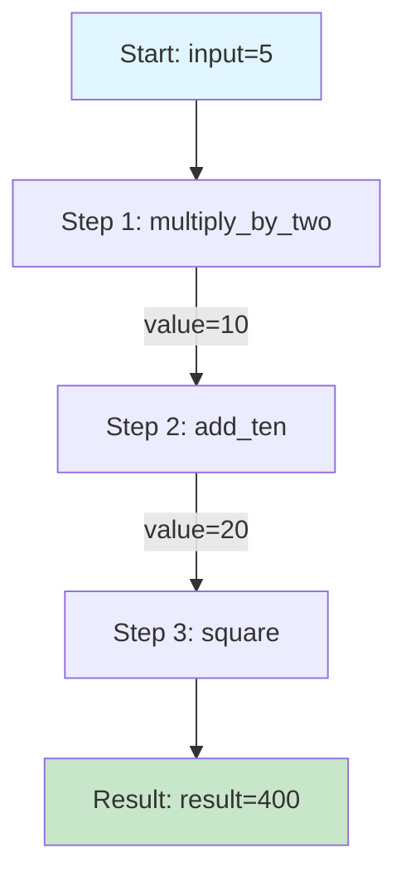
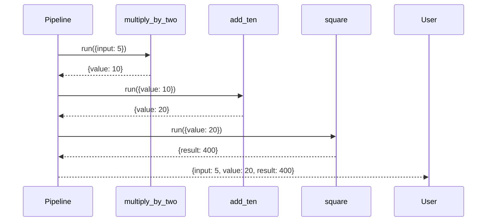
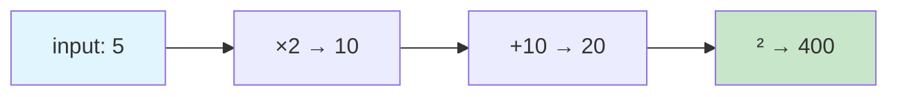

# 01 Simple Function Pipeline

Basic pipeline example demonstrating sequential function execution.

## What It Does

1. Creates a Pipeline instance
2. Adds three functions as sequential steps
3. Runs the pipeline with input data
4. Each step transforms and passes data to the next

## Flow Diagram



## Execution Sequence



## Data Transformation



## Code

```python
from wpipe import Pipeline

def multiply_by_two(data):
    return {"value": data["input"] * 2}

def add_ten(data):
    return {"value": data["value"] + 10}

def square(data):
    return {"result": data["value"] ** 2}

pipeline = Pipeline(verbose=True)
pipeline.set_steps([
    (multiply_by_two, "Multiply by 2", "v1.0"),
    (add_ten, "Add 10", "v1.0"),
    (square, "Square", "v1.0"),
])
result = pipeline.run({"input": 5})
# Result: {"input": 5, "value": 20, "result": 400}
```

## Run

```bash
python examples/basic_pipeline/01_simple_function/example.py
```