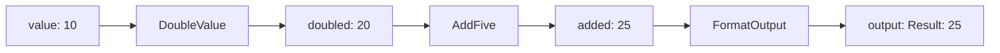

# 02 Class-Based Steps

Demonstrates using classes as pipeline steps.

## Flow


```mermaid
flowchart LR
    A[value: 10] --> B[DoubleValue] --> C[doubled: 20]
    C --> D[AddFive] --> E[added: 25]
    E --> F[FormatOutput] --> G[output: Result: 25]
```

## Run

```bash
python examples/basic_pipeline/02_class_steps/example.py
```
