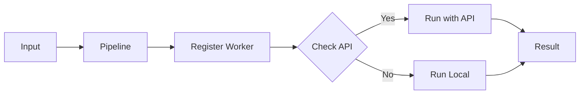
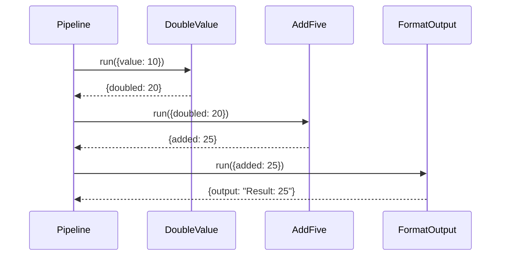
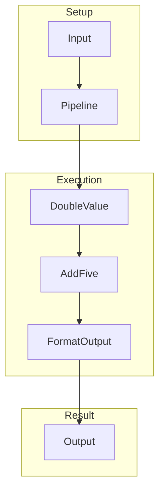
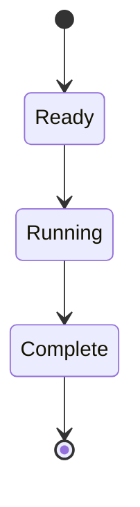
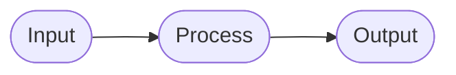

# 02 Class-Based Steps

Using classes as pipeline steps with state.

## What It Does

- Creates pipeline with class instances
- Classes maintain state via __call__
- Chains class instances as steps

## Flow

