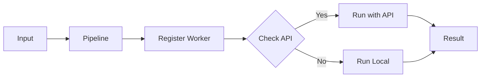
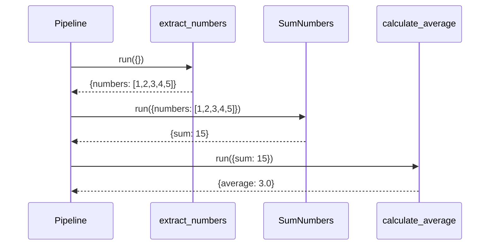
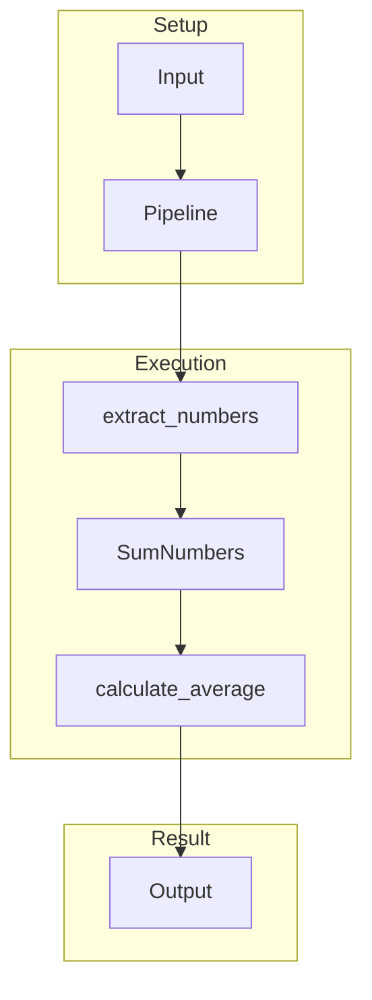
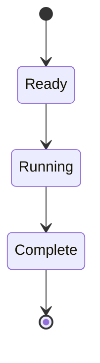
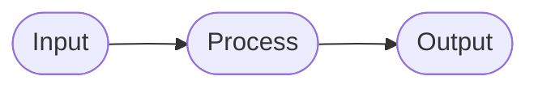

# 03 Mixed Steps

Functions and classes working together.

## What It Does

- Combines functions and classes
- Processes list data
- Calculates aggregate values

## Flow

```mermaid
graph LR
    A[Input] --> B[Pipeline]
    B --> C[Register Worker]
    C --> D{Check API}
    D -->|Yes| E[Run with API]
    D -->|No| F[Run Local]
    E --> G[Result]
    F --> G
```

```mermaid
sequenceDiagram
    participant P as Pipeline
    participant F1 as extract_numbers
    participant C1 as SumNumbers
    participant F2 as calculate_average
    
    P->>F1: run({})
    F1-->>P: {numbers: [1,2,3,4,5]}
    P->>C1: run({numbers: [1,2,3,4,5]})
    C1-->>P: {sum: 15}
    P->>F2: run({sum: 15})
    F2-->>P: {average: 3.0}
```

```mermaid
graph TB
    subgraph Setup
        A[Input]
        B[Pipeline]
    end
    
    subgraph Execution
        C[extract_numbers]
        D[SumNumbers]
        E[calculate_average]
    end
    
    subgraph Result
        F[Output]
    end
    
    A --> B
    B --> C
    C --> D
    D --> E
    E --> F
```

```mermaid
stateDiagram-v2
    [*] --> Ready
    Ready --> Running
    Running --> Complete
    Complete --> [*]
```

```mermaid
flowchart LR
    I([Input]) --> P([Process])
    P --> O([Output])
```
