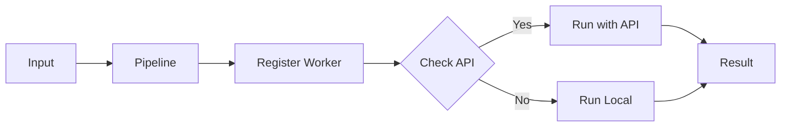
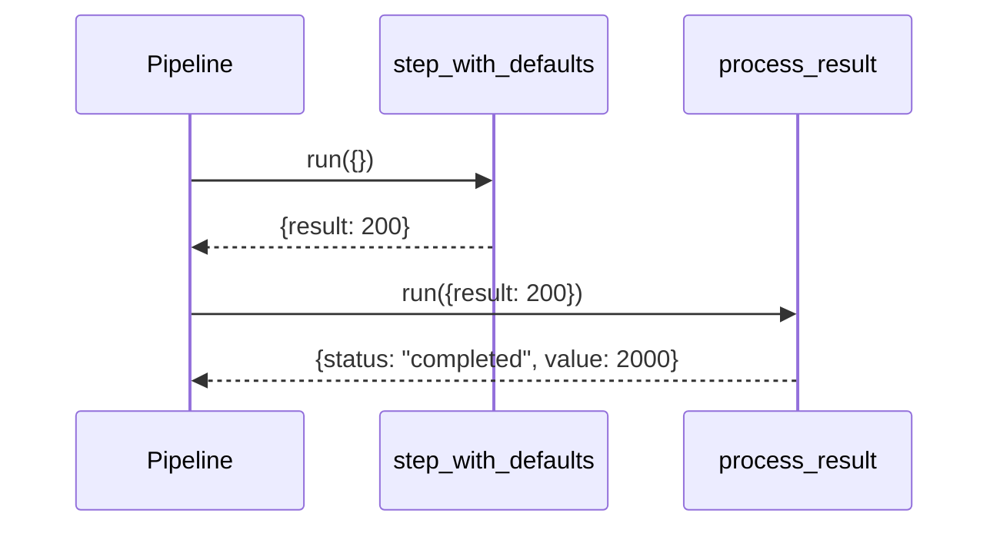
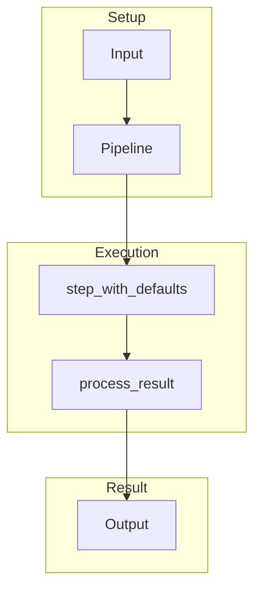
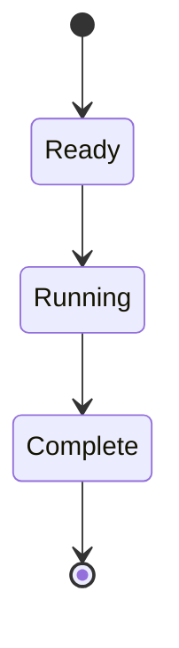
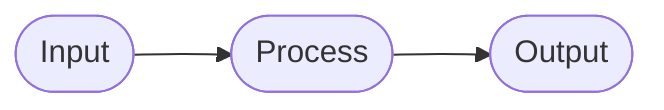

# 04 Default Values

Safe data access with default values.

## What It Does

- Uses get() with default values
- Handles missing data gracefully
- Chains steps with defaults

## Flow

```mermaid
graph LR
    A[Input] --> B[Pipeline]
    B --> C[Register Worker]
    C --> D{Check API}
    D -->|Yes| E[Run with API]
    D -->|No| F[Run Local]
    E --> G[Result]
    F --> G
```

```mermaid
sequenceDiagram
    participant P as Pipeline
    participant S1 as step_with_defaults
    participant S2 as process_result
    
    P->>S1: run({})
    S1-->>P: {result: 200}
    P->>S2: run({result: 200})
    S2-->>P: {status: "completed", value: 2000}
```

```mermaid
graph TB
    subgraph Setup
        A[Input]
        B[Pipeline]
    end
    
    subgraph Execution
        C[step_with_defaults]
        D[process_result]
    end
    
    subgraph Result
        E[Output]
    end
    
    A --> B
    B --> C
    C --> D
    D --> E
```

```mermaid
stateDiagram-v2
    [*] --> Ready
    Ready --> Running
    Running --> Complete
    Complete --> [*]
```

```mermaid
flowchart LR
    I([Input]) --> P([Process])
    P --> O([Output])
```
