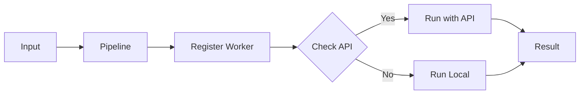
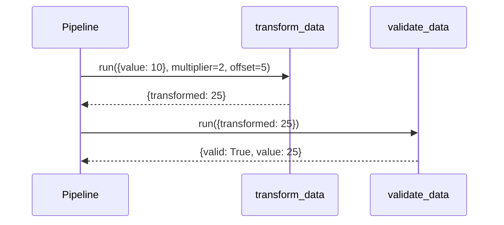
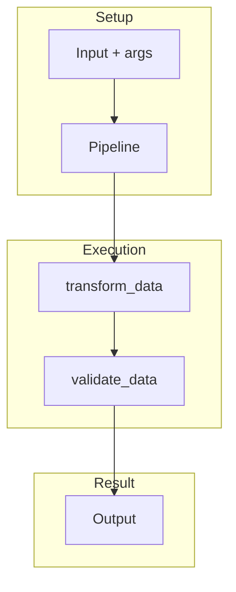
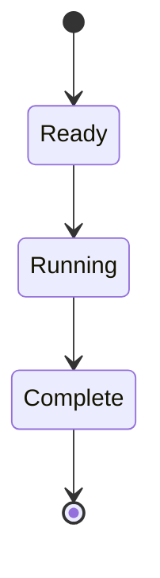
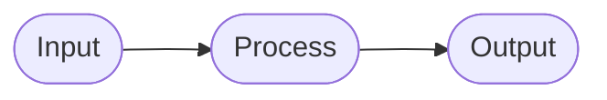

# 05 Args and Kwargs

Passing additional arguments to pipeline steps.

## What It Does

- Passes extra arguments to pipeline.run()
- Uses default parameters in steps
- Validates with configurable ranges

## Flow

