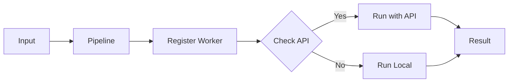
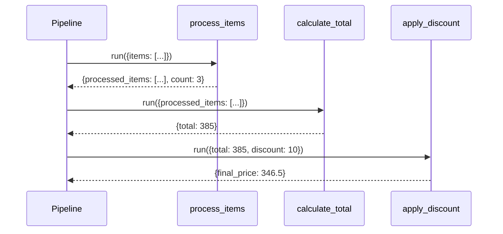
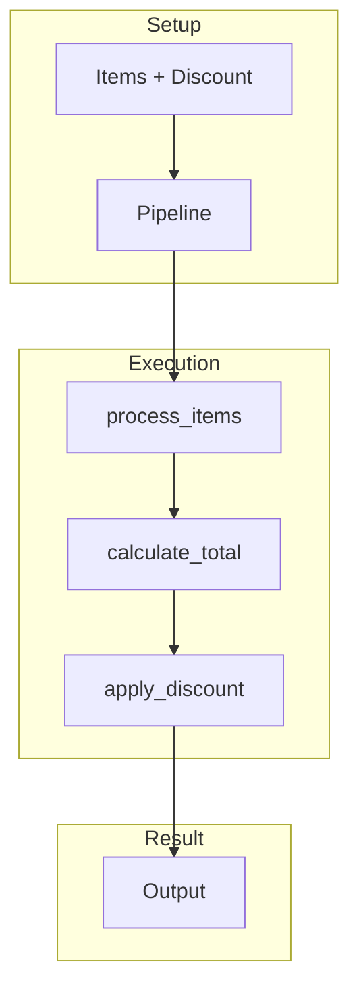
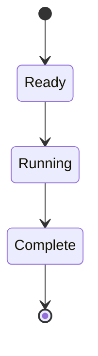
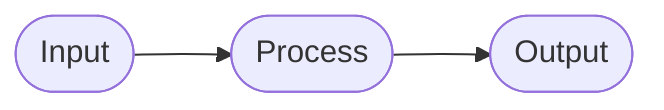

# 06 Dictionary Processing

Processing complex nested data structures.

## What It Does

- Processes list of dictionaries
- Calculates totals
- Applies percentage discounts

## Flow

```mermaid
graph LR
    A[Input] --> B[Pipeline]
    B --> C[Register Worker]
    C --> D{Check API}
    D -->|Yes| E[Run with API]
    D -->|No| F[Run Local]
    E --> G[Result]
    F --> G
```

```mermaid
sequenceDiagram
    participant P as Pipeline
    participant P1 as process_items
    participant P2 as calculate_total
    participant P3 as apply_discount
    
    P->>P1: run({items: [...]})
    P1-->>P: {processed_items: [...], count: 3}
    P->>P2: run({processed_items: [...]})
    P2-->>P: {total: 385}
    P->>P3: run({total: 385, discount: 10})
    P3-->>P: {final_price: 346.5}
```

```mermaid
graph TB
    subgraph Setup
        A[Items + Discount]
        B[Pipeline]
    end
    
    subgraph Execution
        C[process_items]
        D[calculate_total]
        E[apply_discount]
    end
    
    subgraph Result
        F[Output]
    end
    
    A --> B
    B --> C
    C --> D
    D --> E
    E --> F
```

```mermaid
stateDiagram-v2
    [*] --> Ready
    Ready --> Running
    Running --> Complete
    Complete --> [*]
```

```mermaid
flowchart LR
    I([Input]) --> P([Process])
    P --> O([Output])
```
