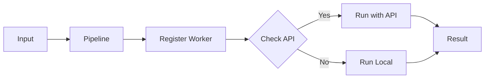
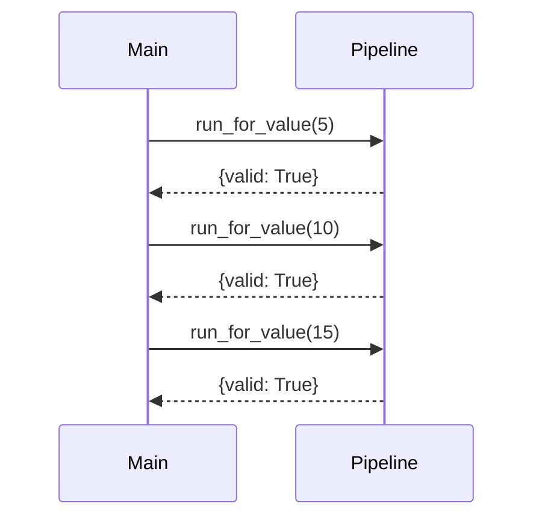
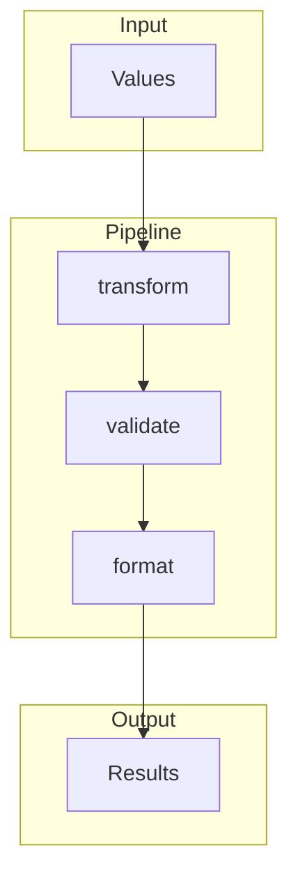
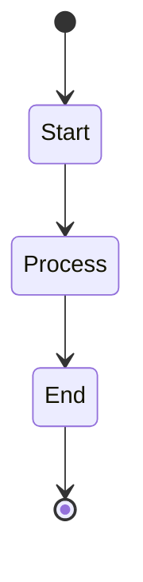
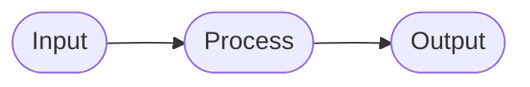

# 07 Multiple Runs

Reusing pipeline with different inputs.

## What It Does

- Creates reusable pipeline
- Runs with multiple values
- Collects results from runs

## Flow

```mermaid
graph LR
    A[Input] --> B[Pipeline]
    B --> C[Register Worker]
    C --> D{Check API}
    D -->|Yes| E[Run with API]
    D -->|No| F[Run Local]
    E --> G[Result]
    F --> G
```

```mermaid
sequenceDiagram
    participant M as Main
    participant P as Pipeline
    
    M->>P: run_for_value(5)
    P-->>M: {valid: True}
    M->>P: run_for_value(10)
    P-->>M: {valid: True}
    M->>P: run_for_value(15)
    P-->>M: {valid: True}
```

```mermaid
graph TB
    subgraph Input
        A[Values]
    end
    
    subgraph Pipeline
        B[transform]
        C[validate]
        D[format]
    end
    
    subgraph Output
        E[Results]
    end
    
    A --> B
    B --> C
    C --> D
    D --> E
```

```mermaid
stateDiagram-v2
    [*] --> Start
    Start --> Process
    Process --> End
    End --> [*]
```

```mermaid
flowchart LR
    I([Input]) --> P([Process])
    P --> O([Output])
```
