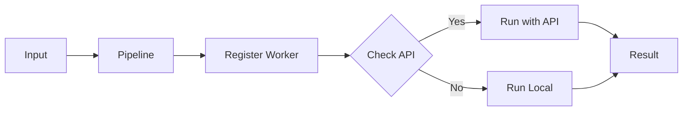
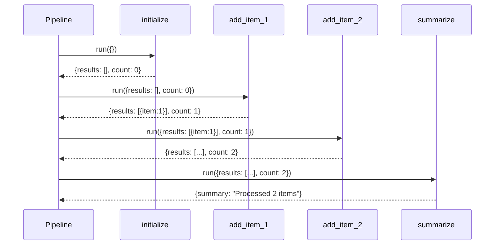
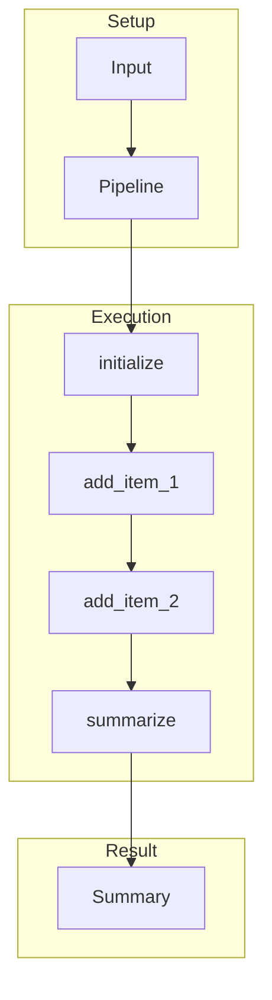
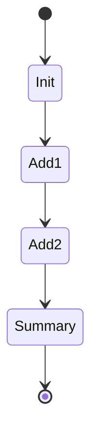
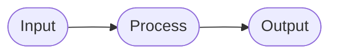

# 08 Data Aggregation

Accumulating data across pipeline steps.

## What It Does

- Initializes data structures
- Accumulates data across steps
- Summarizes collected data

## Flow

```mermaid
graph LR
    A[Input] --> B[Pipeline]
    B --> C[Register Worker]
    C --> D{Check API}
    D -->|Yes| E[Run with API]
    D -->|No| F[Run Local]
    E --> G[Result]
    F --> G
```

```mermaid
sequenceDiagram
    participant P as Pipeline
    participant I as initialize
    participant A1 as add_item_1
    participant A2 as add_item_2
    participant S as summarize
    
    P->>I: run({})
    I-->>P: {results: [], count: 0}
    P->>A1: run({results: [], count: 0})
    A1-->>P: {results: [{item:1}], count: 1}
    P->>A2: run({results: [{item:1}], count: 1})
    A2-->>P: {results: [...], count: 2}
    P->>S: run({results: [...], count: 2})
    S-->>P: {summary: "Processed 2 items"}
```

```mermaid
graph TB
    subgraph Setup
        A[Input]
        B[Pipeline]
    end
    
    subgraph Execution
        C[initialize]
        D[add_item_1]
        E[add_item_2]
        F[summarize]
    end
    
    subgraph Result
        G[Summary]
    end
    
    A --> B
    B --> C
    C --> D
    D --> E
    E --> F
    F --> G
```

```mermaid
stateDiagram-v2
    [*] --> Init
    Init --> Add1
    Add1 --> Add2
    Add2 --> Summary
    Summary --> [*]
```

```mermaid
flowchart LR
    I([Input]) --> P([Process])
    P --> O([Output])
```
