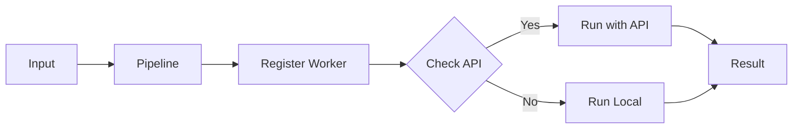
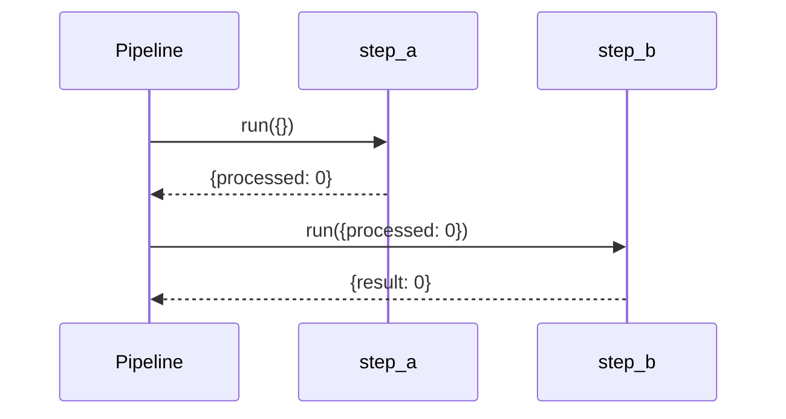
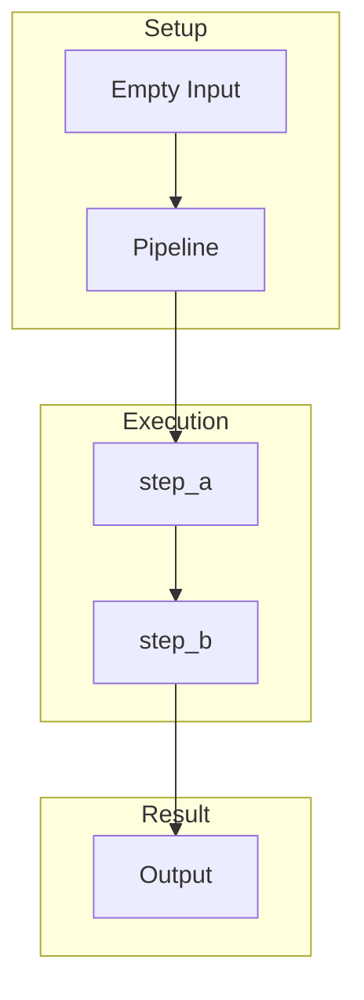
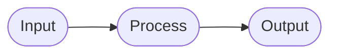

# 09 Empty Data Handling

Handling missing or empty input data gracefully.

## What It Does

- Handles empty input data
- Uses default values
- Graceful degradation

## Flow







```mermaid
stateDiagram-v2
    [*] --> Empty
    Empty --> Default
    Default --> Process
    Process --> End
    End --> [*]
```


