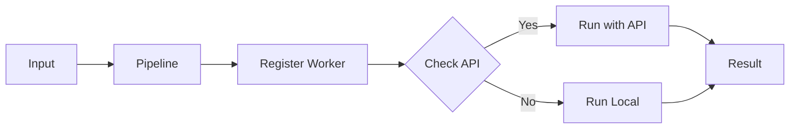
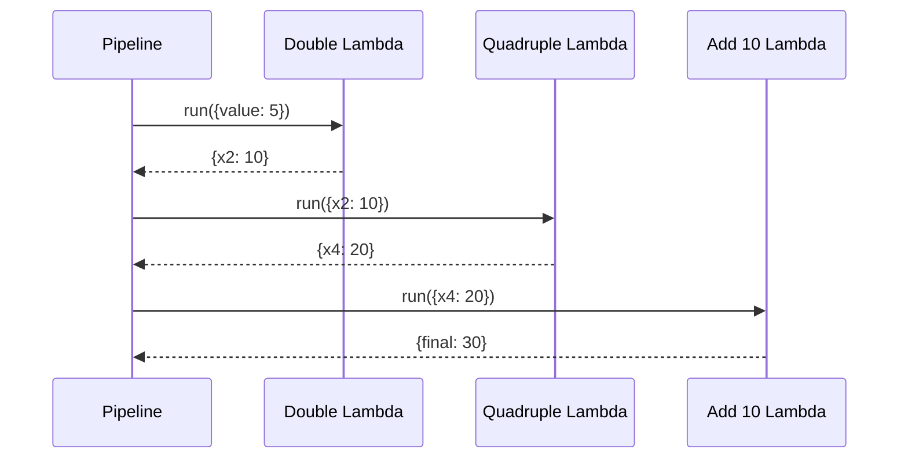
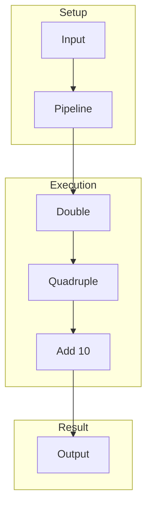
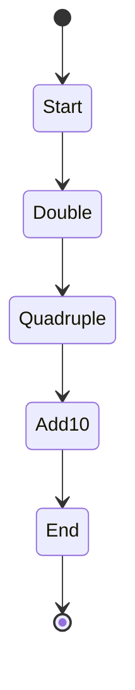
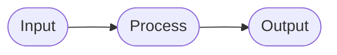

# 10 Lambda Steps

Using lambda functions as pipeline steps.

## What It Does

- Uses lambda functions as steps
- Chains lambda transformations
- Quick inline transformations

## Flow

```mermaid
graph LR
    A[Input] --> B[Pipeline]
    B --> C[Register Worker]
    C --> D{Check API}
    D -->|Yes| E[Run with API]
    D -->|No| F[Run Local]
    E --> G[Result]
    F --> G
```

```mermaid
sequenceDiagram
    participant P as Pipeline
    participant L1 as Double Lambda
    participant L2 as Quadruple Lambda
    participant L3 as Add 10 Lambda
    
    P->>L1: run({value: 5})
    L1-->>P: {x2: 10}
    P->>L2: run({x2: 10})
    L2-->>P: {x4: 20}
    P->>L3: run({x4: 20})
    L3-->>P: {final: 30}
```

```mermaid
graph TB
    subgraph Setup
        A[Input]
        B[Pipeline]
    end
    
    subgraph Execution
        C[Double]
        D[Quadruple]
        E[Add 10]
    end
    
    subgraph Result
        F[Output]
    end
    
    A --> B
    B --> C
    C --> D
    D --> E
    E --> F
```

```mermaid
stateDiagram-v2
    [*] --> Start
    Start --> Double
    Double --> Quadruple
    Quadruple --> Add10
    Add10 --> End
    End --> [*]
```

```mermaid
flowchart LR
    I([Input]) --> P([Process])
    P --> O([Output])
```
