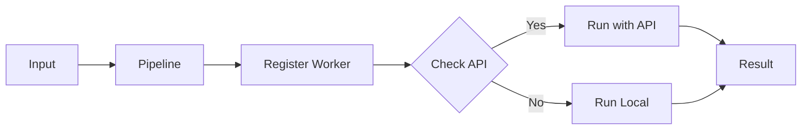
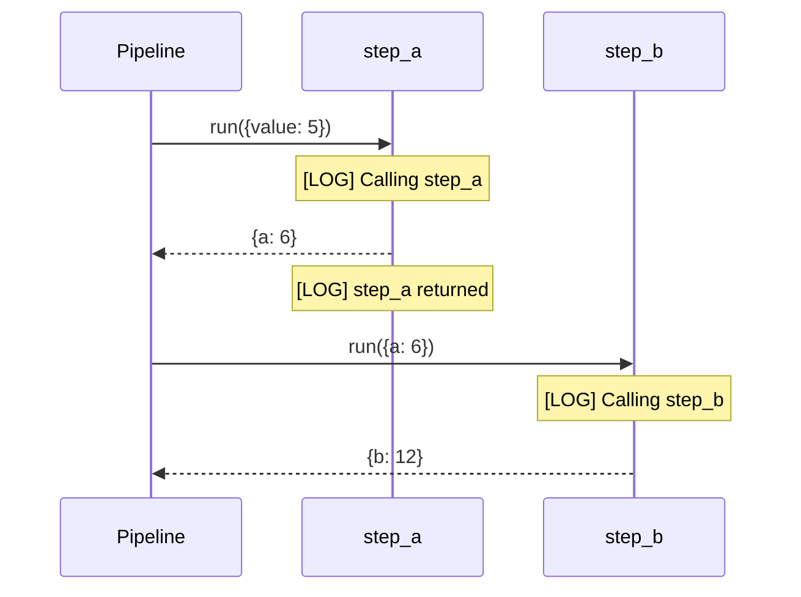
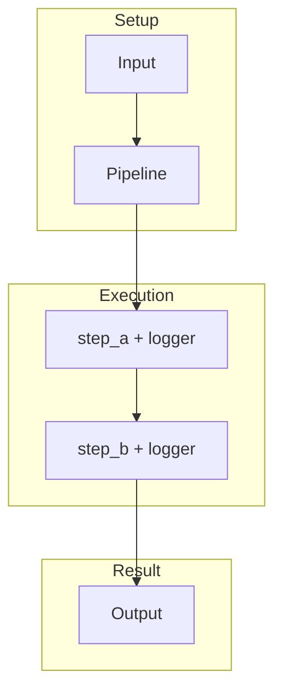
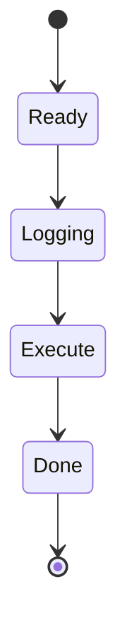
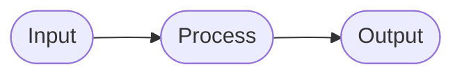

# 11 Decorator Steps

Using decorators with pipeline steps.

## What It Does

- Uses decorators with steps
- Logs step execution
- Preserves step functionality

## Flow

```mermaid
graph LR
    A[Input] --> B[Pipeline]
    B --> C[Register Worker]
    C --> D{Check API}
    D -->|Yes| E[Run with API]
    D -->|No| F[Run Local]
    E --> G[Result]
    F --> G
```

```mermaid
sequenceDiagram
    participant P as Pipeline
    participant S1 as step_a
    participant S2 as step_b
    
    P->>S1: run({value: 5})
    Note over S1: [LOG] Calling step_a
    S1-->>P: {a: 6}
    Note over S1: [LOG] step_a returned
    P->>S2: run({a: 6})
    Note over S2: [LOG] Calling step_b
    S2-->>P: {b: 12}
```

```mermaid
graph TB
    subgraph Setup
        A[Input]
        B[Pipeline]
    end
    
    subgraph Execution
        C[step_a + logger]
        D[step_b + logger]
    end
    
    subgraph Result
        E[Output]
    end
    
    A --> B
    B --> C
    C --> D
    D --> E
```

```mermaid
stateDiagram-v2
    [*] --> Ready
    Ready --> Logging
    Logging --> Execute
    Execute --> Done
    Done --> [*]
```

```mermaid
flowchart LR
    I([Input]) --> P([Process])
    P --> O([Output])
```
