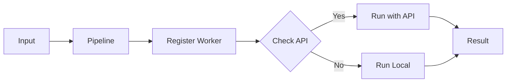
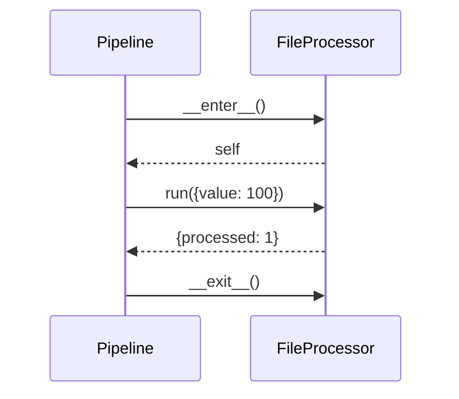
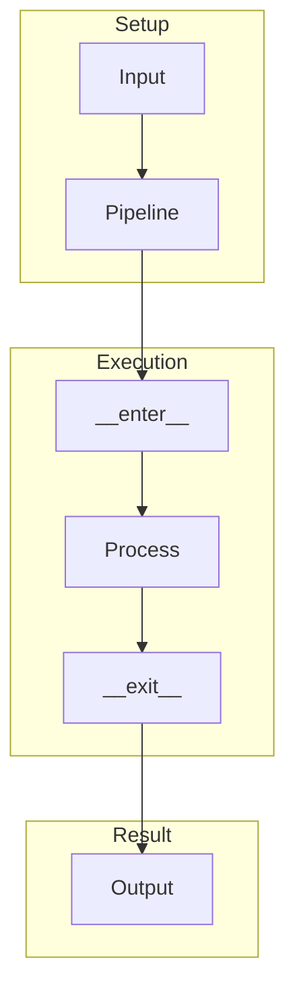
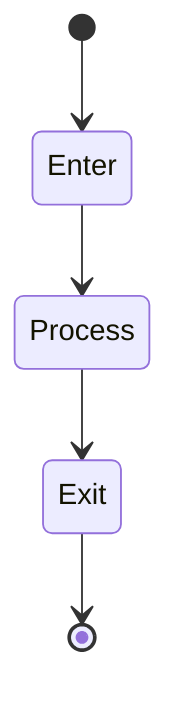
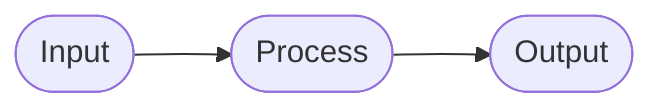

# 12 Context Manager Steps

Pipeline steps using context managers.

## What It Does

- Uses context managers as steps
- Maintains state across calls
- Cleanup on exit

## Flow

```mermaid
graph LR
    A[Input] --> B[Pipeline]
    B --> C[Register Worker]
    C --> D{Check API}
    D -->|Yes| E[Run with API]
    D -->|No| F[Run Local]
    E --> G[Result]
    F --> G
```

```mermaid
sequenceDiagram
    participant P as Pipeline
    participant F as FileProcessor
    
    P->>F: __enter__()
    F-->>P: self
    P->>F: run({value: 100})
    F-->>P: {processed: 1}
    P->>F: __exit__()
```

```mermaid
graph TB
    subgraph Setup
        A[Input]
        B[Pipeline]
    end
    
    subgraph Execution
        C[__enter__]
        D[Process]
        E[__exit__]
    end
    
    subgraph Result
        F[Output]
    end
    
    A --> B
    B --> C
    C --> D
    D --> E
    E --> F
```

```mermaid
stateDiagram-v2
    [*] --> Enter
    Enter --> Process
    Process --> Exit
    Exit --> [*]
```

```mermaid
flowchart LR
    I([Input]) --> P([Process])
    P --> O([Output])
```
