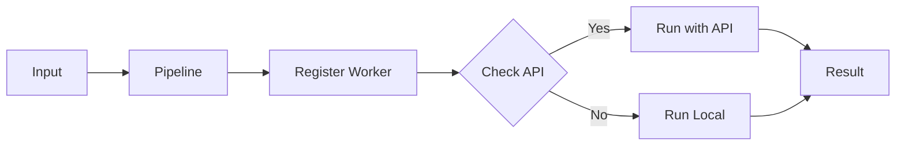
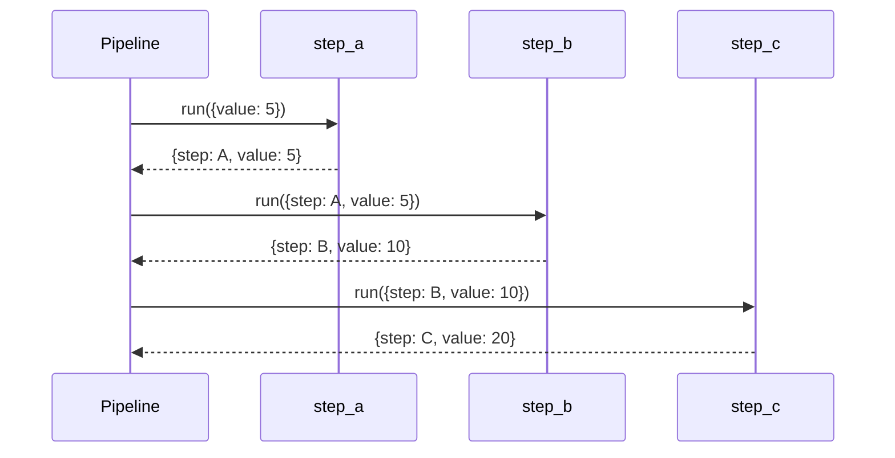
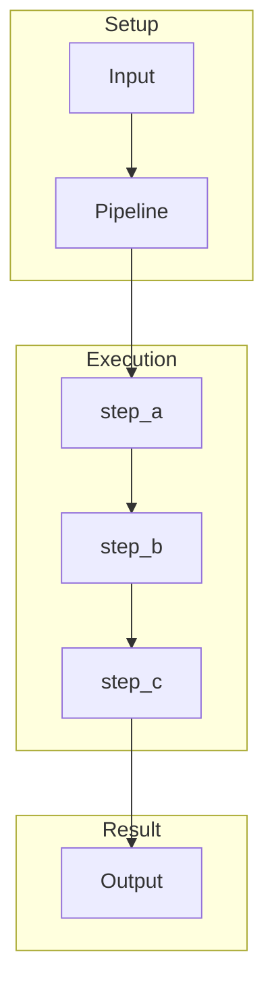
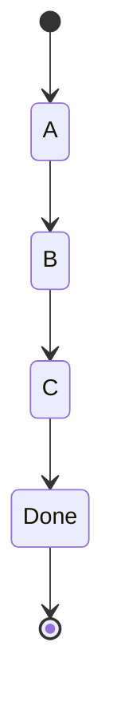
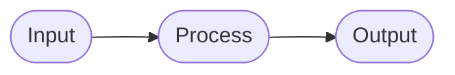

# 13 Async Pipeline

Sequential async-like pipeline processing.

## What It Does

- Sequential step execution
- Multiple transformations
- Async-like processing pattern

## Flow

```mermaid
graph LR
    A[Input] --> B[Pipeline]
    B --> C[Register Worker]
    C --> D{Check API}
    D -->|Yes| E[Run with API]
    D -->|No| F[Run Local]
    E --> G[Result]
    F --> G
```

```mermaid
sequenceDiagram
    participant P as Pipeline
    participant A as step_a
    participant B as step_b
    participant C as step_c
    
    P->>A: run({value: 5})
    A-->>P: {step: A, value: 5}
    P->>B: run({step: A, value: 5})
    B-->>P: {step: B, value: 10}
    P->>C: run({step: B, value: 10})
    C-->>P: {step: C, value: 20}
```

```mermaid
graph TB
    subgraph Setup
        A[Input]
        B[Pipeline]
    end
    
    subgraph Execution
        C[step_a]
        D[step_b]
        E[step_c]
    end
    
    subgraph Result
        F[Output]
    end
    
    A --> B
    B --> C
    C --> D
    D --> E
    E --> F
```

```mermaid
stateDiagram-v2
    [*] --> A
    A --> B
    B --> C
    C --> Done
    Done --> [*]
```

```mermaid
flowchart LR
    I([Input]) --> P([Process])
    P --> O([Output])
```
