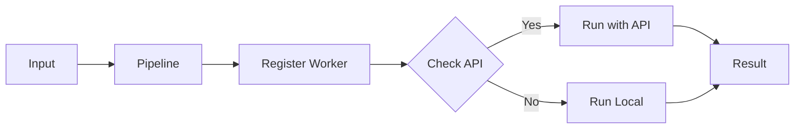
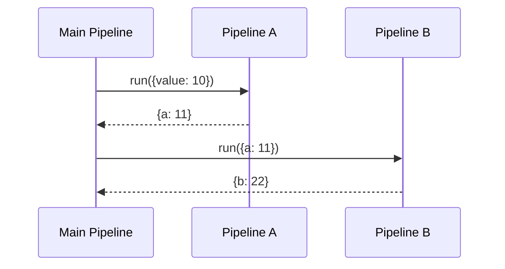
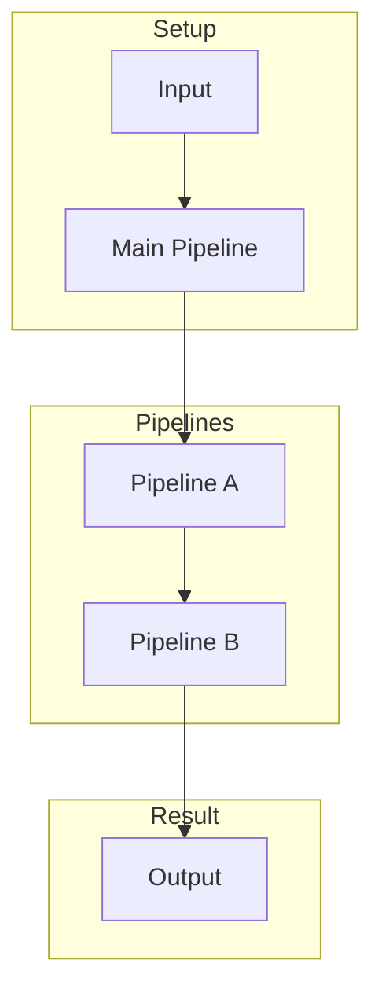
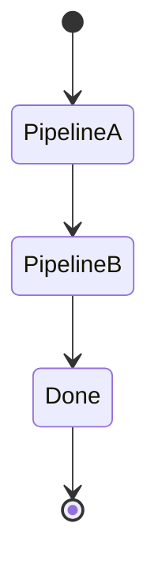
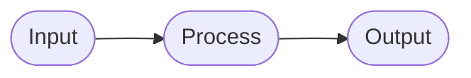

# 14 Pipeline Chaining

Running pipelines within pipelines.

## What It Does

- Creates reusable pipelines
- Chains pipelines together
- Runs pipelines within pipelines

## Flow

```mermaid
graph LR
    A[Input] --> B[Pipeline]
    B --> C[Register Worker]
    C --> D{Check API}
    D -->|Yes| E[Run with API]
    D -->|No| F[Run Local]
    E --> G[Result]
    F --> G
```

```mermaid
sequenceDiagram
    participant M as Main Pipeline
    participant P1 as Pipeline A
    participant P2 as Pipeline B
    
    M->>P1: run({value: 10})
    P1-->>M: {a: 11}
    M->>P2: run({a: 11})
    P2-->>M: {b: 22}
```

```mermaid
graph TB
    subgraph Setup
        A[Input]
        B[Main Pipeline]
    end
    
    subgraph Pipelines
        C[Pipeline A]
        D[Pipeline B]
    end
    
    subgraph Result
        E[Output]
    end
    
    A --> B
    B --> C
    C --> D
    D --> E
```

```mermaid
stateDiagram-v2
    [*] --> PipelineA
    PipelineA --> PipelineB
    PipelineB --> Done
    Done --> [*]
```

```mermaid
flowchart LR
    I([Input]) --> P([Process])
    P --> O([Output])
```
