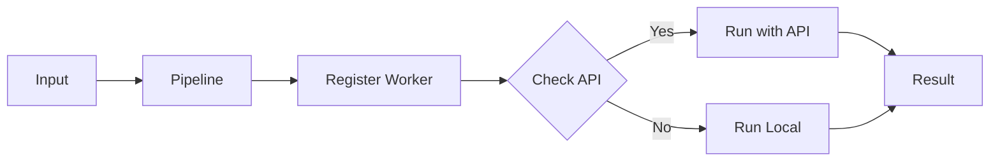
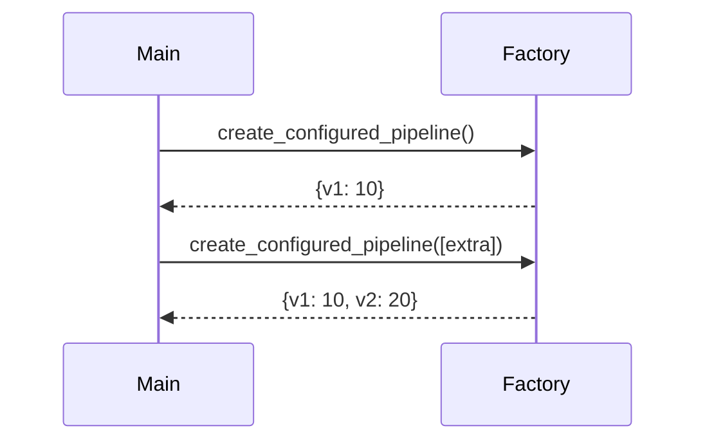
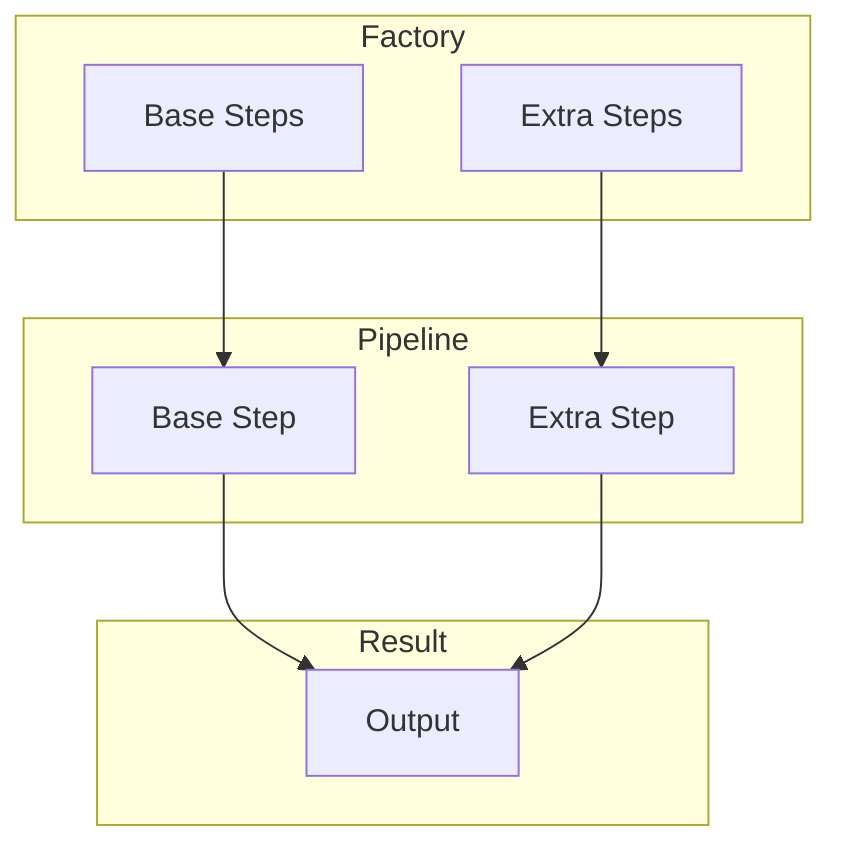
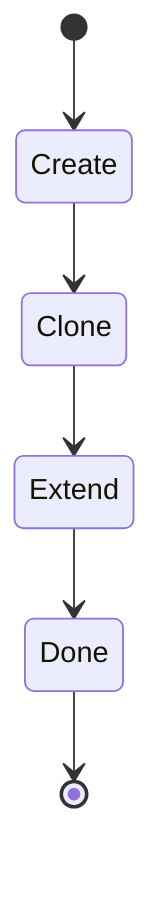
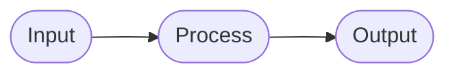

# 15 Pipeline Configuration

Reusable pipeline configuration patterns.

## What It Does

- Creates reusable configurations
- Adds extra steps dynamically
- Clones and extends pipelines

## Flow

