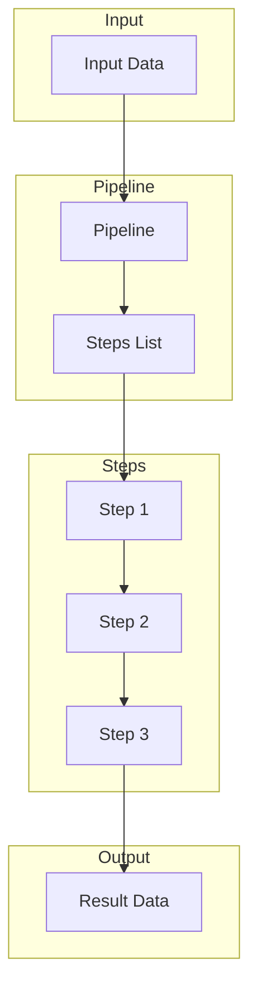
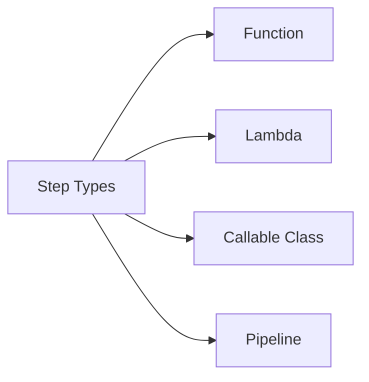
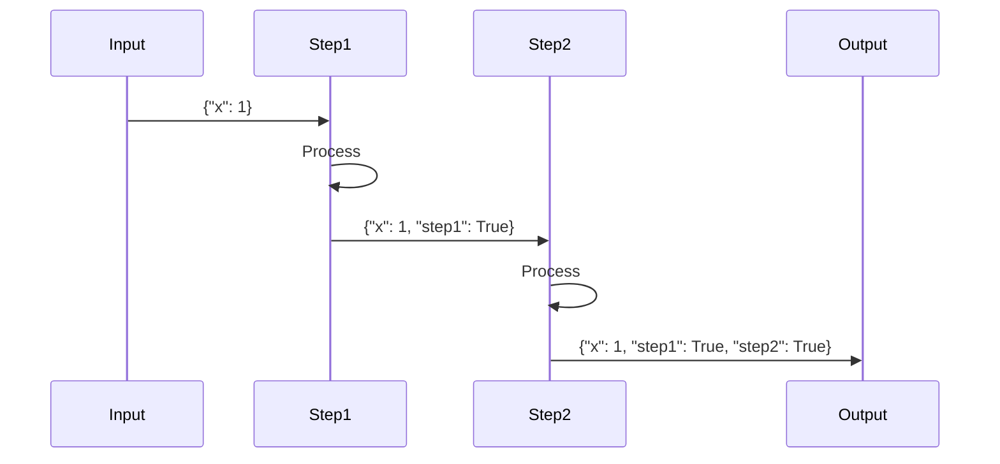
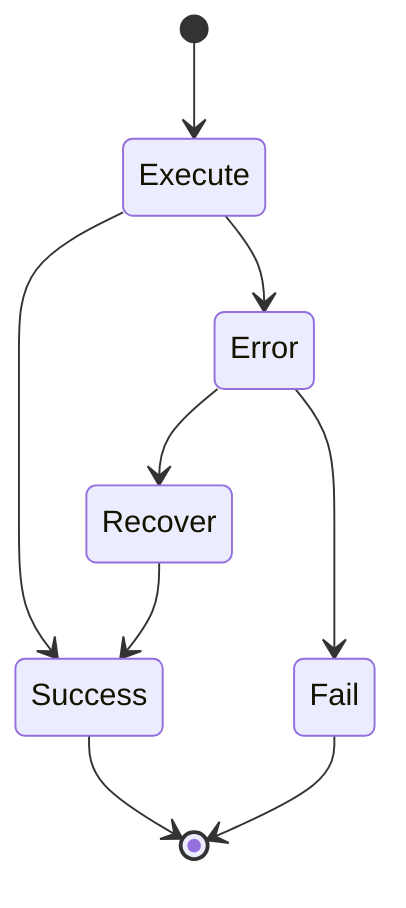
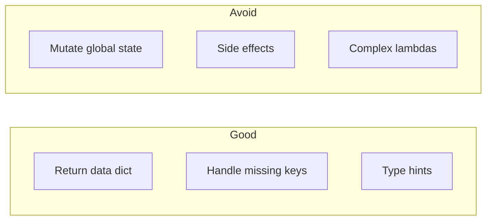

# Basic Pipeline

This directory contains foundational examples for understanding pipeline creation and execution.

## Overview

The `basic_pipeline` module is the core of wpipe, demonstrating how to create and run pipelines with various step types.

## Quick Start

```python
from wpipe import Pipeline

def step_function(data):
    return {"result": "success"}

pipeline = Pipeline(verbose=True)
pipeline.set_steps([
    (step_function, "Step Name", "v1.0"),
])
result = pipeline.run({"input": "value"})
```

## Examples

| Example | Description |
|---------|-------------|
| [01_simple_function](01_simple_function/) | Basic pipeline with function step |
| [02_class_steps](02_class_steps/) | Using class instances as steps |
| [03_mixed_steps](03_mixed_steps/) | Mix of functions and classes |
| [04_default_values](04_default_values/) | Using default parameter values |
| [05_args_kwargs](05_args_kwargs/) | Handling *args and **kwargs |
| [06_dict_processing](06_dict_processing/) | Dictionary manipulation in steps |
| [07_multiple_runs](07_multiple_runs/) | Running pipeline multiple times |
| [08_data_aggregation](08_data_aggregation/) | Aggregating data across steps |
| [09_empty_data](09_empty_data/) | Running with empty input data |
| [10_lambda_steps](10_lambda_steps/) | Using lambda functions |
| [11_decorator_steps](11_decorator_steps/) | Using decorators with pipelines |
| [12_context_manager](12_context_manager/) | Context manager pattern |
| [13_async_pipeline](13_async_pipeline/) | Asynchronous pipeline execution |
| [14_pipeline_chaining](14_pipeline_chaining/) | Chaining multiple pipelines |
| [15_pipeline_clone](15_pipeline_clone/) | Cloning and reusing pipelines |

## Architecture



## Step Types



### Function Steps

```python
def my_step(data):
    data["processed"] = True
    return data
```

### Lambda Steps

```python
step = (lambda d: {**d, "done": True}, "Lambda Step", "v1.0")
```

### Class Steps

```python
class MyStep:
    def __call__(self, data):
        return {"result": data.get("value", 0) * 2}

step = (MyStep(), "Class Step", "v1.0")
```

## Data Flow



## Error Handling



## Best Practices



1. Always return a dictionary from steps
2. Handle missing keys with `.get()`
3. Use type hints for better IDE support
4. Keep steps focused and small
5. Use descriptive step names

## See Also

- [API Pipeline](../02_api_pipeline/) - Pipeline with API integration
- [Condition](../04_condition/) - Conditional branching
- [Error Handling](../03_error_handling/) - Error handling patterns
