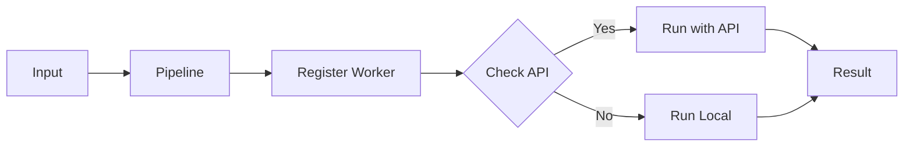
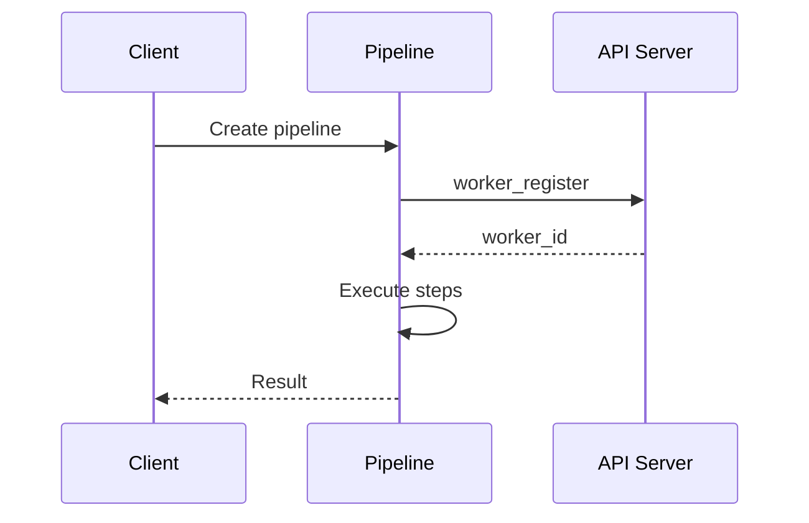
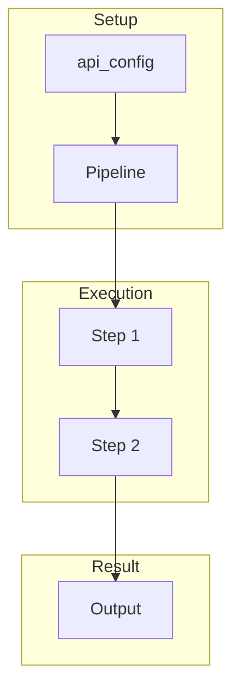
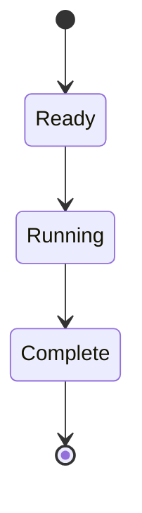
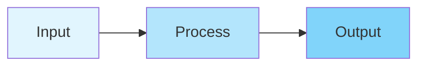

# 01 Basic API

Demonstrates basic API configuration for a pipeline.
Shows how to set up a pipeline with API server connection.

## What it evaluates

- Creating Pipeline with api_config
- Worker registration with API server
- Graceful fallback when API is unavailable
- Processing data through pipeline steps

## Flow

