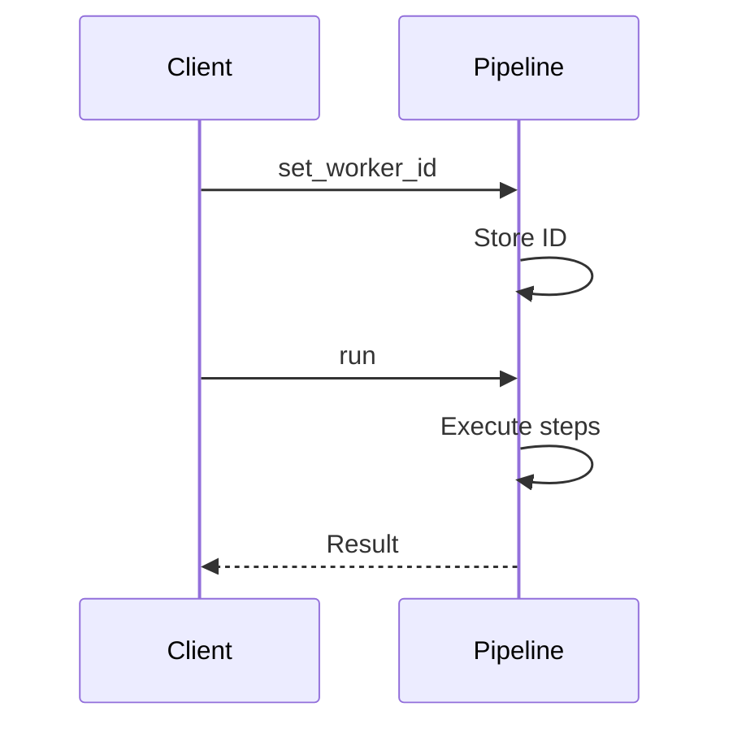
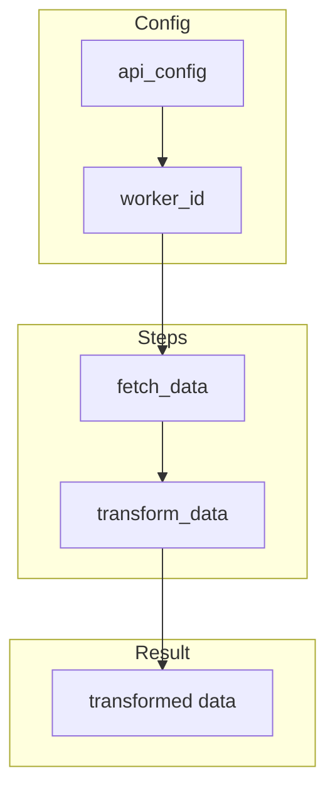
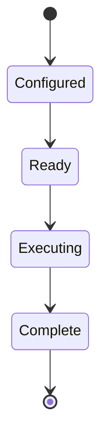

# 02 Worker ID

Demonstrates worker ID management in API pipelines.
Shows how to set and track worker identity for API operations.

## What it evaluates

- Setting worker_id manually
- Tracking worker_id in pipeline
- Enabling API communication with worker_id
- Data transformation through pipeline steps

## Flow

