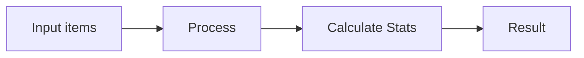
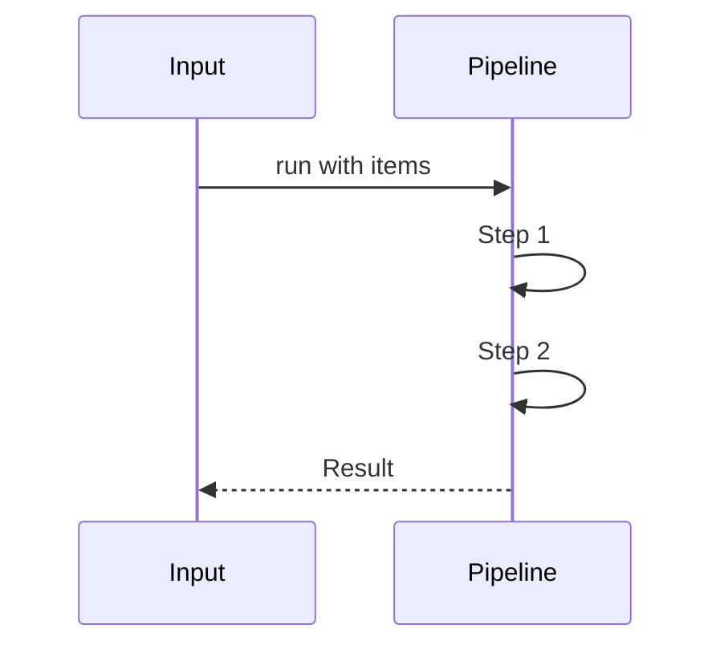
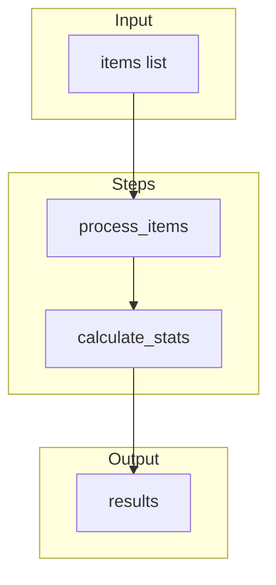
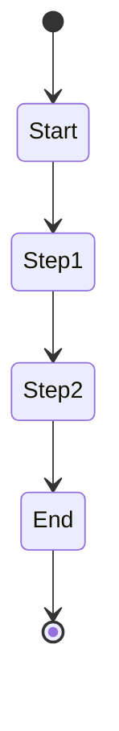
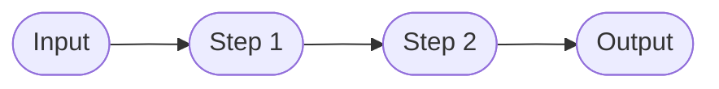

# 03 No API Configuration

Demonstrates running pipeline without API configuration (local-only mode).
Useful for testing or when API server is not available.

## What it evaluates

- Pipeline runs without api_config parameter
- All steps execute locally
- Data aggregation through multiple steps
- Statistics calculation from input data

## Flow

