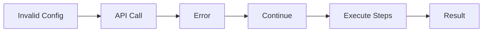
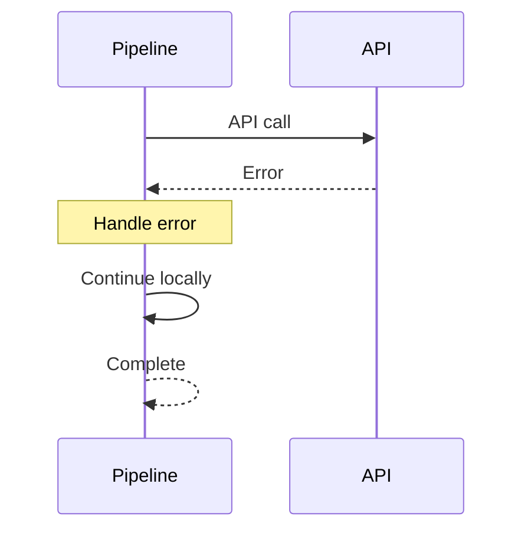
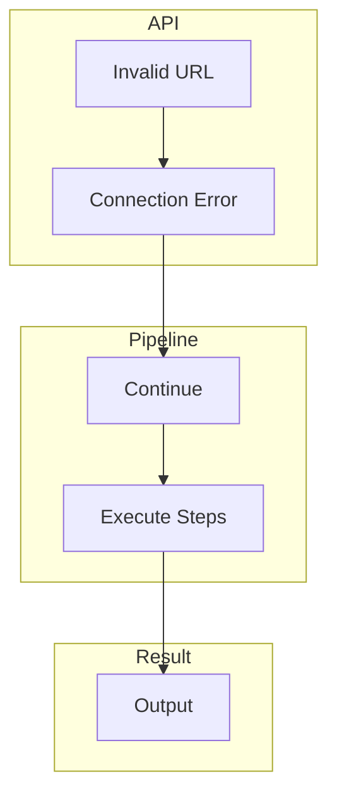
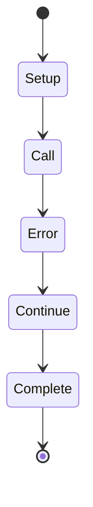
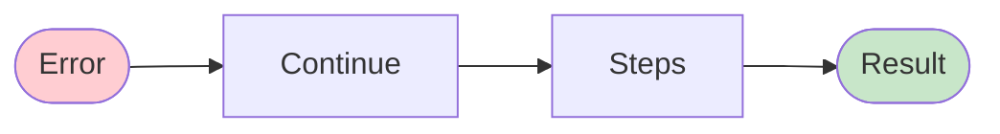

# 04 API Error Handling

Demonstrates how API errors are handled when server is unavailable.
Pipeline continues executing even if API calls fail.

## What it evaluates

- API errors do not stop pipeline execution
- Pipeline handles invalid API server gracefully
- Local execution continues when API fails
- Data flows through steps regardless of API state

## Flow

