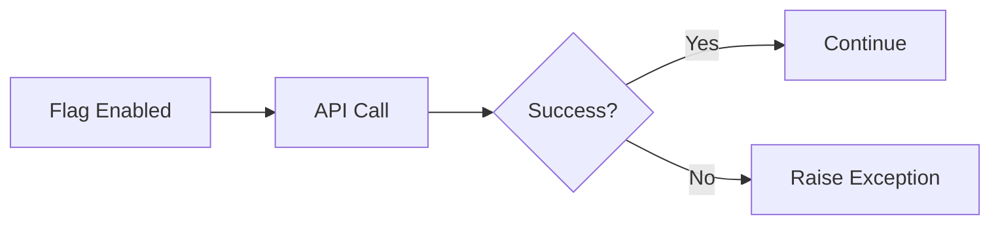
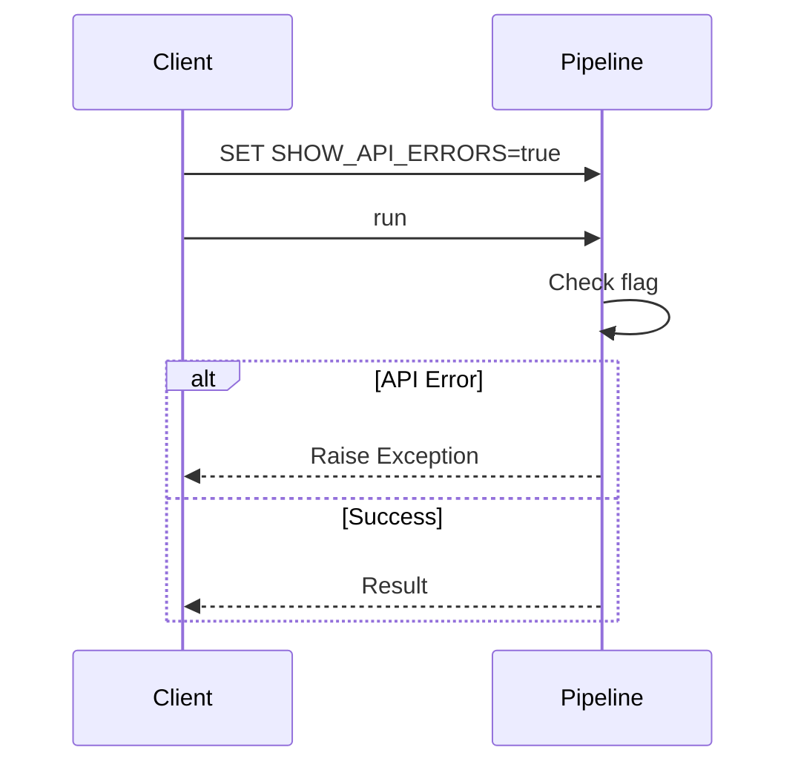
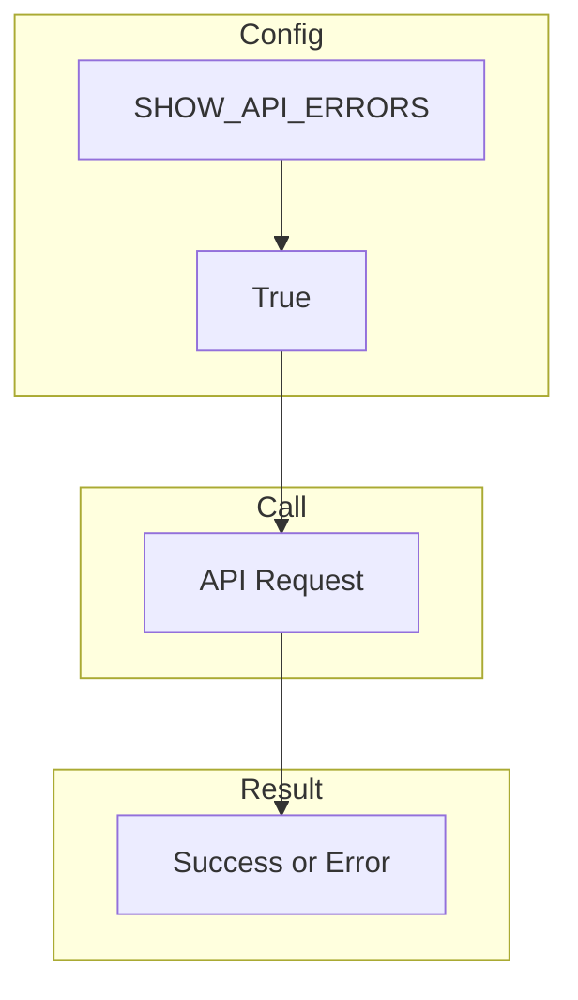
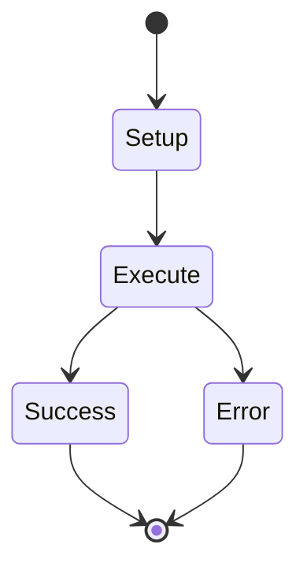
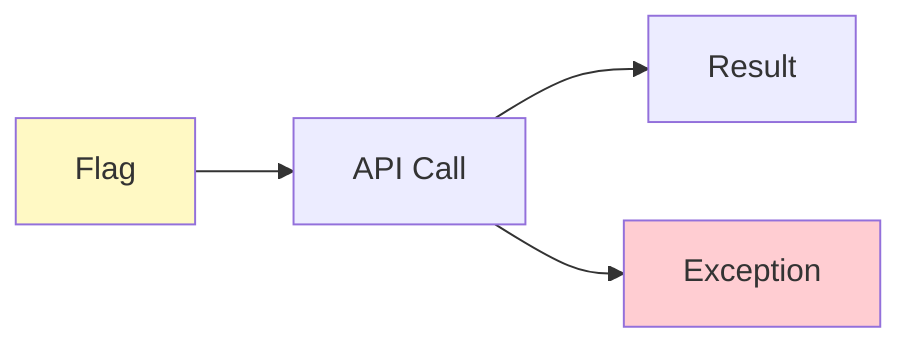

# 05 Show API Errors

Demonstrates using SHOW_API_ERRORS flag to raise exceptions on API errors.
When enabled, API errors will raise exceptions instead of being silently ignored.

## What it evaluates

- SHOW_API_ERRORS flag controls exception behavior
- When True, API errors raise exceptions
- Pipeline can be configured to fail fast on API issues

## Flow

