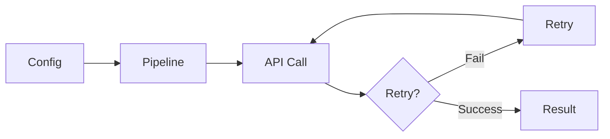
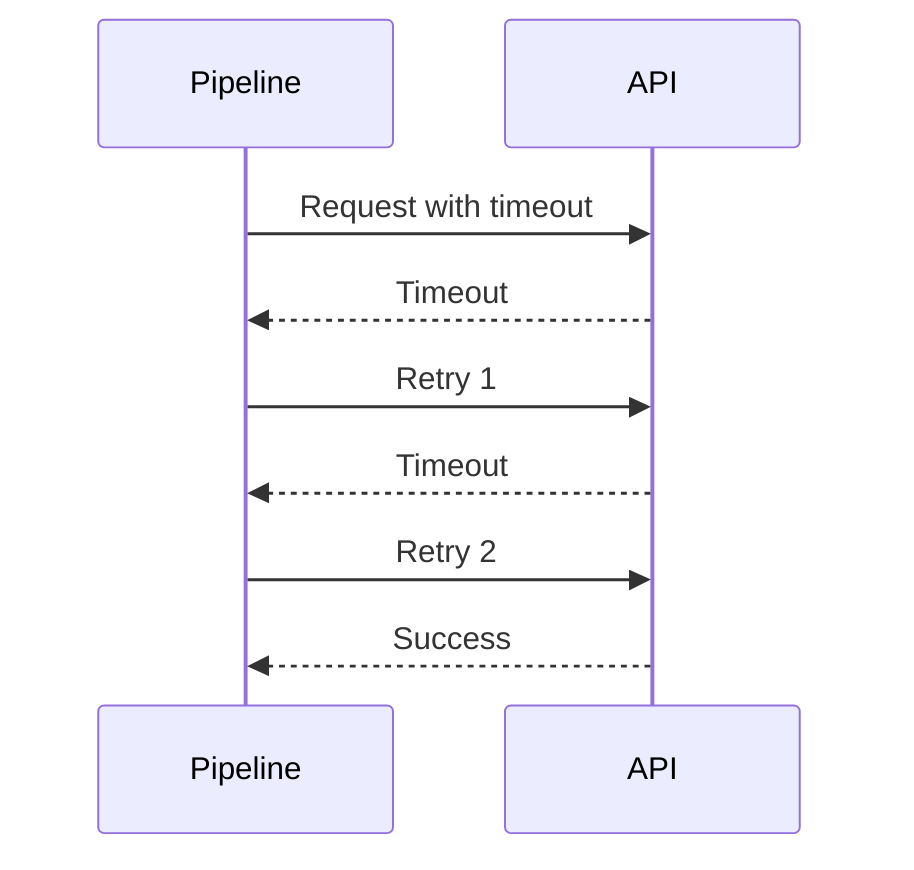
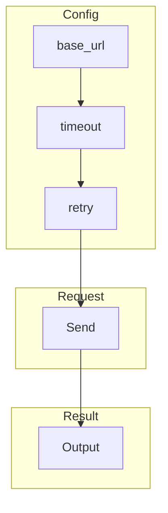
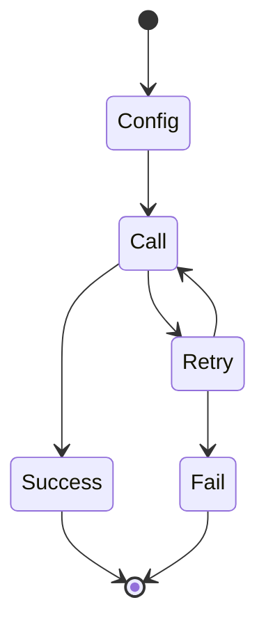
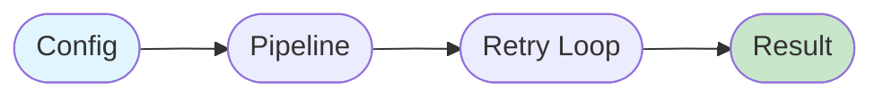

# 06 Full Configuration

Demonstrates full API configuration with all options combined.
Shows how to use timeout and retry settings together.

## What it evaluates

- Combining multiple API config options
- Timeout and retry configuration
- Complete API setup for production
- Single-step processing with full config

## Flow

