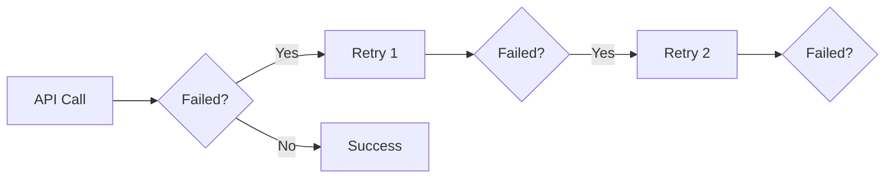
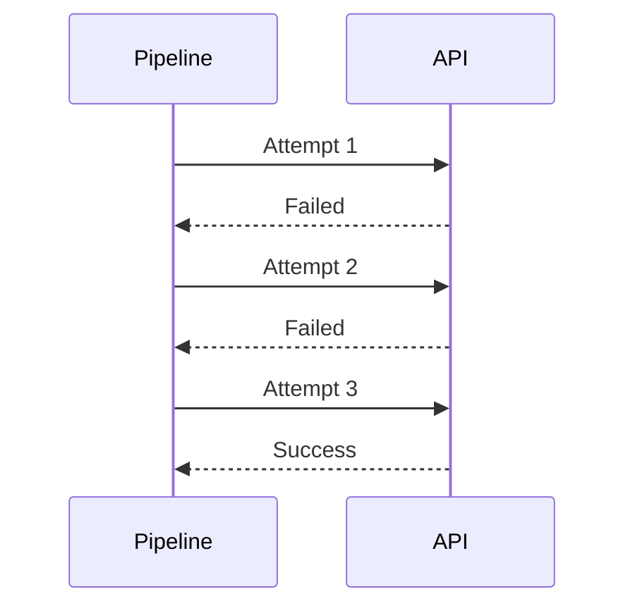
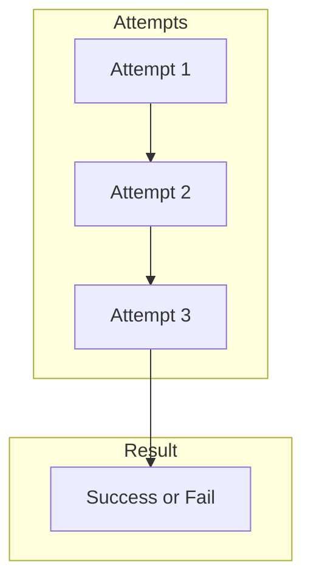
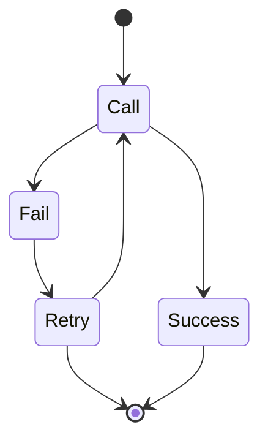
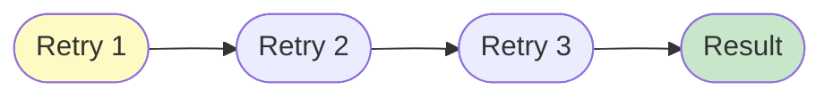

# 07 API Retry Configuration

Demonstrates configuring retry behavior for failed API calls.
Pipeline can retry API calls automatically on failure.

## What it evaluates

- max_retries parameter controls retry behavior
- API calls are retried on failure
- Pipeline eventually succeeds or fails after retries

## Flow

