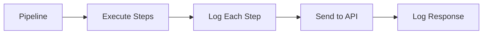
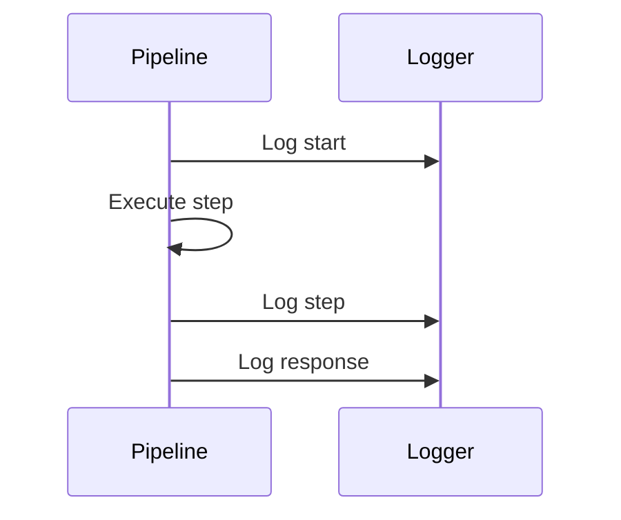
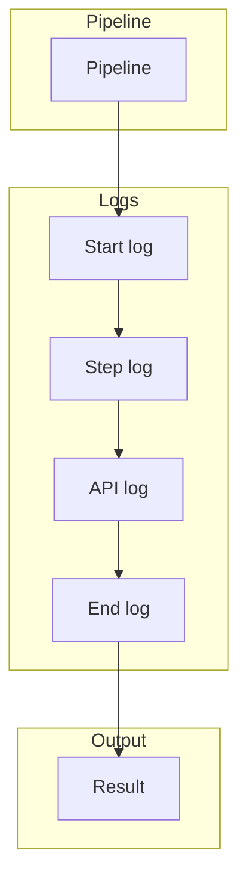
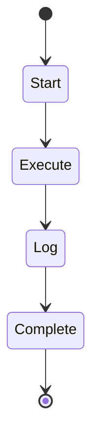
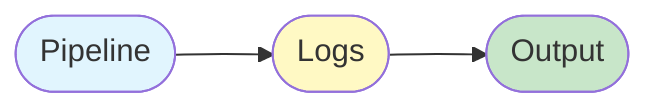

# 09 API Logging

Demonstrates configuring logging for API calls.
Shows how logging helps debug API interactions.

## What it evaluates

- Pipeline logging configuration
- Verbose mode for debugging
- API call logging
- Pipeline execution logging

## Flow

