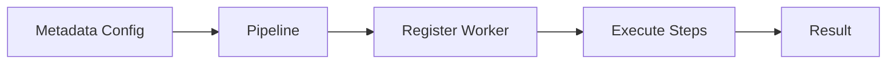
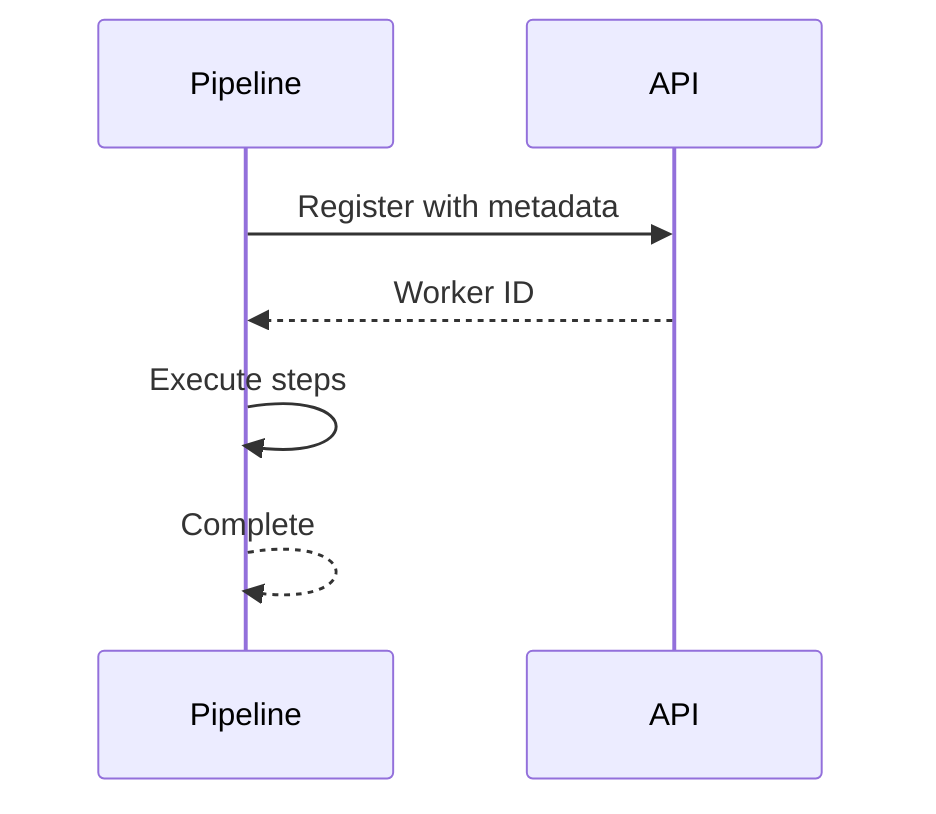
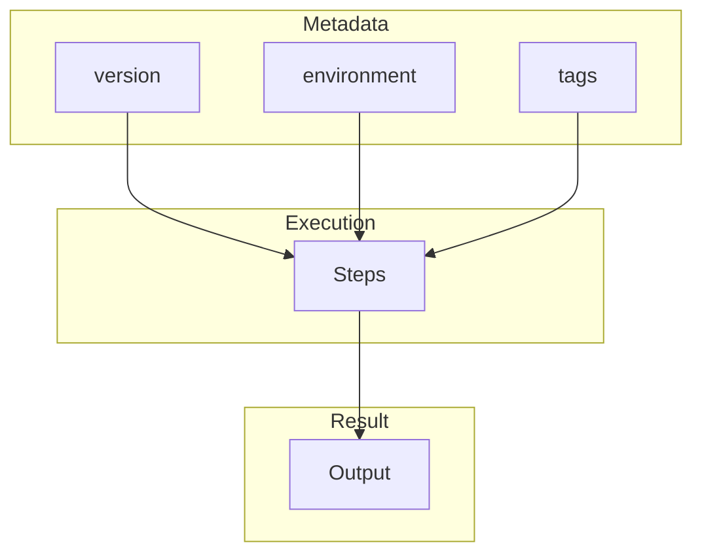
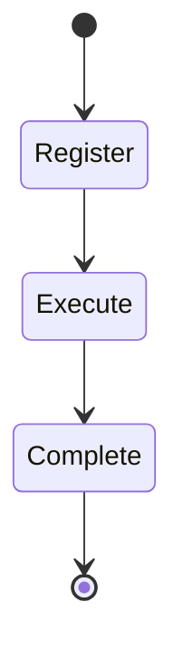
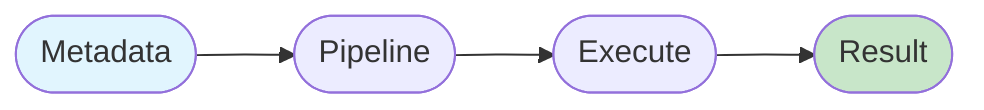

# 10 Worker Metadata

Demonstrates passing custom metadata to the worker registration.
Metadata can include version info, environment, tags, etc.

## What it evaluates

- worker_metadata parameter in api_config
- Metadata is sent during worker registration
- Pipeline can track worker properties

## Flow

