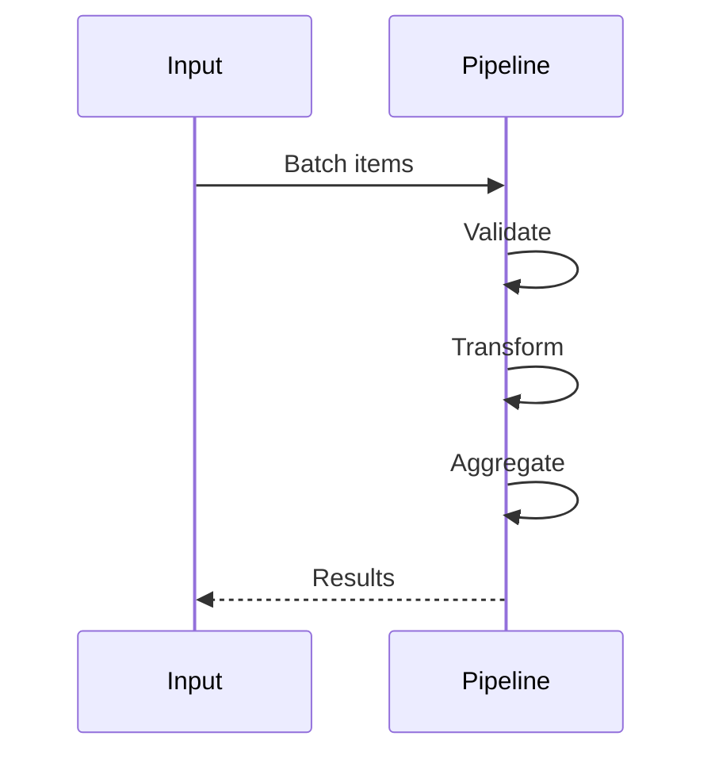
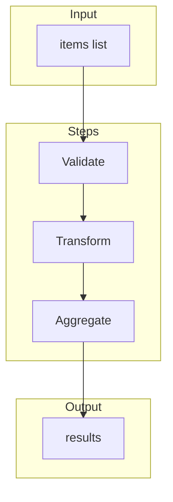
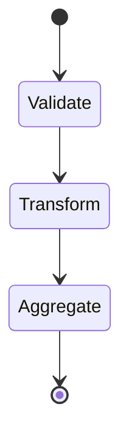

# 12 Batch Operations

Demonstrates processing data in batches through the pipeline.
Useful for handling large datasets efficiently.

## What it evaluates

- Processing multiple items in a single pipeline run
- Batch data aggregation
- Efficient data handling for bulk operations

## Flow

