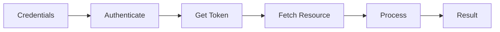
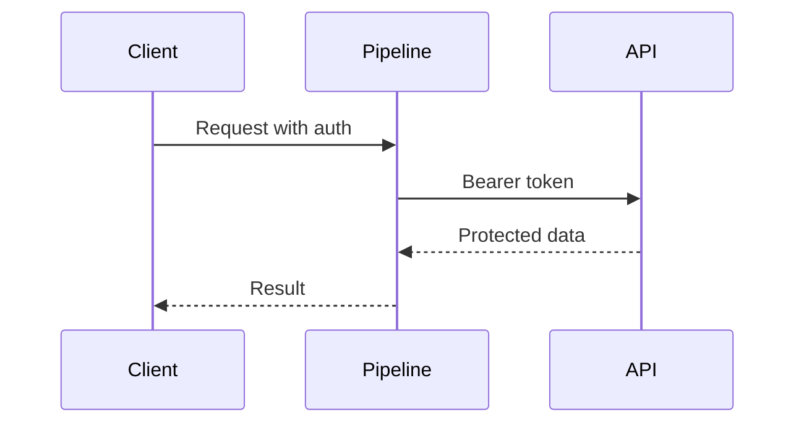
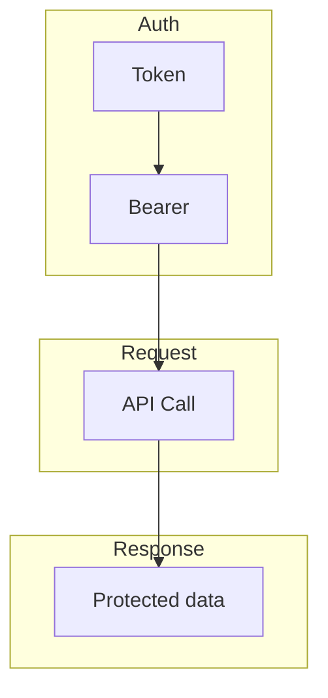
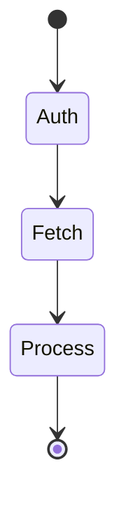
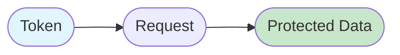

# 13 Authentication

Demonstrates using authentication tokens in API requests.
Shows different auth schemes supported by the API client.

## What it evaluates

- Token-based authentication
- Custom authentication headers
- Secure API communication

## Flow

