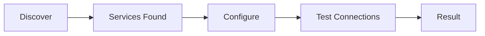
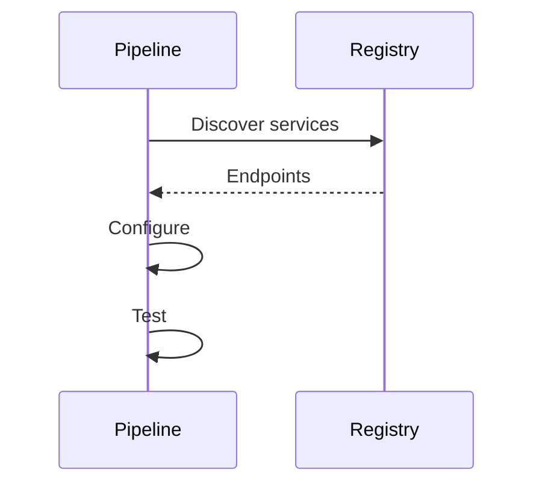
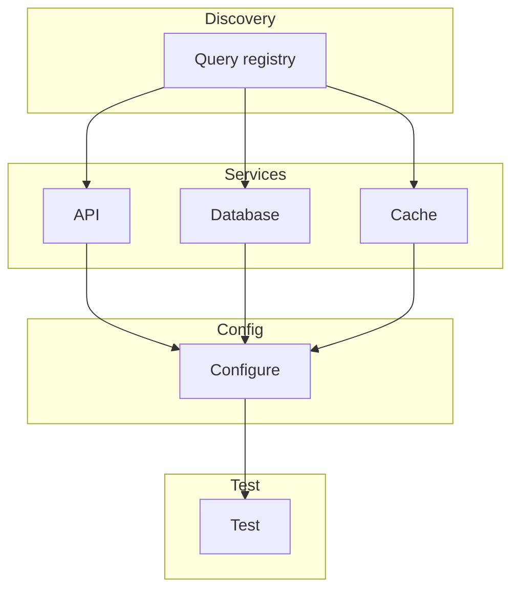
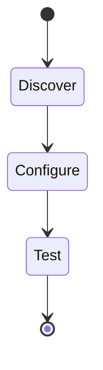

# 15 Service Discovery

Demonstrates dynamic service discovery and configuration.
Pipeline discovers services and configures connections dynamically.

## What it evaluates

- Dynamic service discovery
- Configuration based on discovered services
- Flexible service routing

## Flow

