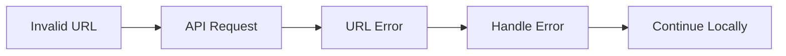
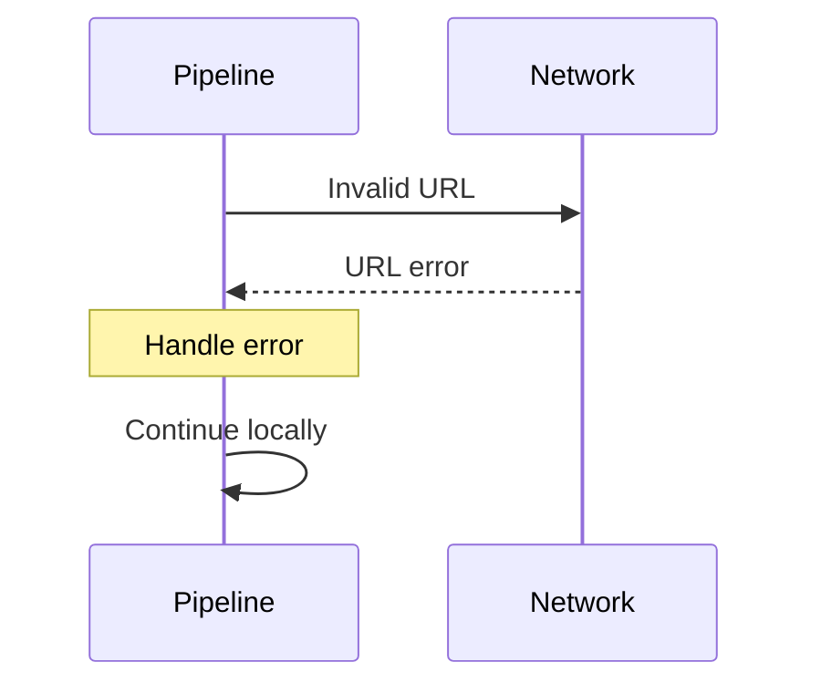
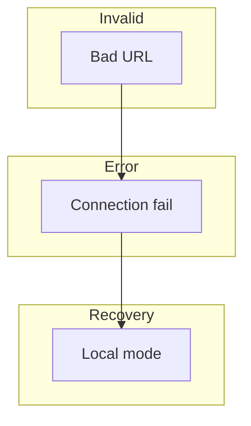
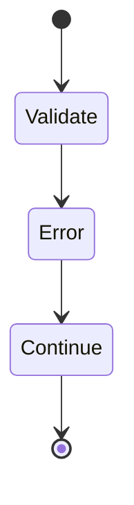
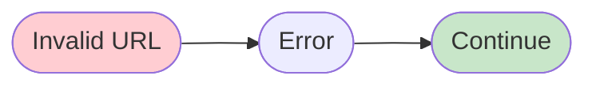

# 18 Invalid URL

Demonstrates handling of invalid or malformed URLs in API configuration.
Pipeline should handle URL validation errors gracefully.

## What it evaluates

- Invalid URL handling
- Malformed URL detection
- Clear error messages
- Fallback to local execution

## Flow

