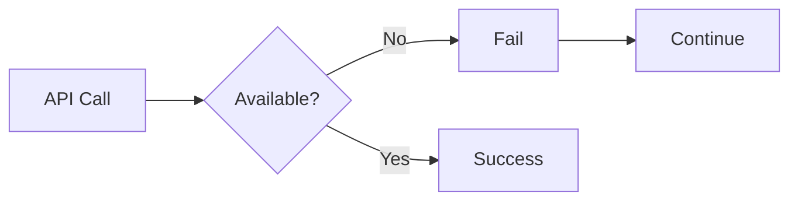
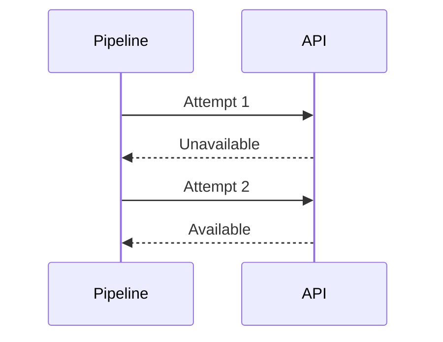
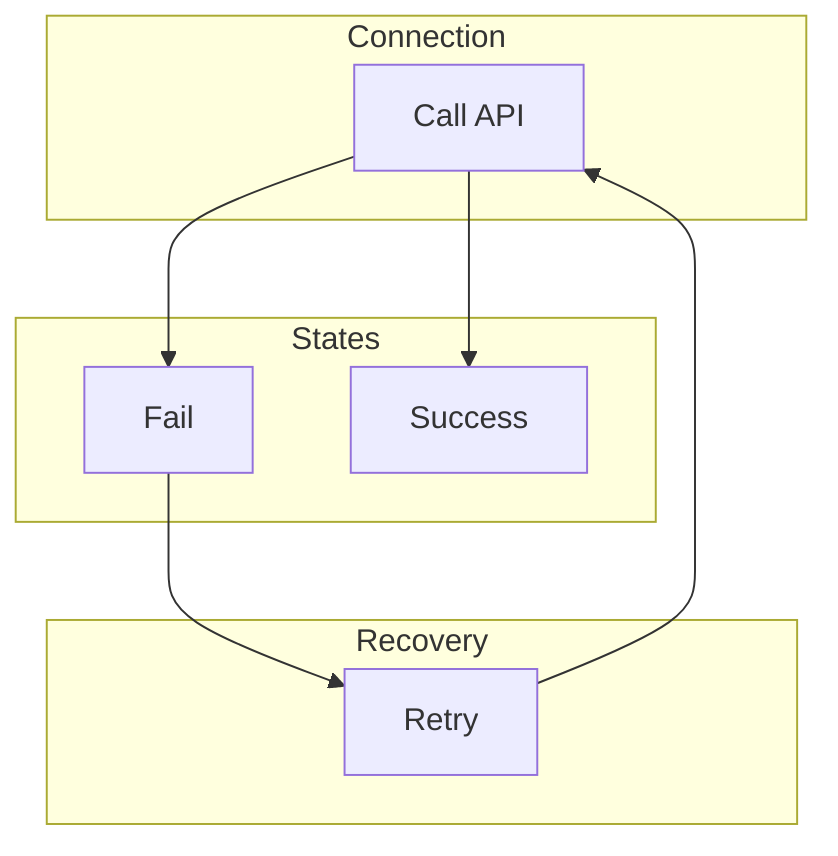
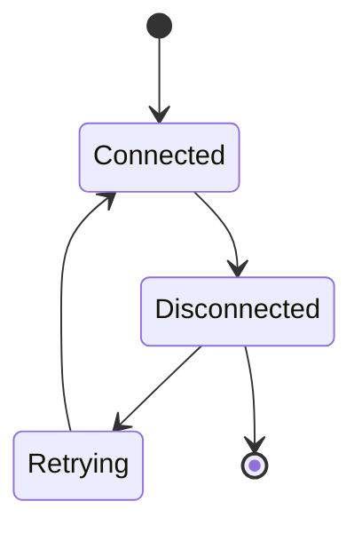
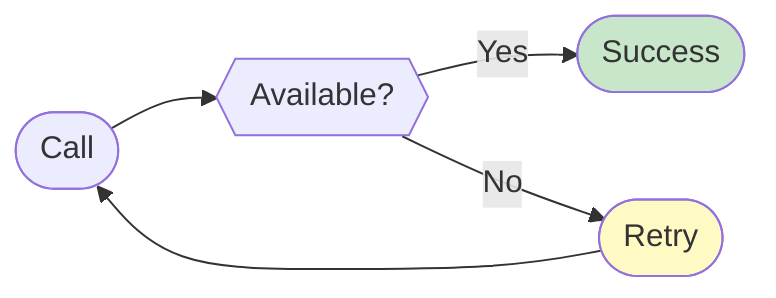

# 20 Reconnection Logic

Demonstrates automatic reconnection when API server becomes available.
Pipeline should recover from temporary API failures.

## What it evaluates

- Reconnection after failure
- API recovery handling
- Automatic retry to API
- Graceful degradation and recovery

## Flow

