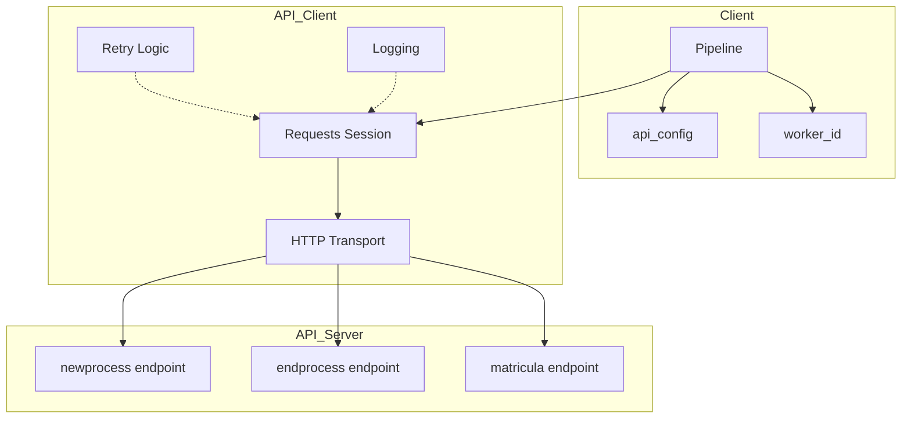
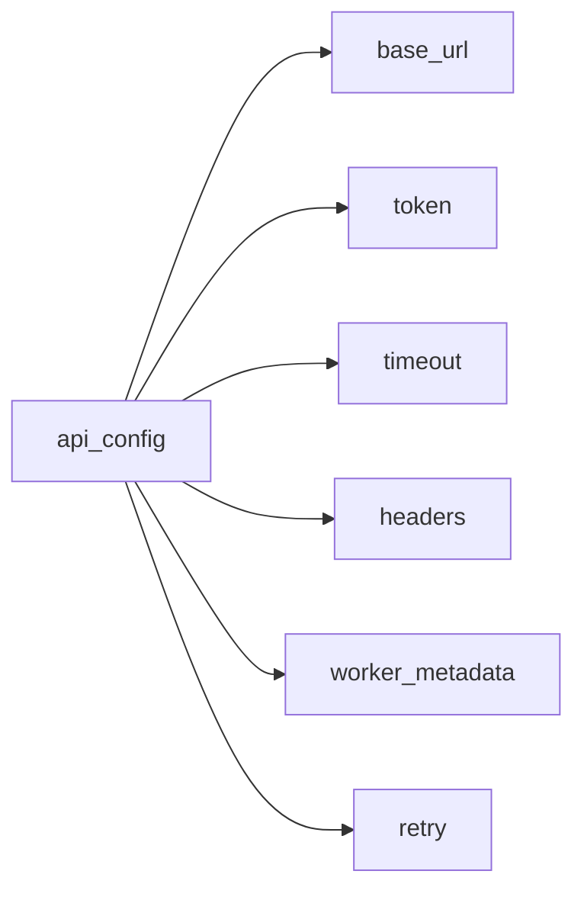
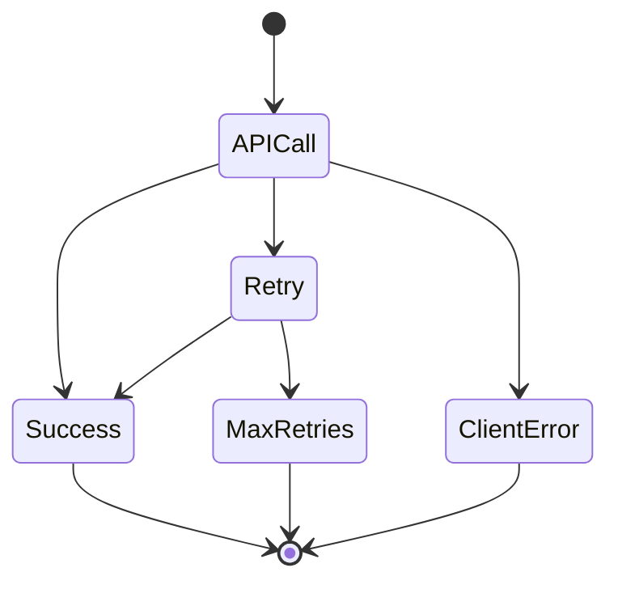
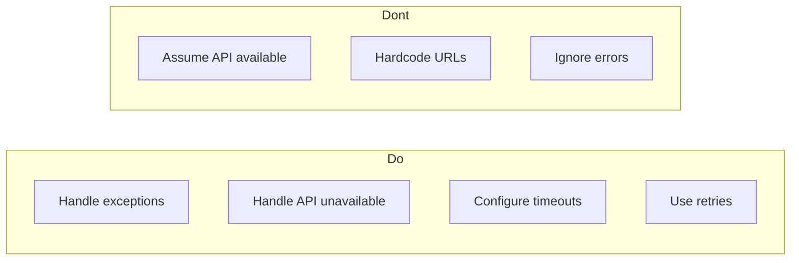

# API Pipeline

Pipeline integration with external API servers for worker tracking, registration, and asynchronous communication.

## Overview

The `api_pipeline` module enables wpipe pipelines to communicate with external API servers, providing:

- **Worker Registration**: Automatic worker registration with the server
- **Task Tracking**: Tracking of task executions
- **Async Communication**: Asynchronous communication with external services
- **Error Handling**: Robust network error handling
- **Configuration**: Flexible timeout, retry, and header configuration

## Architecture



## Quick Start

```python
from wpipe import Pipeline

api_config = {
    "base_url": "http://localhost:8418",
    "token": "your_token"
}

pipeline = Pipeline(
    worker_name="my_worker",
    api_config=api_config,
    verbose=True
)

pipeline.set_steps([
    (my_function, "Step 1", "v1.0"),
])

worker_id = pipeline.worker_register("my_worker", "v1.0")
if worker_id:
    pipeline.set_worker_id(worker_id.get("id"))

result = pipeline.run({"data": "value"})
```

## Configuration Options



### api_config Parameters

| Parameter | Type | Default | Description |
|-----------|------|---------|-------------|
| `base_url` | str | required | Base URL of the API server |
| `token` | str | required | Authentication token |
| `timeout` | int | 30 | Timeout in seconds |
| `headers` | dict | {} | Custom headers |
| `worker_metadata` | dict | {} | Worker metadata |

### Pipeline Parameters

| Parameter | Type | Default | Description |
|-----------|------|---------|-------------|
| `worker_name` | str | required | Worker identifier name |
| `api_config` | dict | None | API configuration |
| `max_retries` | int | 3 | Maximum retry attempts |
| `verbose` | bool | False | Detailed logging |

## Examples

Examples are organized in numbered subfolders:

### Basic (01-05)

| Example | Description |
|---------|-------------|
| [01_basic_api](01_basic_api/) | Basic API configuration |
| [02_worker_id](02_worker_id/) | Worker ID management |
| [03_no_api](03_no_api/) | Pipeline without API (local mode) |
| [04_api_errors](04_api_errors/) | API error handling |
| [05_show_errors](05_show_errors/) | SHOW_API_ERRORS flag |

### Configuration (06-09)

| Example | Description |
|---------|-------------|
| [06_api_with_timeout](06_api_with_timeout/) | Timeout configuration |
| [06_full_config](06_full_config/) | Full configuration |
| [07_api_retry_config](07_api_retry_config/) | Retry configuration |
| [08_api_custom_headers](08_api_custom_headers/) | Custom headers |
| [09_api_logging](09_api_logging/) | Logging configuration |

### Advanced (10-15)

| Example | Description |
|---------|-------------|
| [10_worker_metadata](10_worker_metadata/) | Worker metadata |
| [11_rate_limiting](11_rate_limiting/) | Rate limiting |
| [12_batch_operations](12_batch_operations/) | Batch operations |
| [13_authentication](13_authentication/) | Authentication |
| [14_health_checks](14_health_checks/) | Health checks |
| [15_service_discovery](15_service_discovery/) | Service discovery |

### Edge Cases (16-20)

| Example | Description |
|---------|-------------|
| [16_expired_token](16_expired_token/) | Expired/invalid token |
| [17_network_timeout](17_network_timeout/) | Network timeout |
| [18_invalid_url](18_invalid_url/) | Invalid URLs |
| [19_concurrent_workers](19_concurrent_workers/) | Concurrent workers |
| [20_reconnection](20_reconnection/) | Automatic reconnection |

## Error Handling



### SHOW_API_ERRORS Flag

```python
pipeline.SHOW_API_ERRORS = True  # Raises exceptions on API errors
pipeline.SHOW_API_ERRORS = False  # Silently continues (default)
```

## API Endpoints Used

| Endpoint | Method | Description |
|----------|--------|-------------|
| `/matricula` | POST | Register worker |
| `/newprocess` | POST | Start process |
| `/endprocess` | POST | End process |

## Testing

```bash
# Run all API tests
pytest test/test_api_client.py

# Run with coverage
pytest --cov=wpipe.api_client --cov-report=html

# Run specific example
python examples/api_pipeline/01_basic_api/example.py
```

## Best Practices



1. **Always handle API errors** - Use try/except blocks
2. **Configure appropriate timeouts** - Prevent indefinite hanging
3. **Use retries for critical operations** - Configure max_retries
4. **Verify worker_id before sending** - Only send if configured
5. **Use verbose=True in development** - For debugging

## See Also

- [Pipeline Documentation](../../wpipe/)
- [API Client Source Code](client.py)
- [Tests](../../test/test_api_client.py)
