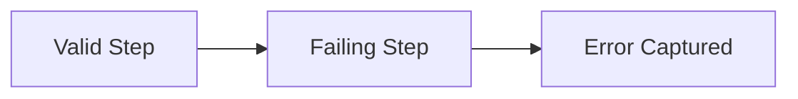
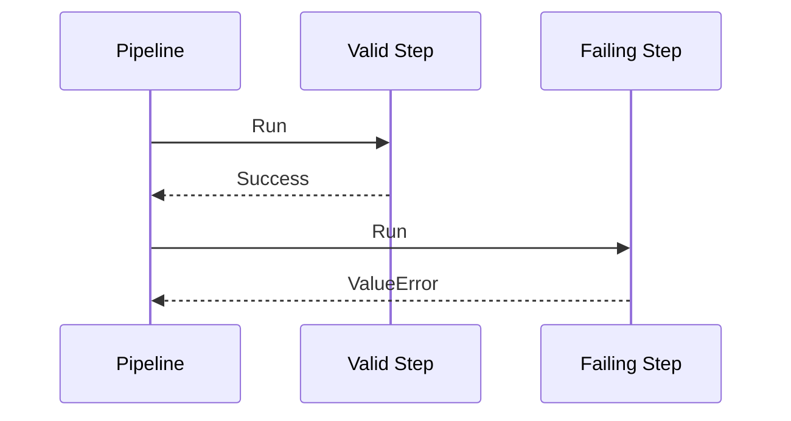
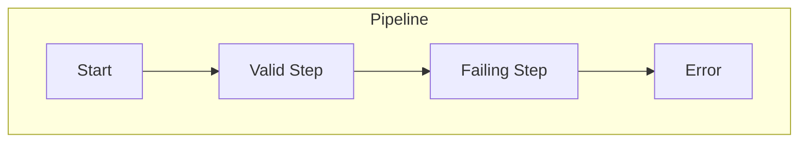
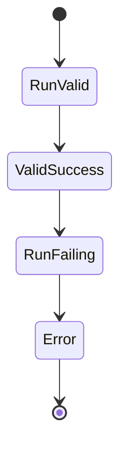
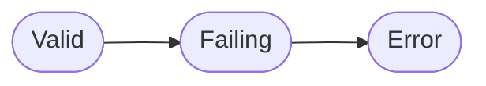

# Basic Error Example

Shows the simplest error handling pattern - catching a ValueError in a pipeline step.

## What It Does

Demonstrates how to create a pipeline where one step intentionally fails.
The error is captured in the pipeline result, allowing graceful handling.

## Flow

