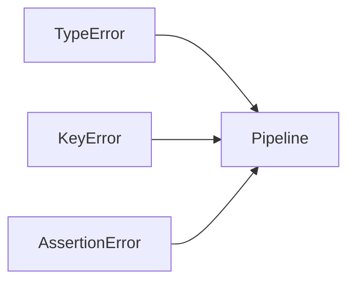
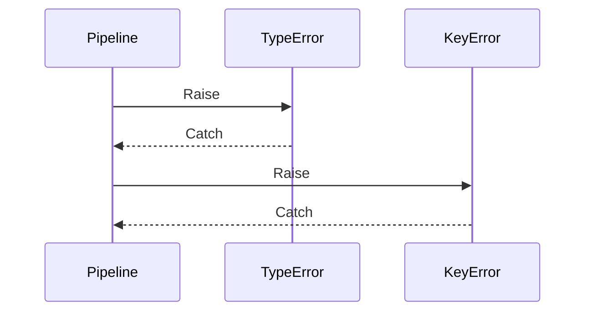
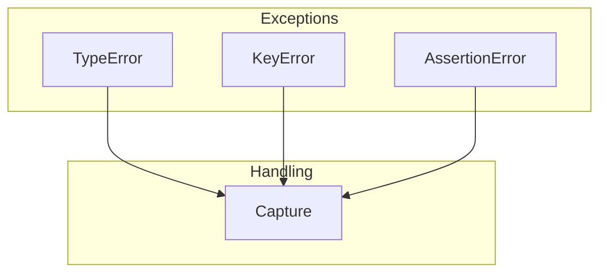
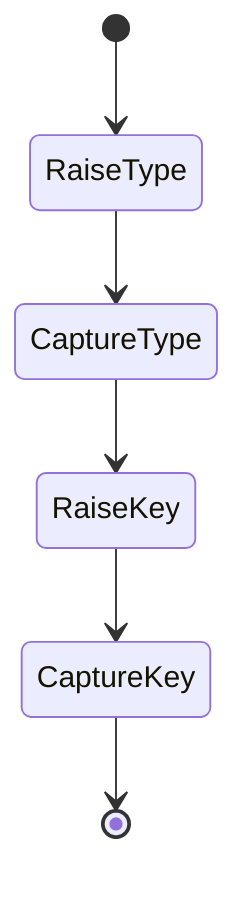
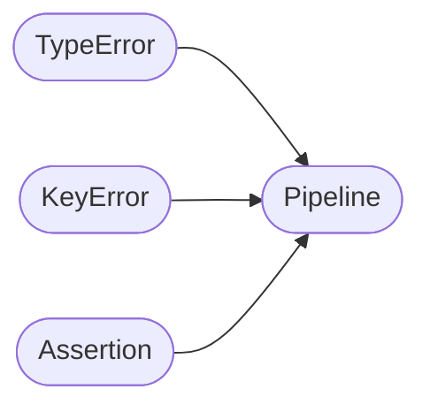

# Exception Types Example

Shows handling different types of exceptions in pipeline steps.

## What It Does

Demonstrates how the pipeline handles various exception types:
TypeError, KeyError, and AssertionError are all captured uniformly.

## Flow

