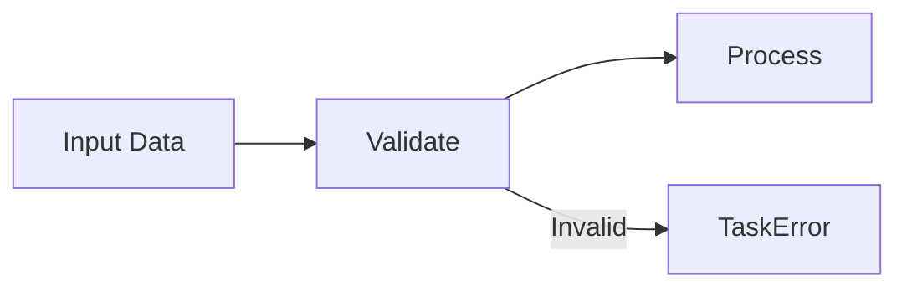
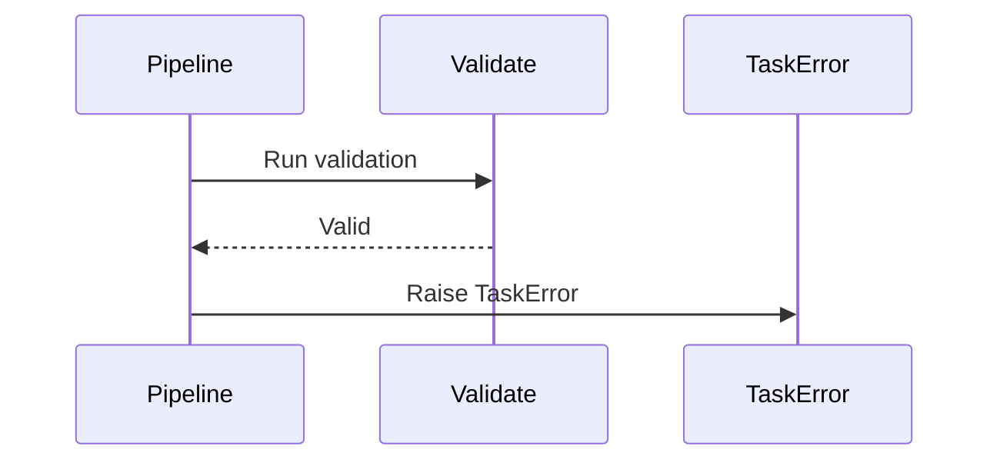
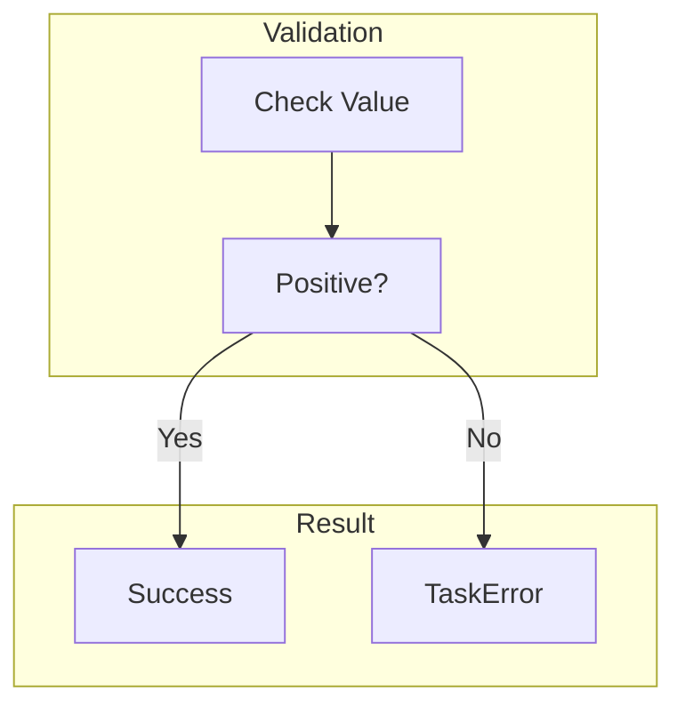
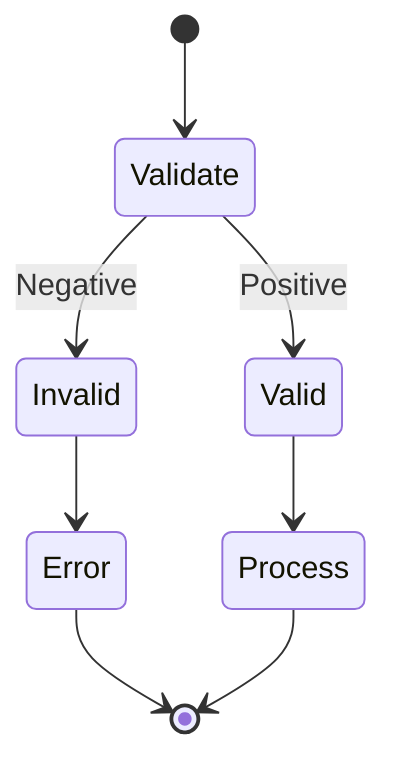
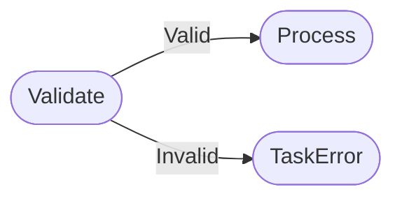

# TaskError Example

Shows using TaskError exception directly for custom error handling.

## What It Does

Demonstrates creating a validation step that uses TaskError
with error codes to indicate validation failures.

## Flow

