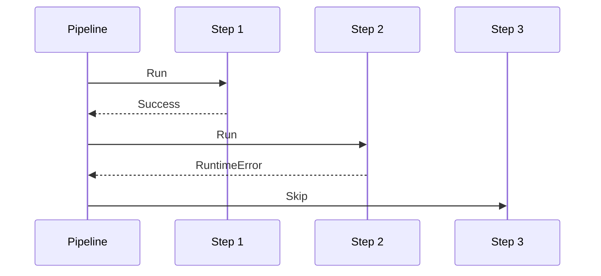
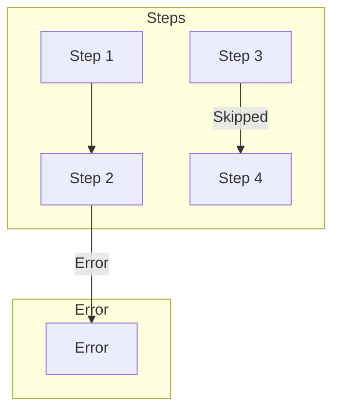
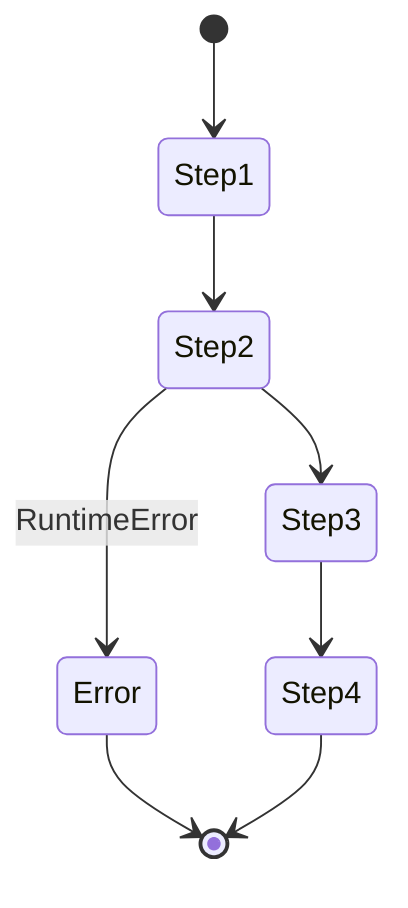
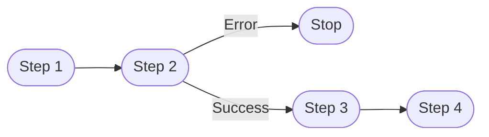

# Middle Error Example

Shows error handling when failure occurs in the middle of the pipeline.

## What It Does

Demonstrates how the pipeline handles errors that occur
after some steps have already completed successfully.

## Flow

