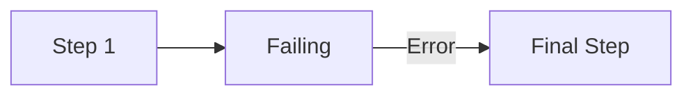
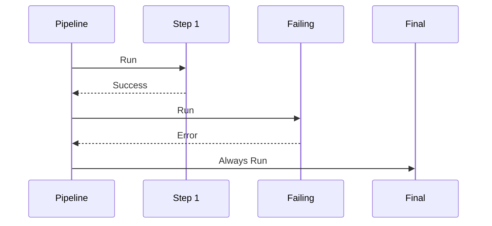
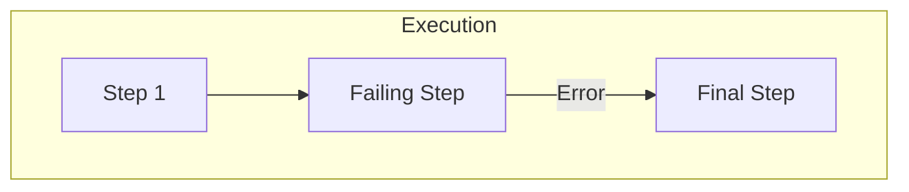
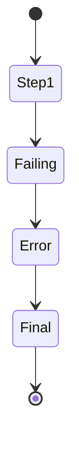

# Continue After Error Example

Shows that pipeline continues even when errors occur.

## What It Does

Demonstrates the finally block behavior - cleanup steps
always execute regardless of errors in previous steps.

## Flow

