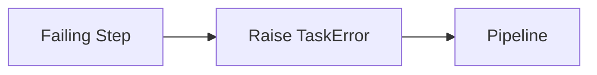
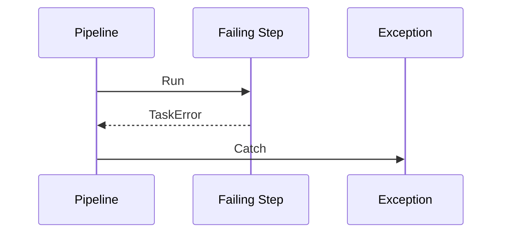
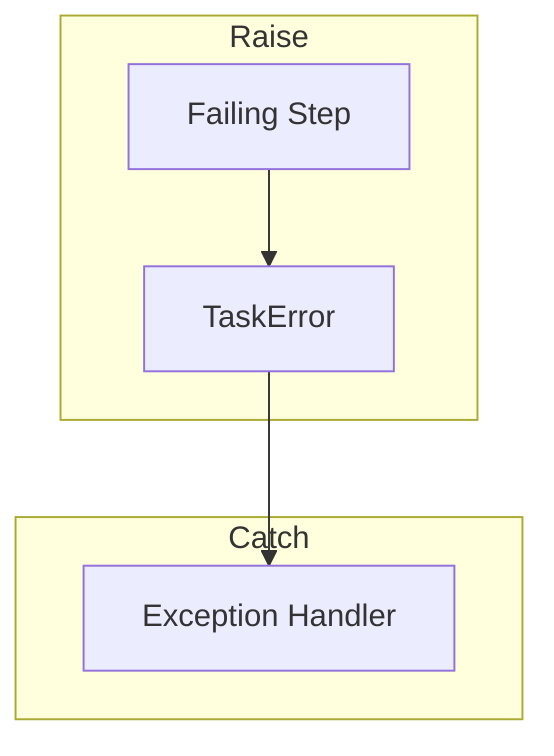
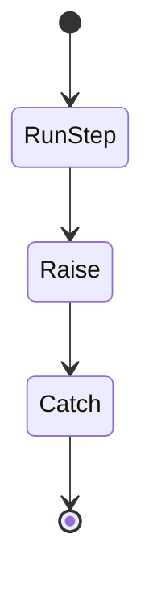
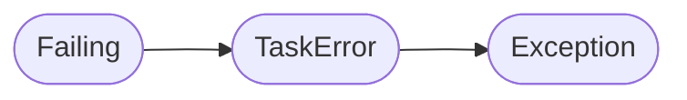

# Exception Chaining Example

Shows exception chaining with cause.

## What It Does

Demonstrates how TaskError exceptions are caught and chained
when raised within pipeline steps.

## Flow

```mermaid
graph LR
    A[Failing Step] --> B[Raise TaskError]
    B --> C[Pipeline]
```

```mermaid
sequenceDiagram
    participant P as Pipeline
    participant F as Failing Step
    participant E as Exception
    
    P->>F: Run
    F-->>P: TaskError
    P->>E: Catch
```

```mermaid
graph TB
    subgraph Raise
        A[Failing Step]
        B[TaskError]
    end
    
    subgraph Catch
        C[Exception Handler]
    end
    
    A --> B
    B --> C
```

```mermaid
stateDiagram-v2
    [*] --> RunStep
    RunStep --> Raise
    Raise --> Catch
    Catch --> [*]
```

```mermaid
flowchart LR
    F([Failing]) --> T([TaskError])
    T --> E([Exception])
```
