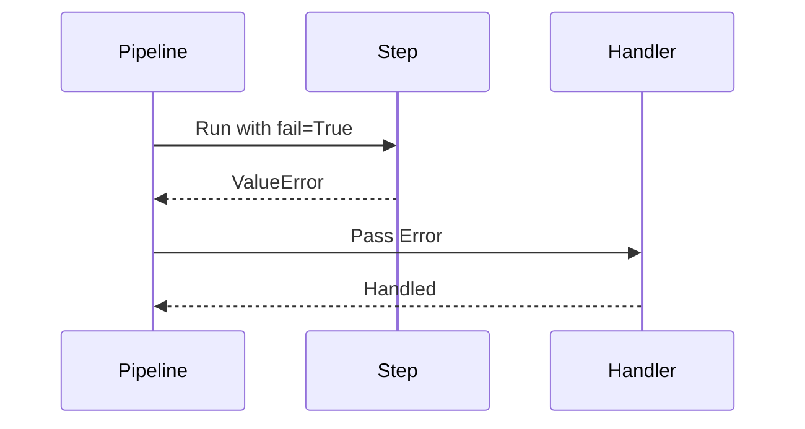
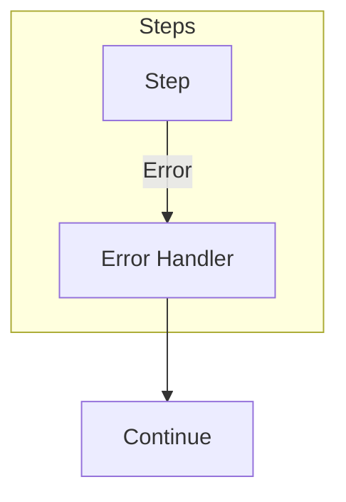
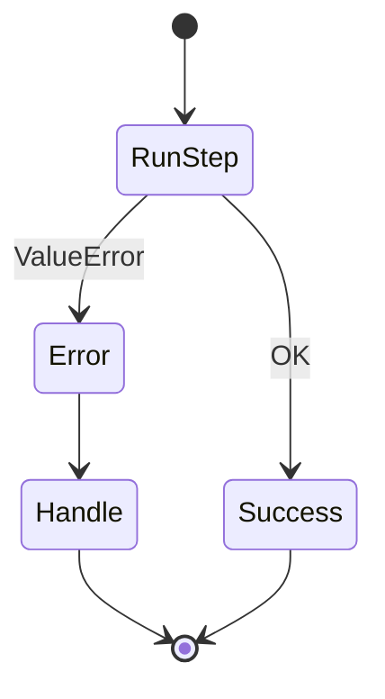
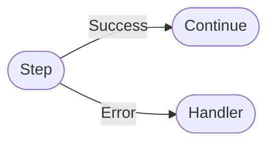

# Custom Error Handler Example

Shows implementing custom error handling logic.

## What It Does

Demonstrates how to handle errors in a pipeline step
and access error information in subsequent steps.

## Flow

